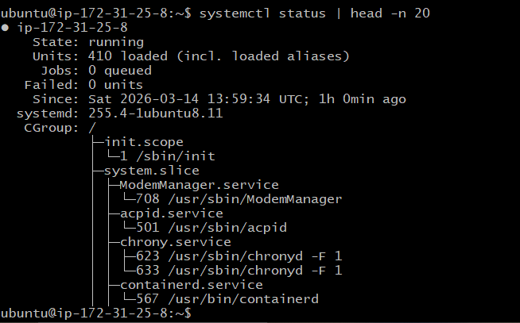
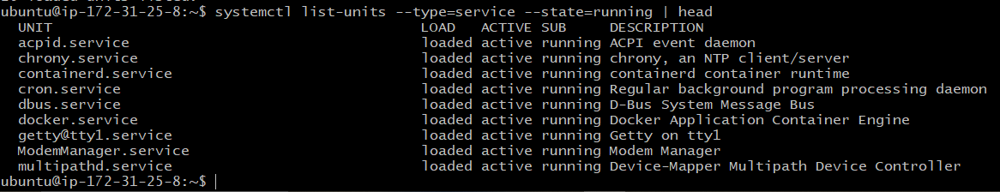
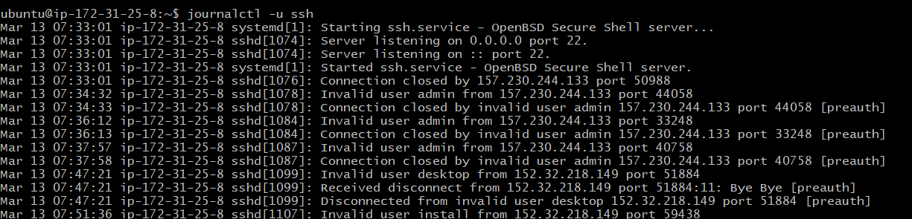
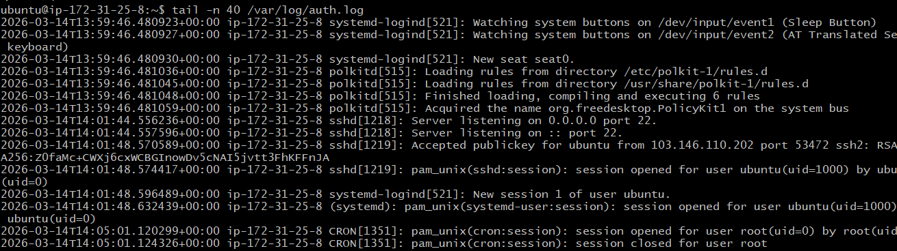

# Process commands  
- ps -aux | head -n 10 = List running processes(top 10 lines).  

-pgrep -l sshd - Get the process id by process name.  
   

# Service commands
- systemctl status | head -n 20 = Prints first 20 lines of system service status summary.   

- systemctl list-units = used to display all active systemd units currently loaded in the system.  
- systemctl list-units --type=service --state=running | head = Prints first 10 lines of running services status.  

# Log commands
- journalctl -u ssh = Displays logs for the SSH service.   

- tail -n 40 /var/log/auth.log = Last 40 lines of the authentication log(ssh, sudo).  

#Service for inspection (SSH)
- systemctl status ssh  

-  systemctl status docker  

docker service running let's stop it.  

