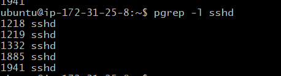

# Process commands  
- ps -aux | head -n 10 = List running processes(top 10 lines).  

-pgrep -l sshd - Get the process id by process name.
   

# Service commands
- systemctl status | head -n 20 = Prints first 20 lines of system service status summary.

# Log checks