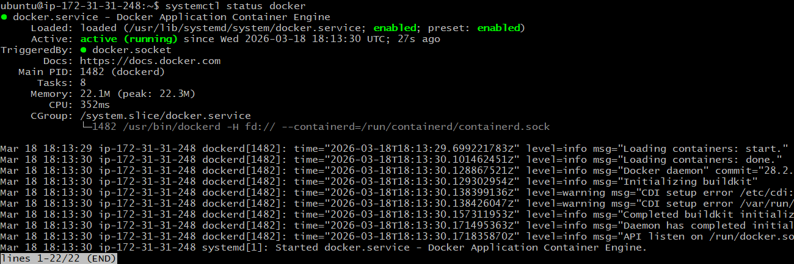
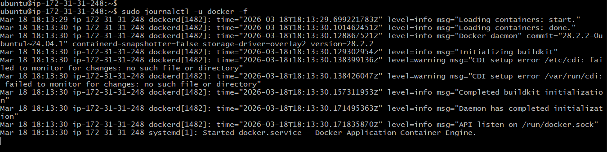

# Linux File System Hierarchy & Scenario-Based Practice

*Scenario 3: Finding Service Logs*
`A developer asks: "Where are the logs for the 'docker' service?"`
`The service is managed by systemd.`
`What commands would you use?`

- Step 1: To confirm service status and see log hints.
sudo systemctl status docker

Step 2: To view recent Docker service logs.
sudo journalctl -u docker -n 50

Step 3: To follow logs in real-time.
sudo journalctl -u docker -f

