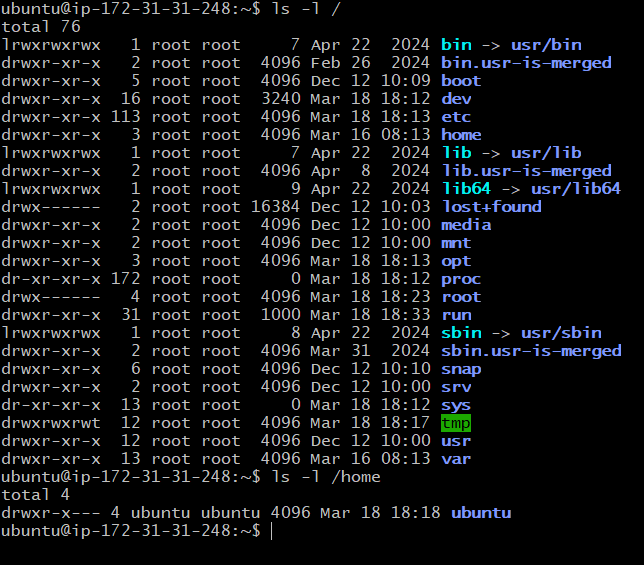
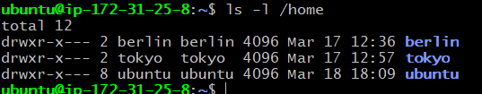
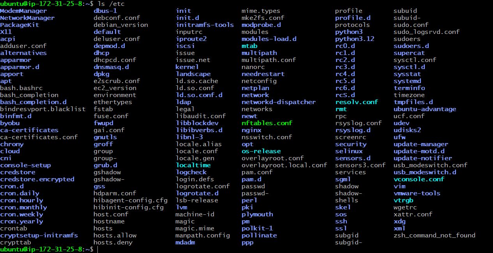
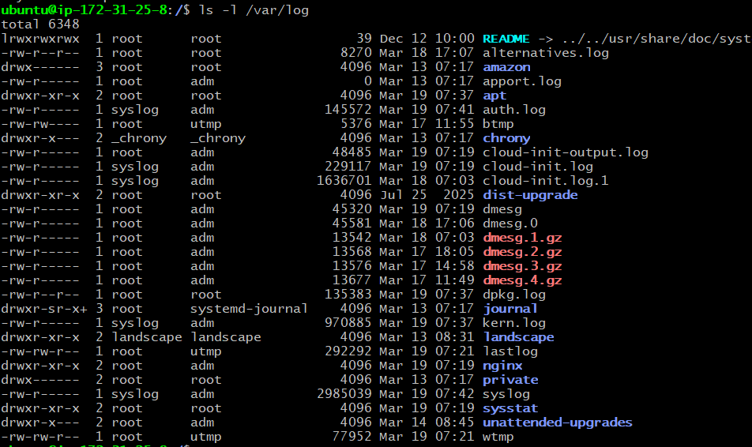
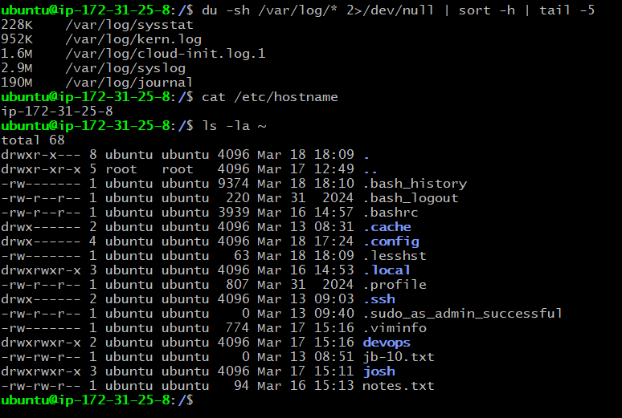
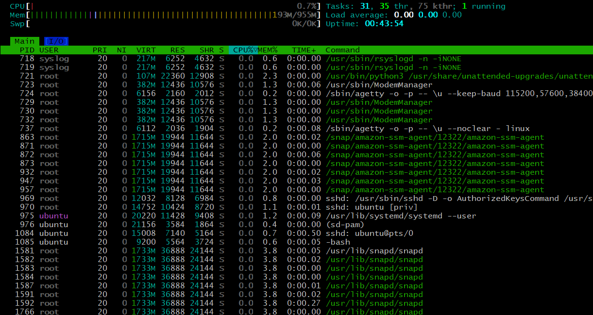
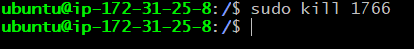

# Linux File System Hierarchy & Scenario-Based Practice
## Part 1: Linux File System Hierarchy
## / (Root Directory)
**Contains:** The top-level directory of Linux; all other directories branch from here.

**Observed (`ls -l /`):**
- `bin -> usr/bin`
- `etc/`
- `home/`
- `var/`

**I would use this when** I want to understand the overall system layout or navigate to core directories.



## /home
**Contains:** Home directories for normal users where personal files, scripts, and configs are stored.

**Observed (`ls -l /home`):**
- `berlin/`
- `tokyo/`
- `ubuntu/`

**I would use this when** working with user files, projects, and automation scripts.



## /etc
**Contains:** System-wide configuration files for users, services, networking, and boot settings.

**Observed (`ls /etc`):**
- `ssh/`
- `passwd`
- `vim`
- `apt`
- `sudoers.d/`
- `netplan/`

**I would use this when** configuring users, security, networking, or system services.



## /var/log
**Contains:** Log files generated by the system, services, and AWS components.

**Observed (`ls -l /var/log`):**
- `syslog`
- `auth.log`
- `cloud-init.log`
- `kern.log`

**I would use this when** troubleshooting system issues, boot problems, or service failures.


---
- /root = Home directory of super user (root user) separate from normal users. I would use this to store files that only root should acsess.  

- /tmp = Temporary files created by applications, services, or users are stored here. Any files stored here will be deleted after reboot. I would use this to store any files that I won't require after reboot.  
---
## Additional Directories (Good to Know):
- /bin = Symbolic link to /usr/bin.  

- /usr/bin = Contains the majority of user command binaries — programs and utilities that regular users and administrators run in daily work. (ex. ls, mkdir, mv) I would use this to look for commands.

- /opt = Reserved for installing optional 3rd party software that are not part of core system distribution(ex. google chrome) I would use this directory to to see what external or commercial applications are installed.

## Hands-on task:

```bash
# Find the largest log file in /var/log
du -sh /var/log/* 2>/dev/null | sort -h | tail -5

# Look at a config file in /etc
cat /etc/hostname

# Check your home directory
ls -la ~
```



**Scenario 2: High CPU Usage** 
```
Your manager reports that the application server is slow.
You SSH into the server. What commands would you run to identify
which process is using high CPU?
```
### Step 1: To view high usages resource in system

```bash
htop
```



### Step 2: kill the process

```bash
kill 2633
```


---

**Scenario 3: Finding Service Logs**
```
A developer asks: "Where are the logs for the 'docker' service?"
The service is managed by systemd.
What commands would you use?
```

### Step 1: To confirm service status and see log hints.
```
sudo systemctl status docker
```


### Step 2: To view recent Docker service logs.
```
sudo journalctl -u docker -n 50
```


### Step 3: To follow logs in real-time.
```
sudo journalctl -u docker -f
```

