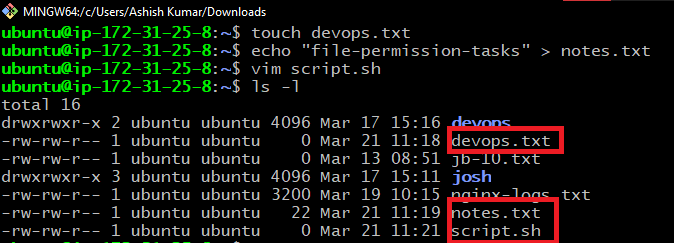
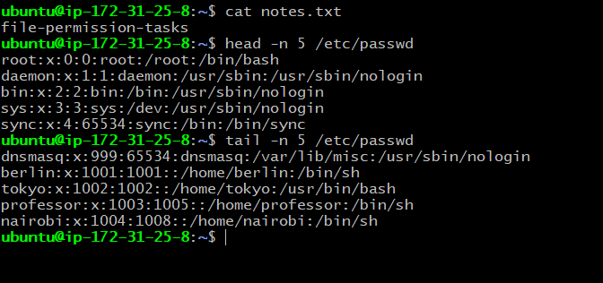
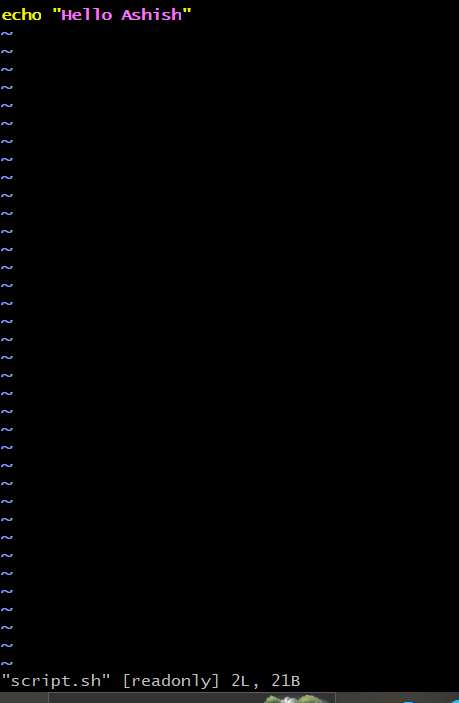
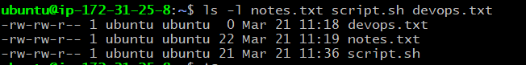
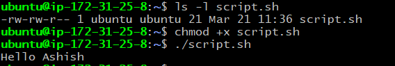
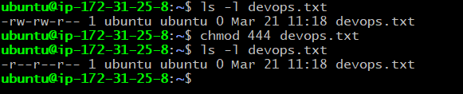
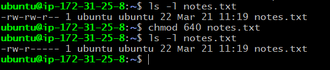
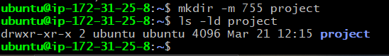
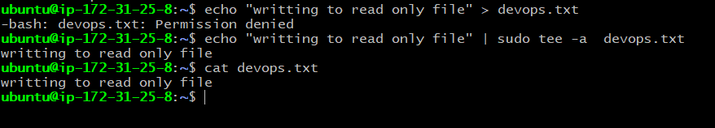
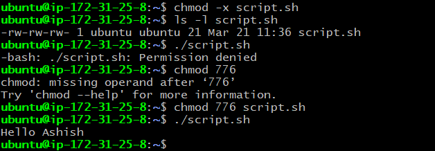

# Day 10 – File Permissions & File Operations Challenge

## Task 1: Create Files 



## Task 2: Read Files



## View script.sh in vim read-only mode - `vim -R script.sh`



## Task 3: Understand Permissions


All three files have the same permissions:
```bash
-rw-rw-r-- 
```

```bash
- → regular file (not a directory)
Owner (ubuntu): rw- → read ✅ write ✅ execute ❌
Group (ubuntu): rw- → read ✅ write ✅ execute ❌
Others        : r-- → read ✅ write ❌ execute ❌
```

## Task 4: Modify Permissions
Make script.sh executable → run it with ./script.sh  



Set devops.txt to read-only (remove write for all)  



Set notes.txt to 640 (owner: rw, group: r, others: none)  



Create directory project/ with permissions 755  




## Task 5: Test Permissions

- Writing to a read-only file - what happens?  

Answer : Writing to a read‑only file normally gives Permission denied. With sudo, you can override and write to the file — but only if the redirection itself is executed with root privileges (using tee or sudo bash -c). Even sudo won’t help if the file is set to immutable (via chattr +i) or mounted on a read‑only filesystem.  



- Try executing a file without execute permission.  

Answer : Executing a file without execute permission gives Permission denied. Even sudo cannot bypass this, because the shell requires the execute bit.
    

---

## Commands used

- Create: `touch`, `echo`, `vim file`
- Read: `cat`, `head -n`, `tail -n`, `vim -R file` 
- Permissions: `chmod +x`, `chmod 444`, `chmod 755`

## What I learned

1. **File Creation and Inspection:** I learned how to create and edit files using `touch`, `echo`, and `vim`.I also discovered how to open files safely in read-only mode using `vim -R` .Additionally, I used the `head` and `tail` commands to filter specific lines from system files (`like /etc/passwd`) to verify user accounts on the system.

2. **Managing Permissions with chmod:** I learned how to modify file and directory permissions using the chmod command. I practiced using both symbolic mode (e.g., chmod +x to make a script executable) and numeric mode (e.g., `chmod 755` for directories, chmod `444` for read-only files).

3. **Troubleshooting Access Control:** I observed how Linux permissions directly affect file operations. I saw "Permission denied" errors when trying to execute a script without the executable permission or write to a read-only file, and fixed them by adjusting permissions.