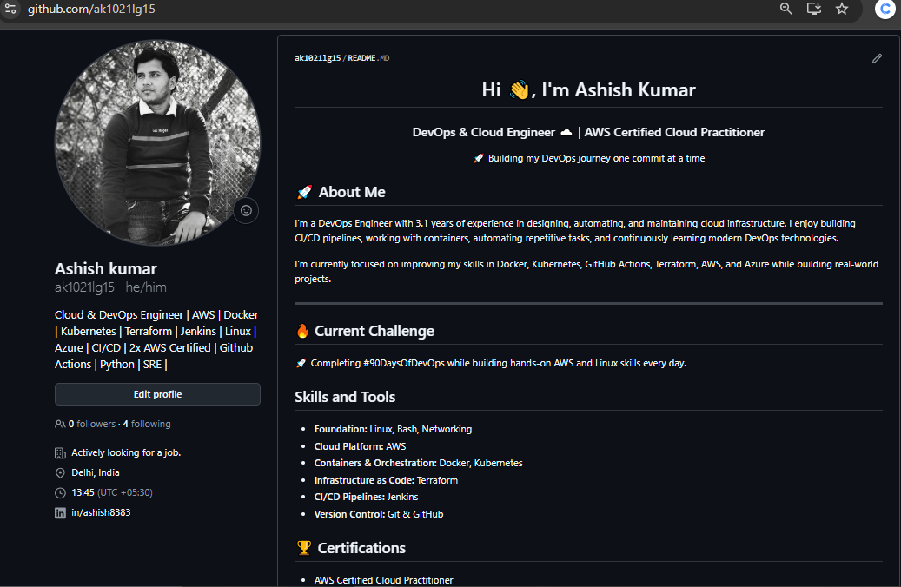

# Day 27 – GitHub Profile Makeover

### Task 1: Audit Your Current GitHub Profile
Before making changes, assess where you stand:
1. Visit your own GitHub profile as if you were a stranger — what impression does it give?
2. Answer in your notes:
   - Is your profile picture professional?
        - Yes
   - Is your bio filled in? Does it say what you do?
        - Yes
   - Are your pinned repo?
        - Yes
   - Do your repos have descriptions, or are they blank?
        - Partially,some repos have descriptions,but many are blank or unclear.
   - Would a recruiter understand what you've been working on?
        - Yes, after adding a Profile README

---

### Task 2: Create Your Profile README
    
**README includes**

- Introduction — Ashish Kumar, Cloud & DevOps Engineer passionate about automation and scalable cloud solutions

- What I'm working on — 90 Days of DevOps challenge

- Skills and tools — Linux, Bash, Networking, AWS, Docker, Kubernetes, Terraform, Jenkins, Git & GitHub

- Tech stack highlights, GitHub activity graph, 
- Certification section
- contact section — Email and LinkedIn

---

### Task 3: Organize Your Repositories

| Repo | Status |
|---|---|
| `90-days-of-devops`| Created |
| `devops-nginx-demo`| Created |
| `devops-git-practice`| Created |

All repos have:
- Descriptive repo names using hyphens
- One-line descriptions on GitHub
- README.md explaining contents

---

### Task 4: Pin Your Best Repos

Selected pinned repos
- `90-days-of-devops`

---

### Task 5: Clean Up
- Deleted irrelevant repos
- Confirmed all active repos have descriptions set on GitHub

---

### Task 6: Before & After
1. GitHub profile **before**

2. GitHub profile **after**

    

3. Things improved

    **Added a Personal Introduction**
    I added a heading and short summary (e.g., Hi, I’m Ashish — Cloud & DevOps Engineer) so visitors instantly know who I am and what I do.

    **Organized Profile Layout**
    I structured the profile into sections like About Me, Skills, What I’m Working On, and Connect with Me. This makes the profile easier to read and more professional.

    **Highlighted Skills Clearly**
    I listed my key technical skills in an organized manner.This helps recruiters quickly see my strengths and expertise.