# Day 31 – Dockerfile: Build Your Own Images

## Challenge Tasks

### Task 1: Your First Dockerfile
1. Create a folder called `my-first-image`
2. Inside it, create a `Dockerfile` that:
   - Uses `ubuntu` as the base image
   - Installs `curl`
   - Sets a default command to print `"Hello from my custom image!"`
3. Build the image and tag it `my-ubuntu:v1`

    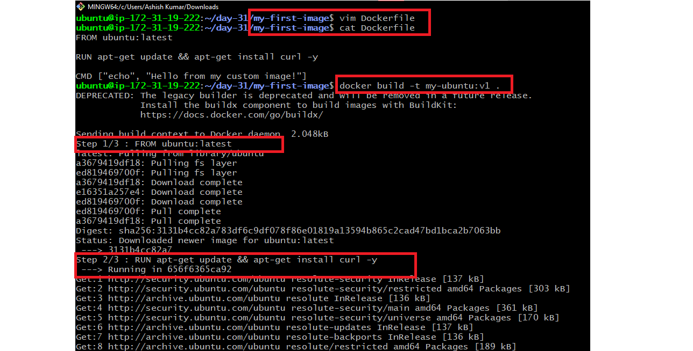

4. Run a container from your image

    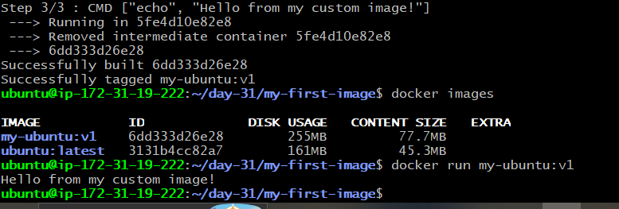

**Verify:** The message prints on `docker run`

    

---

### Task 2: Dockerfile Instructions
## Objective

Understand the purpose of commonly used Dockerfile instructions by building and running a custom Docker image.

### Source Files

- **Dockerfile:** [Dockerfile-demo/Dockerfile](./Dockerfile-demo/Dockerfile)
- **HTML File:** [Dockerfile-demo/index.html](./Dockerfile-demo/index.html)

### Instructions Used

| Instruction | Purpose |
|-------------|---------|
| `FROM` | Defines the base image |
| `RUN` | Executes commands during image build |
| `COPY` | Copies files into the image |
| `WORKDIR` | Sets the working directory |
| `EXPOSE` | Documents the application port |
| `CMD` | Defines the default startup command |

### Steps Performed

1. Created a custom HTML page.
2. Wrote a Dockerfile using the above instructions.
3. Built the Docker image.
4. Started the Nginx container.
5. Verified the application in the browser.

### Verification

- Docker image built successfully.
- Nginx container started successfully.
- Application served correctly in the browser.

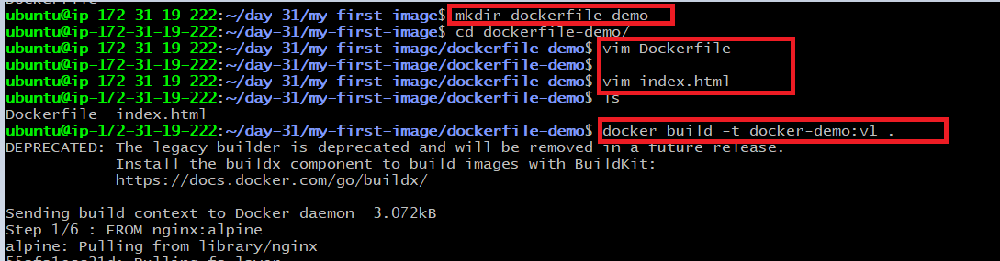
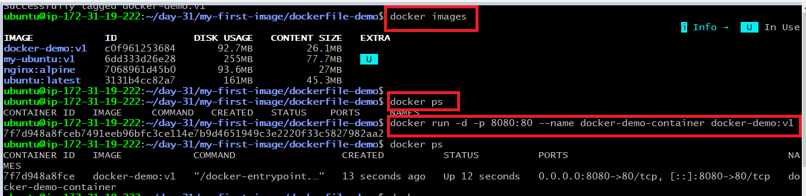
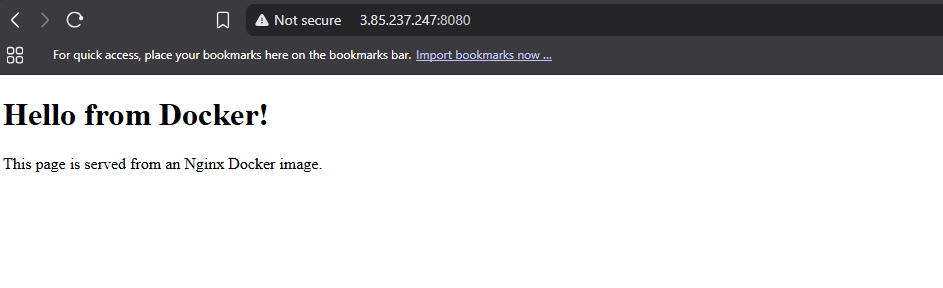


---

### Task 3: CMD vs ENTRYPOINT
1. Create an image with `CMD ["echo", "hello"]` — run it, then run it with a custom command. What happens?

    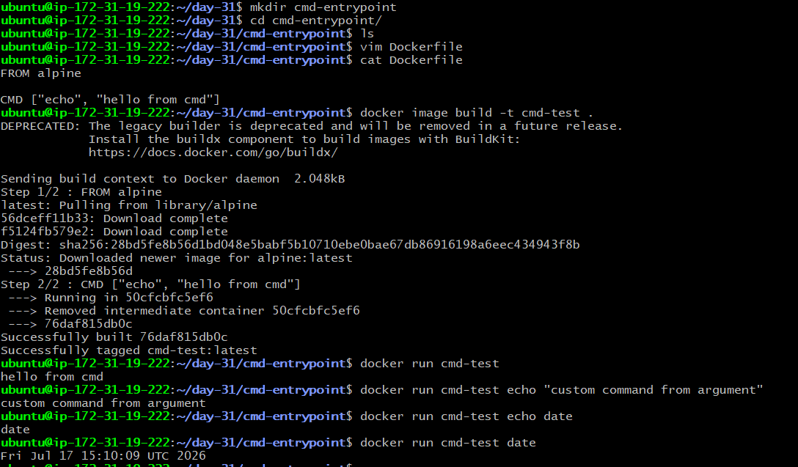

* **Run without arguments:**
  The container runs the default command `echo hello` and outputs:

  ```
  hello
  ```

* **Run with a custom command:**
  When you run the container with a custom command (e.g., `echo "custom command"`), the custom command **completely overrides** the `CMD`, so the output is:

  ```
  custom command
  ```


2. Create an image with `ENTRYPOINT ["echo"]` — run it, then run it with additional arguments. What happens?

    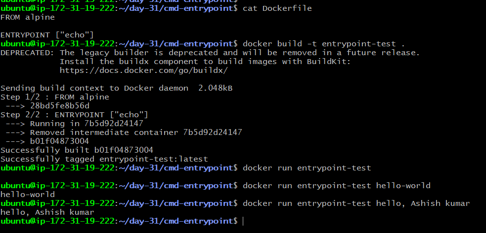

* **Run without arguments:**
  The container runs `echo` with no arguments,resulting in a blank line (no output).

* **Run with additional arguments:**
  When you pass arguments (e.g., `hello-world`), they are **appended** to the `ENTRYPOINT`, so it runs `echo hello-world` and outputs:

  ```
  hello-world
  ```

3. When would you use CMD vs ENTRYPOINT?

- Use `CMD` when you want to provide a default command that can be changed easily when you run the container.

- Use `ENTRYPOINT` when you want to set a fixed command that always runs.

---

### Task 4: Build a Simple Web App Image
## Objective

Deploy a static HTML website using an Nginx Docker container.

### Source Files

- **Dockerfile:** [nginx-demo/Dockerfile](./nginx-demo/Dockerfile)
- **HTML File:** [nginx-demo/index.html](./nginx-demo/index.html)

### Steps Performed

1. Created a static HTML webpage.
2. Wrote the Dockerfile.
3. Built the Docker image.
4. Started the Nginx container.
5. Accessed the application through the browser.

### Verification

- Docker image built successfully.
- Website deployed successfully.
- Browser output verified.

    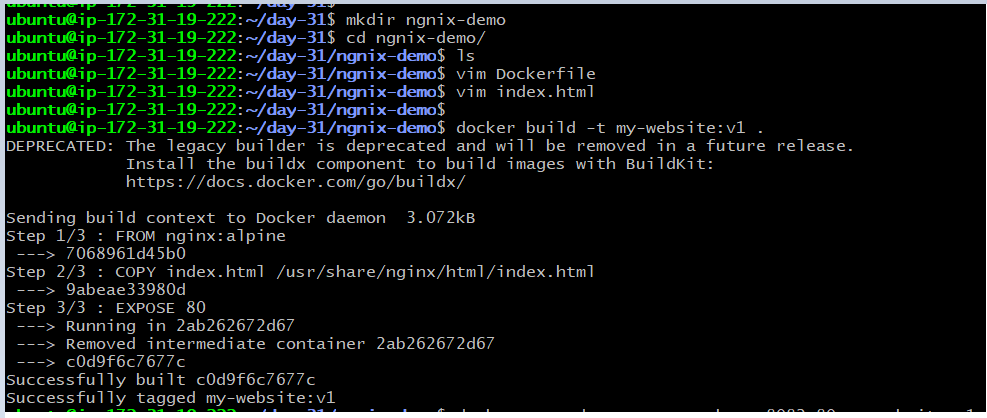
    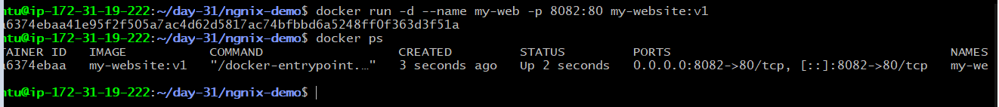
    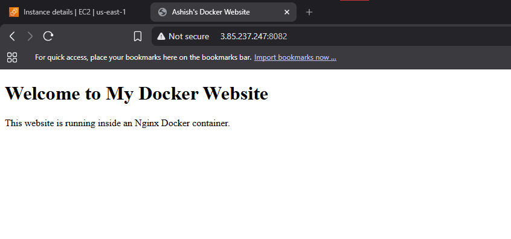

---

### Task 5: .dockerignore
1. Create a `.dockerignore` file in one of your project folders
2. Add entries for: `node_modules`, `.git`, `*.md`, `.env`
3. Build the image — verify that ignored files are not included

    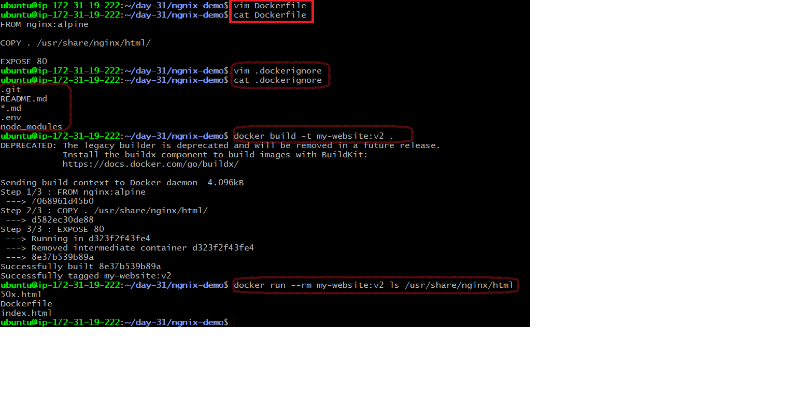


There should be no test.md, .env, .git, or node_modules listed
---

### Task 6: Build Optimization

## Objective

Understand Docker layer caching and its impact on build performance.

### Steps Performed

1. Built the Docker image.
2. Modified the application.
3. Rebuilt the image.
4. Observed Docker cache behavior.

### Key Observations

- Docker creates images layer by layer.
- Every Dockerfile instruction creates a separate layer.
- Unchanged layers are reused from cache.
- Only modified layers and subsequent layers are rebuilt.
- Proper instruction ordering improves build performance.

### Verification

- Successfully observed Docker layer caching.
- Verified faster image rebuilds.

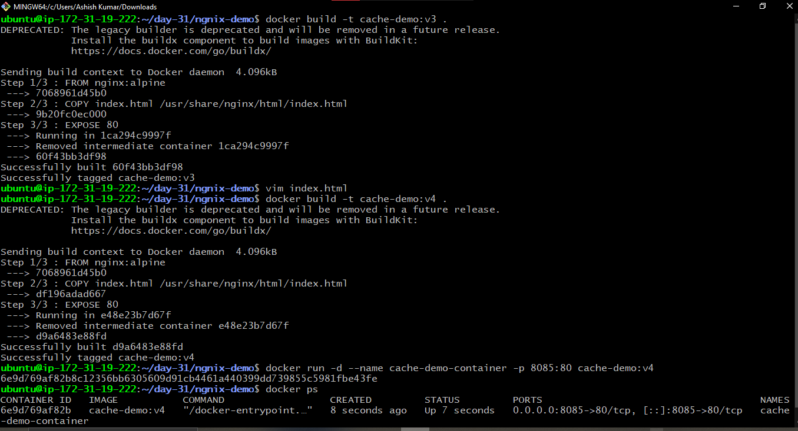

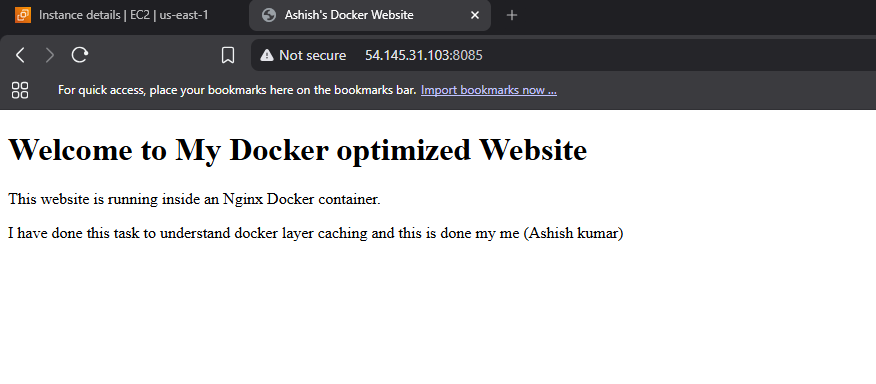

---

# Key Takeaways

- Built custom Docker images using Dockerfiles.
- Learned the purpose of commonly used Dockerfile instructions.
- Compared **CMD** and **ENTRYPOINT** with practical examples.
- Containerized and deployed a static website using **Nginx**.
- Optimized Docker build context using **.dockerignore**.
- Improved image build performance using **Docker layer caching**.
- Successfully built, tested, and verified Docker applications on an **AWS EC2** instance.
---