# Day 33 – Docker Compose: Multi-Container Basics

## Challenge Tasks

### Task 1: Install & Verify
1. Check if Docker Compose is available on your machine if not then install
    
    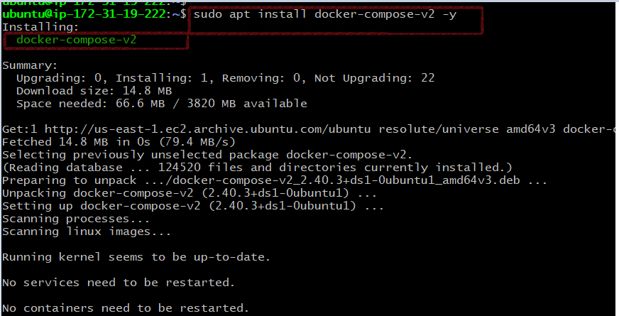

2. Verify the version

    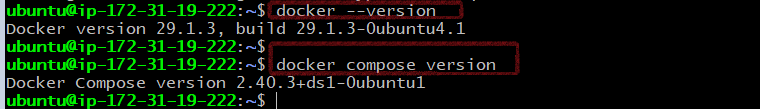

---

### Task 2: Your First Compose File
1. Create a folder `compose-basics`
2. Write a `docker-compose.yml` that runs a single **Nginx** container with port mapping

    [Compose file](compose-basics/docker-compose.yml)

    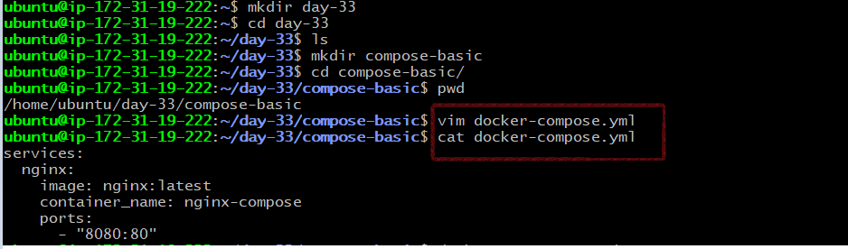

3. Start it with `docker compose up`
    
    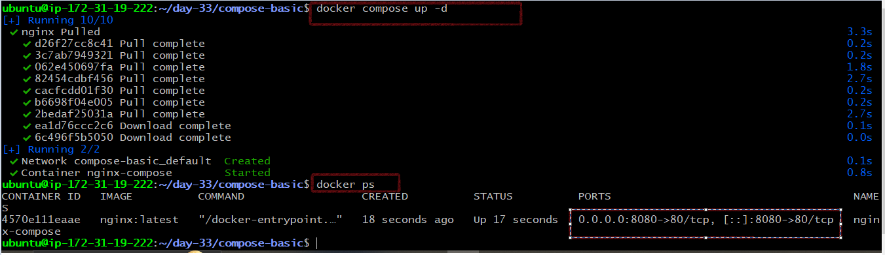

4. Access it in your browser
    
    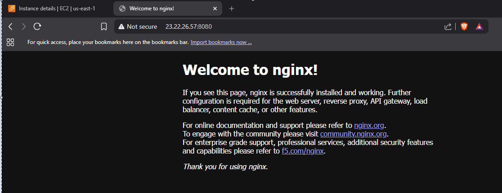

5. Stop it with `docker compose down`

    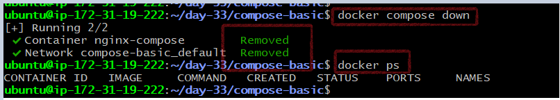

    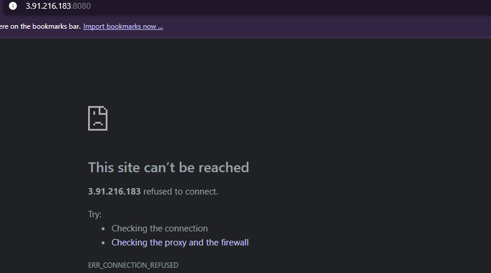
---

### Task 3: Two-Container Setup
Write a `docker-compose.yml` that runs:
- A **WordPress** container
- A **MySQL** container

They should:
- Be on the same network (Compose does this automatically)
- MySQL should have a named volume for data persistence
- WordPress should connect to MySQL using the service name

Start it, access WordPress in your browser, and set it up.

-Docker Compose file of wordpress and mysql container.
    [Compose file](wordpress-mysql-compose/docker-compose.yml)

- Folder create and `docker compose up`

    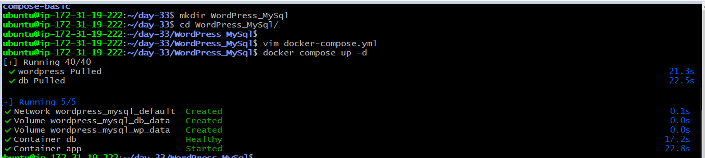

- Verify the container using `docker ps` command.

    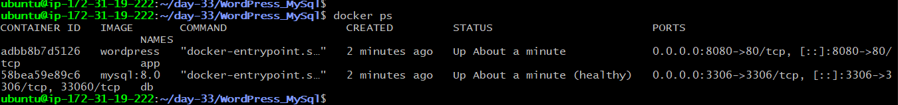

- Verfiy the network `docker network ls`

    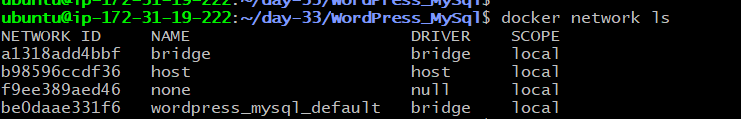

- Verfify the volume `docker volume ls`

    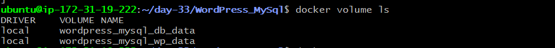

- WordPress

    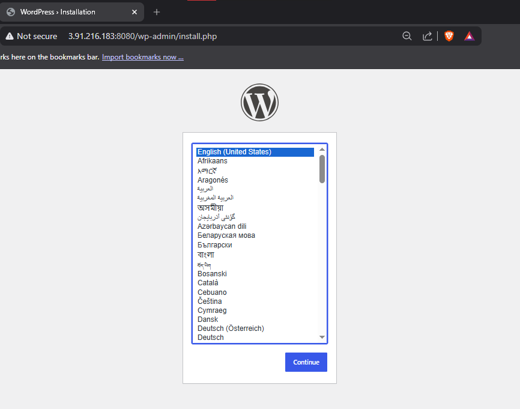
    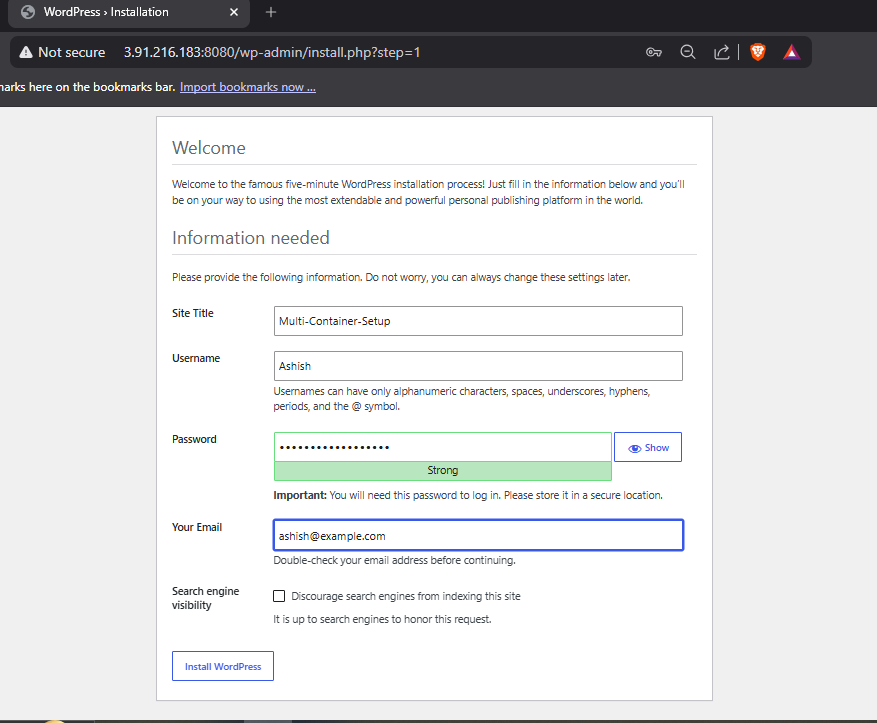
    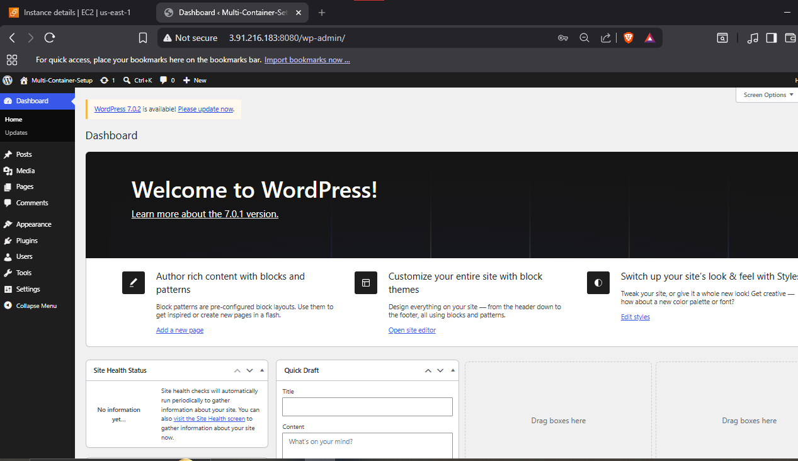

**Verify:** Stop and restart with `docker compose down` and `docker compose up` — is your WordPress data still there?

- Yes,wordpress data is there.
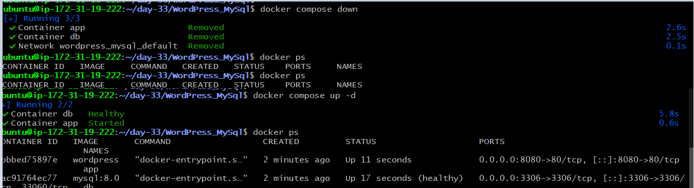
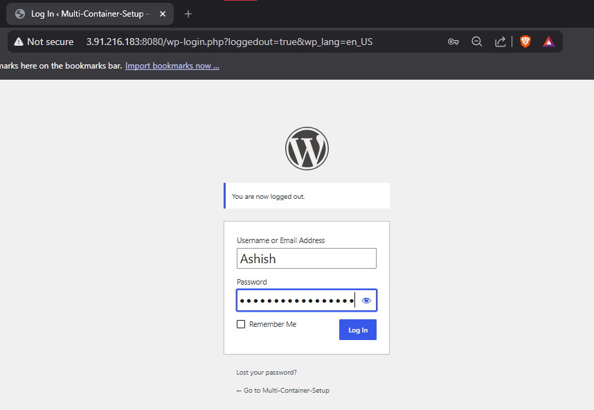
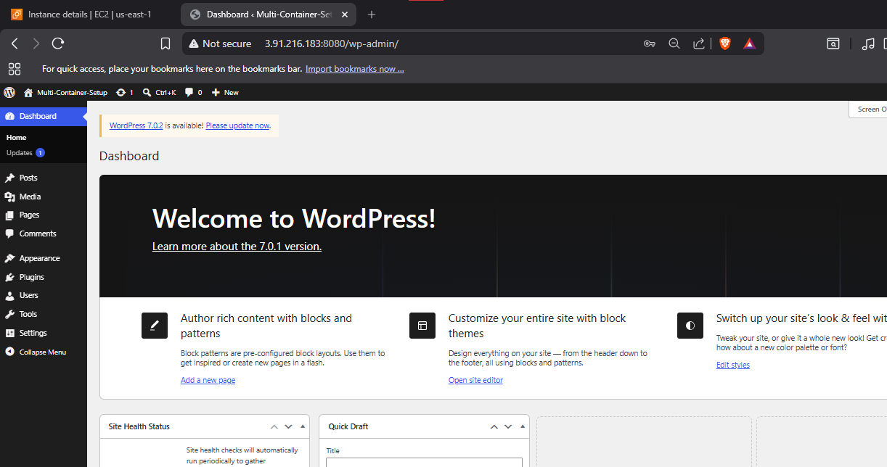

---

### Task 4: Compose Commands
Practice and document these:
1. Start services in **detached mode**

    `docker compose up -d`

    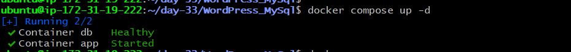

2. View running services

    `docker compose ps`

    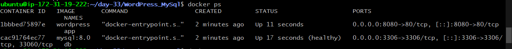

3. View **logs** of all services

    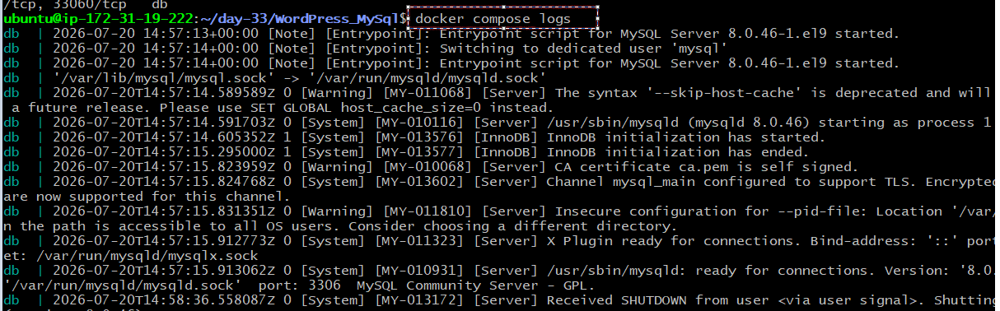

4. View logs of a **specific** service

    `docker compose logs db` && `docker compose logs wordpress`
    
    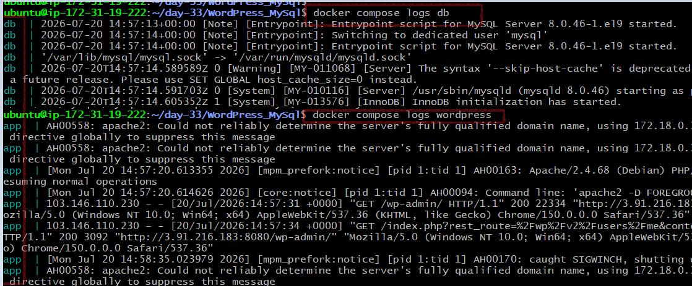

5. **Stop** services without removing

    `docker compose stop`
    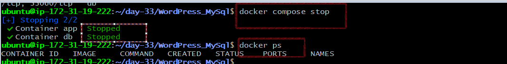

6. **Remove** everything (containers, networks)

    `docker compose down`

    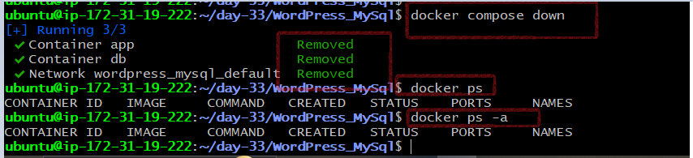

7. **Rebuild** images if you make a change

    `docker compose up --build.`

---

### Task 5: Environment Variables
1. Add environment variables directly in your `docker-compose.yml`
2. Create a `.env` file and reference variables from it in your compose file
3. Verify the variables are being picked up

    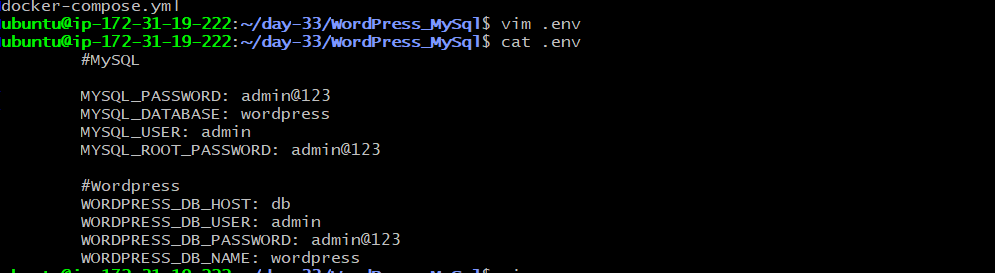

    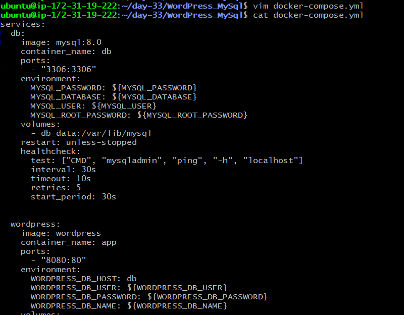
- Verified that Docker Compose successfully loaded all variables from the .env file and generated the expected configuration.
  
   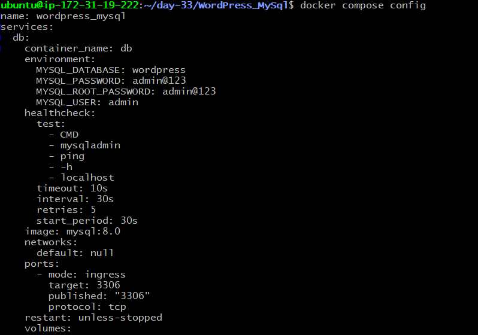

- Container start

   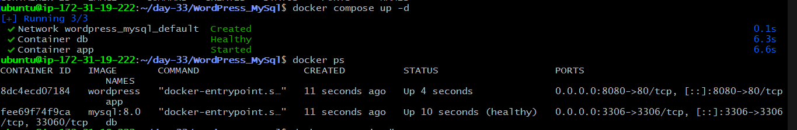

- Verified the env inside the MYSQL Container

   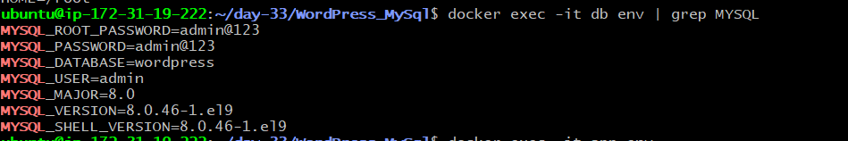
  
- Verified the env inside the Wordpress Container

   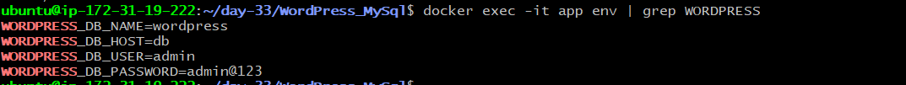

    [Compose file](wordpress-mysql-compose-env/docker-compose.yml)
