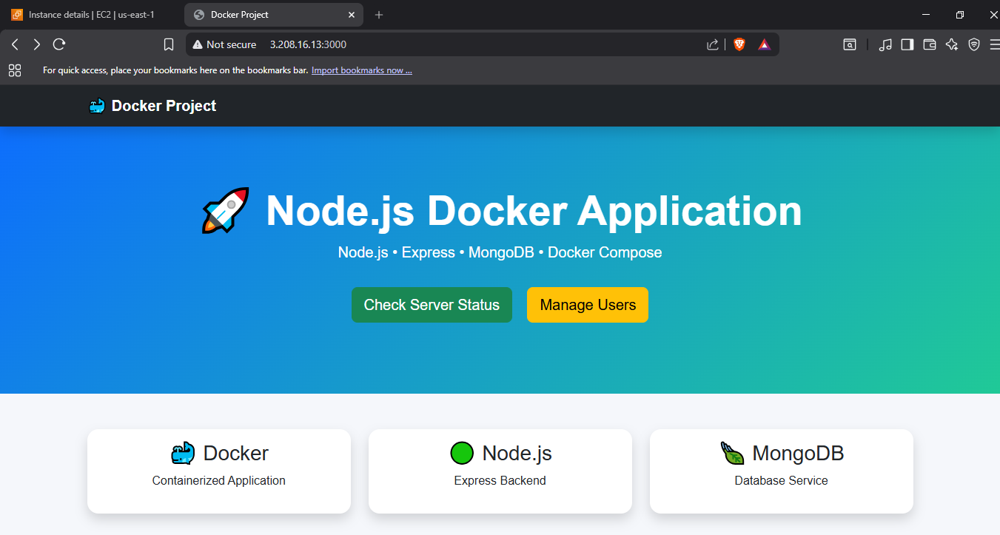
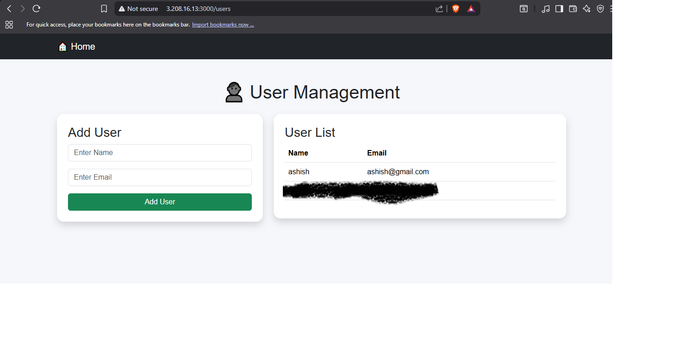
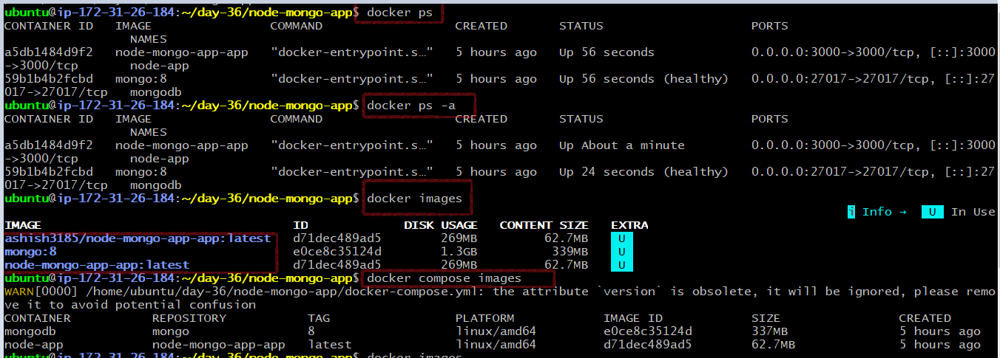
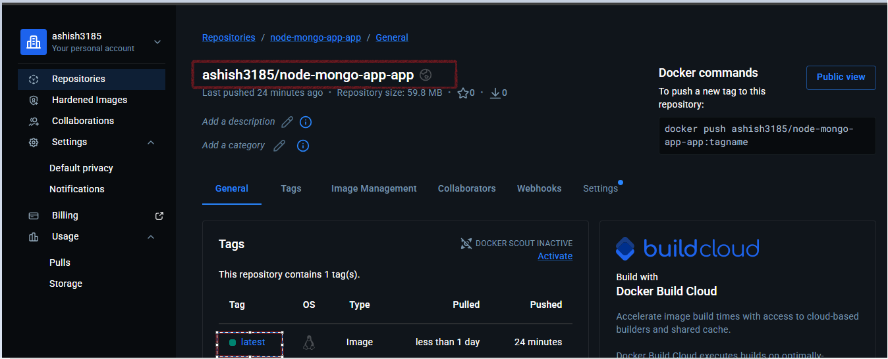
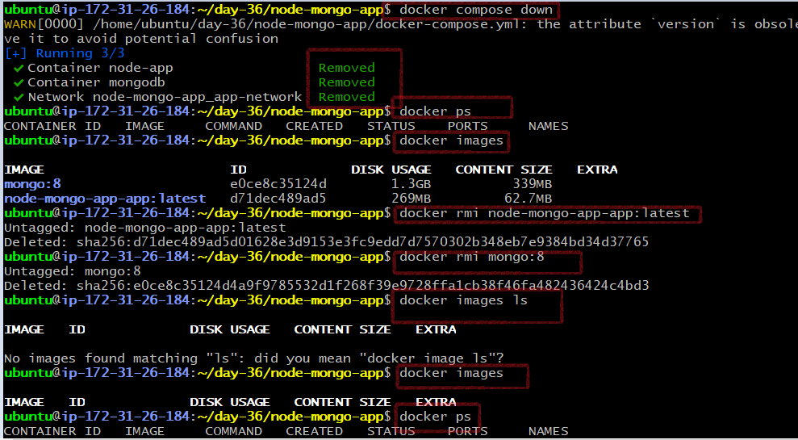
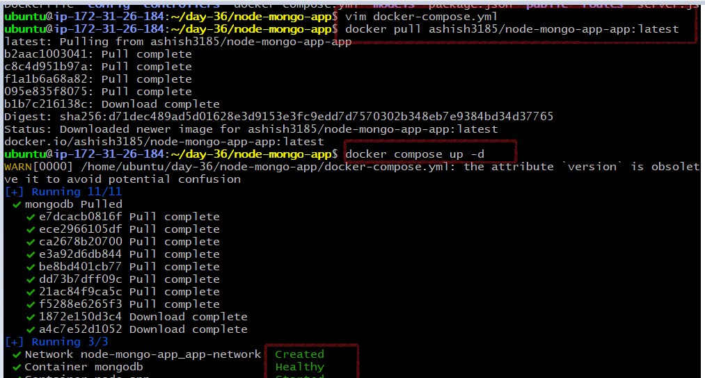
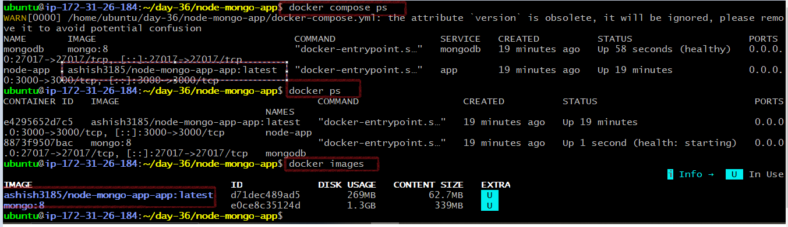
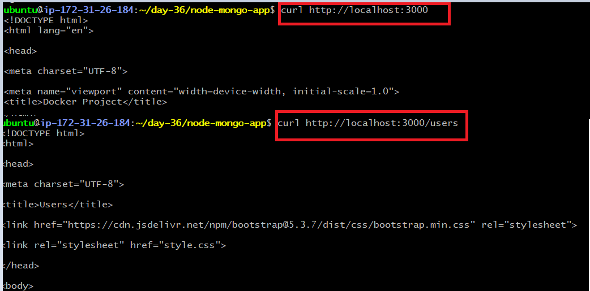
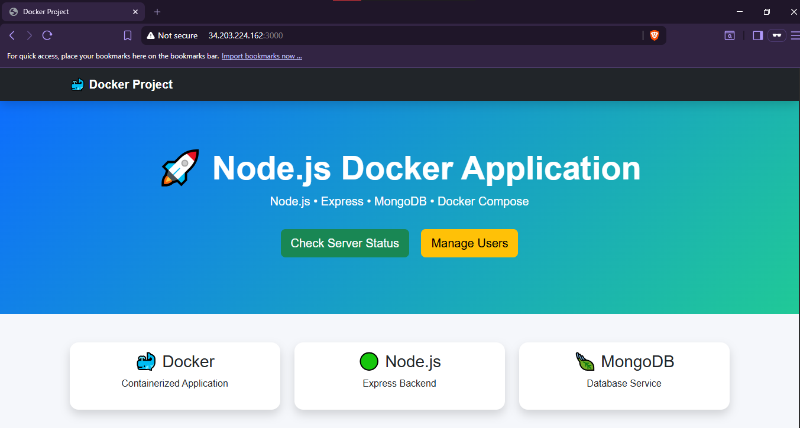

# Day 36 – Docker Project: Dockerize a Full Application

---

# Challenge Tasks

## Task 1: Application

### Application Chosen

**Node.js with MongoDB**

### Why I Chose This Application

I selected a Node.js Task Manager API because it represents a common backend application used in real-world environments. It demonstrates how a REST API communicates with a MongoDB database while running inside Docker containers. This project also provides hands-on experience with container networking, persistent storage, and Docker Compose.

**Project:** [`node-mongop-app`](./node-mongo-app)
---

## Task 2: Dockerfile

The application was containerized using a multi-stage Dockerfile to create a lightweight and production-ready image while following Docker best practices.

### Dockerfile Features

- Multi-stage Docker build
- Alpine Linux base image (`node:22-alpine`)
- Non-root container user
- Optimized image size
- Layer caching
- Production-ready configuration

[`Dockerfile`](./node-mongo-app/Dockerfile)

---

## Task 3: Docker Compose

Created a `docker-compose.yml` file to orchestrate the Node.js application and MongoDB database as a multi-container application.

The Compose file includes:

- Application service
- MongoDB service
- Named Docker volume
- Custom Docker network
- Environment variables using `.env`
- MongoDB Healthcheck
- Automatic restart policy

Run the project using:

```bash
docker compose up -d
```

[`docker-compose.yml`](./node-mongo-app/docker-compose.yml)

---

## Task 4: Ship It

### Docker Image

Tagged the locally built Docker image before publishing it to Docker Hub.

```bash
docker tag node-mongo-app-app:latest ashish3185/node-mongo-app-app:latest
```

### Push to Docker Hub

```bash
docker push ashish3185/node-mongo-app-app:latest
```

### Docker Hub Repository

https://hub.docker.com/repository/docker/ashish3185/node-mongo-app-app/general

---


## Project running on browser.






## Task 5: Test the Whole Flow

To verify that the image works independently of the local build:

1. Removed local application image.
2. Pulled the image from Docker Hub.
3. Modified the Docker Compose configuration to pull the image directly from Docker Hub instead of building it locally.
4. Started containers using Docker Compose.
5. Verified the application and MongoDB were running successfully.
6. Tested CRUD APIs successfully.


### Final Docker Images



### Docker Hub Push



### Fresh Deployment Test






## Running on broswer after pull from docker hub


---


# Learning Outcomes

During this project I learned how to:

- Containerize a Node.js application
- Build production-ready Docker images
- Use multi-stage Docker builds
- Create secure containers with non-root users
- Configure Docker Compose
- Configure Docker volumes and custom bridge networks
- Configure environment variables
- Publish Docker images to Docker Hub
- Verify deployments using pulled Docker images
- Troubleshoot common Docker deployment issues

---

# Conclusion

This project successfully demonstrated how to containerize a full-stack backend application using Docker and Docker Compose. By implementing a multi-stage Dockerfile, persistent storage, custom networking, health checks, and publishing the image to Docker Hub, I gained practical experience with production-style containerization and deployment workflows.