# Day 43 – Jobs, Steps, Env Vars & Conditionals

---

### Task 1: Multi-Job Workflow

Create `.github/workflows/multi-job.yml` with 3 jobs:

- `build` — prints "Building the app"
- `test` — prints "Running tests"
- `deploy` — prints "Deploying"

- Make `test` run only after `build` succeeds.
- Make `deploy` run only after `test` succeeds.

> **`needs`**:tells gitHub actions which job must finish before this job can start.

**Verify:** Check the workflow graph in the Actions tab — does it show the dependency chain?

- Yes, the workflow graph correctly shows the dependency chain using the `needs` keyword.

> Multi-Job Workflow:
>
> [Click here to view the workflow file.](./workflows/multi-job.yml)

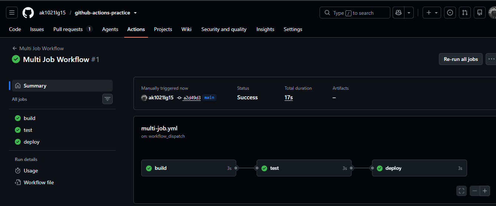

---

### Task 2: Environment Variables

In a new workflow, use environment variables at 3 levels:

1. Workflow level — `APP_NAME: myapp`
2. Job level — `ENVIRONMENT: staging`
3. Step level — `VERSION: 1.0.0`

Print all three in a single step and verify each is accessible.

Then use GitHub context variables to print the commit SHA and actor.

> **`env`**: Used to define variables at the workflow, job, or step level.
>
> **GitHub Context Variables**: Provide metadata about the workflow run, such as the commit SHA, actor, repository, and branch information.

**Verify:** Are all environment variables and GitHub context variables accessible?

- Yes, all environment variables and GitHub context variables were successfully printed during the workflow run.

> Environment Variables Workflow:
>
> [Click here to view the workflow file.](./workflows/env-vars.yml)

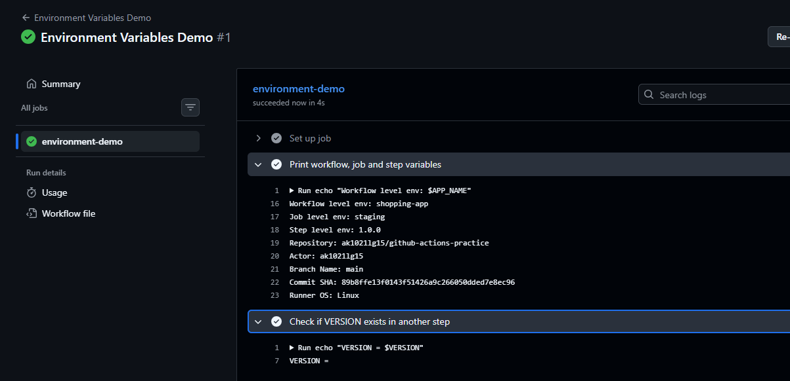

---

### Task 3: Job Outputs

1. Create a job that **sets an output** — e.g., today's date as a string
2. Create a second job that **reads that output** and prints it
3. Pass the value using `outputs:` and `needs.<job>.outputs.<name>`

> Job Outputs Workflow:
>
> [Click here to view the workflow file.](./workflows/job-outputs.yml)

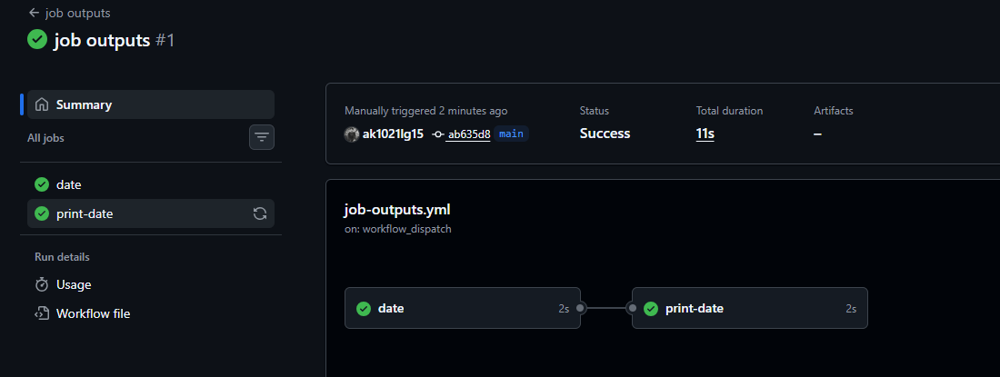

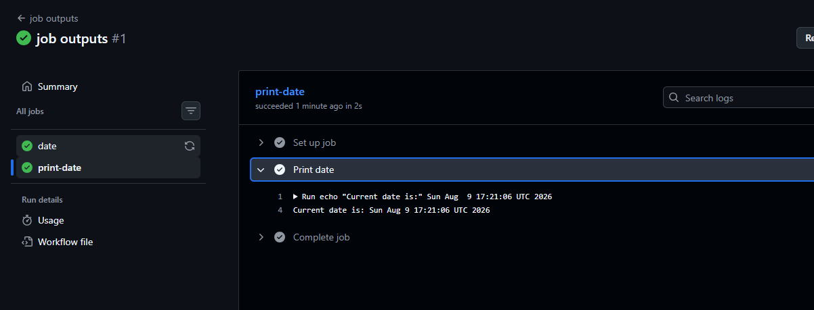

Why would you pass outputs between jobs?
- Each job runs separately, so Job 2 cannot see what Job 1 created.
- Outputs are used to pass that result from Job 1 to Job 2.

- Example:

- Job 1 – Build Docker image
    - This job builds the image and creates a tag for example:myapp:1.0.0

- Job 2 – Push image to registry
    - This job must know which image tag was created so it can push the correct image.

- Job 3 – Deploy the app
    - The deployment job also needs the same tag myapp:1.0.0 to deploy that exact image.

- Why pass outputs?
    - The tag created in Job 1 is passed as an output so the other jobs know exactly which Docker image to use.

---

### Task 4: Conditionals

In a workflow, add:

1. A step that only runs when the branch is `main`.
2. A step that only runs when the previous step failed.
3. A job that only runs on push events and not on pull requests.
4. A step with `continue-on-error: true`.

> **Conditionals (`if`)**: Used to control when a job or step should execute.
>
> **`failure()`**: Runs a step only when a previous step in the job has failed.
>
> **`continue-on-error: true`**: Allows a step to fail without failing the entire job or workflow.

**Verify:** Did all conditional jobs and steps behave as expected?

- Yes, all conditional jobs and steps executed according to their configured conditions.

> Conditionals Workflow:
>
> [Click here to view the workflow file.](./workflows/conditionals.yml)

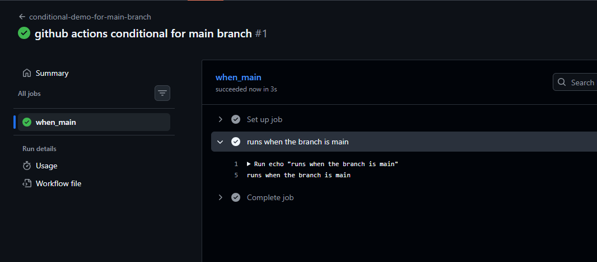

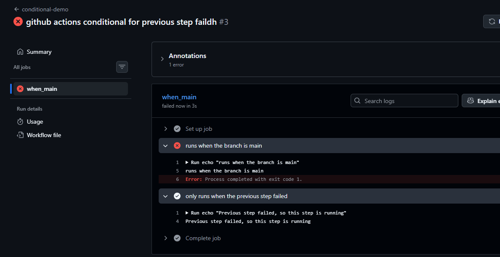

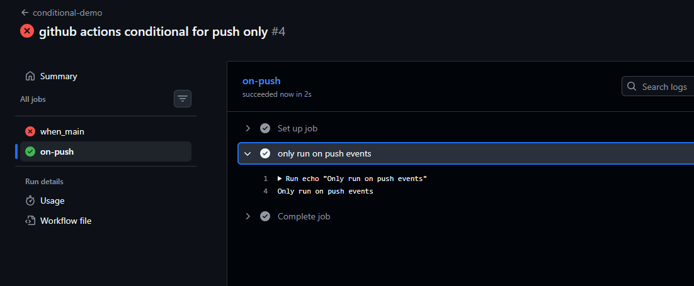

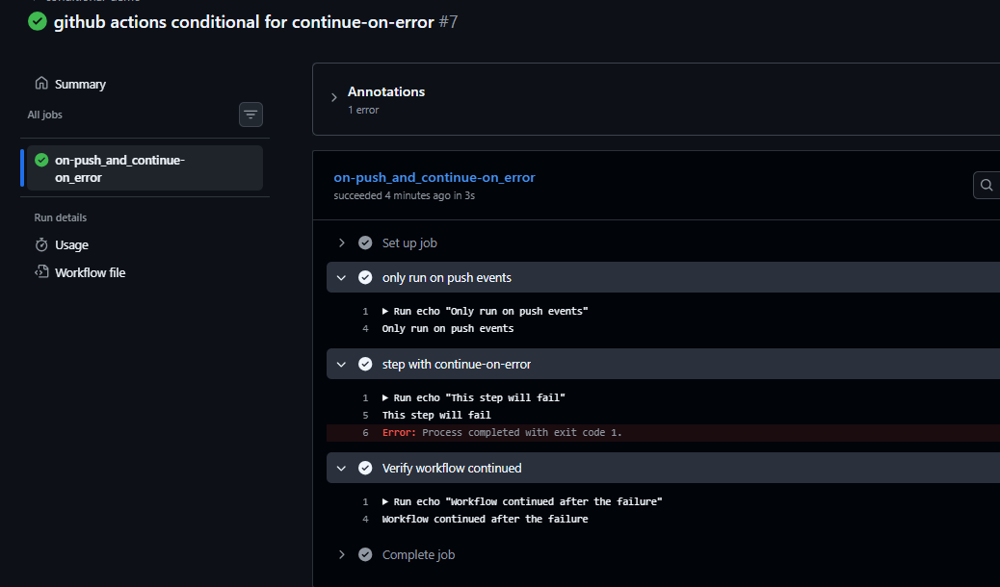

---

### Task 5: Putting It Together

Create `.github/workflows/smart-pipeline.yml` that:

1. Triggers on push to any branch.
2. Has `lint` and `test` jobs running in parallel.
3. Has a `summary` job that runs after all dependent jobs complete successfully.
4. Prints whether the workflow was triggered from the `main` branch or a feature branch.
5. Displays useful workflow information such as the commit message, actor, branch name, commit SHA, deployment environment, and application version.

> **`needs`**: Used to define job dependencies and control workflow execution order.
>
> **Parallel Jobs**: Jobs without dependencies run in parallel by default in GitHub Actions.
>
> **GitHub Context Variables**: Used to access workflow information such as branch name, actor, commit SHA, commit message, and repository details.
>
> **Conditional Logic**: Used to determine whether the workflow was triggered from the `main` branch or another branch.
>
> **Job Outputs**: Used to share the generated application version between jobs.

**Verify:** Did the Smart Pipeline execute successfully and display the expected workflow information?

- Yes, the Smart Pipeline executed successfully and displayed the expected workflow details in the summary job.

> Smart Pipeline Workflow:
>
> [Click here to view the workflow file.](./workflows/smart-pipeline.yml)

### Failed Pipeline

> The `lint` job was intentionally failed to demonstrate that dependent jobs (`generate-version`, `deploy`, and `summary`) are automatically skipped when a required job does not complete successfully.

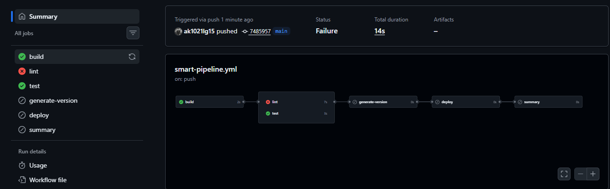

### Successful Pipeline

> All jobs completed successfully, and the Smart Pipeline executed in the expected order.

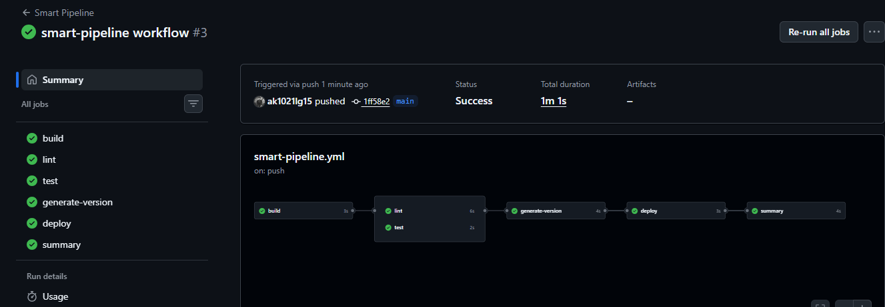

### Workflow Jobs

- **Build Job** – Builds the application.

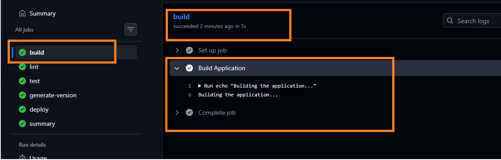

- **Lint Job** – Performs lint checks on the application.

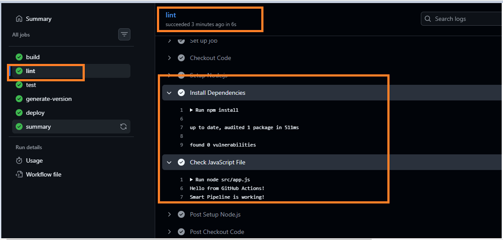

- **Test Job** – Runs the application's test stage.

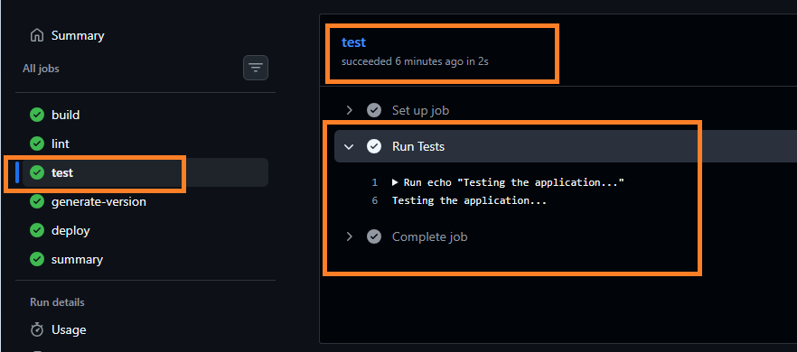

- **Generate Version Job** – Generates and shares the application version using job outputs.

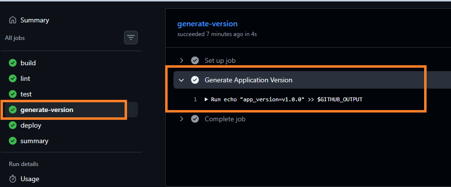

- **Deploy Job** – Simulates the deployment process using the generated application version.

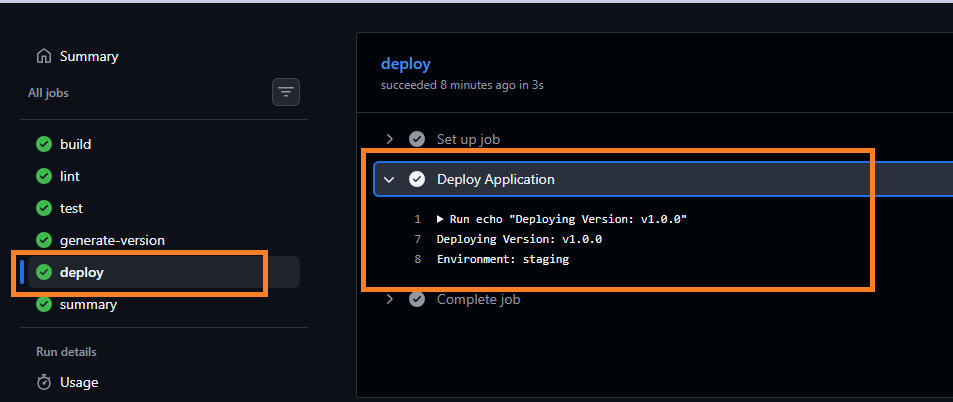

- **Summary Job** – Displays the pipeline summary, including branch information, commit details, deployment environment, and application version.

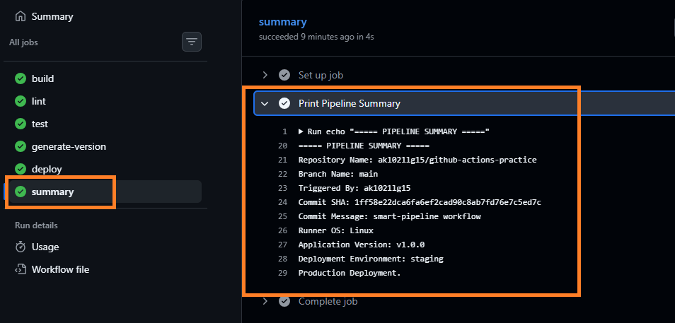

---