# Day 50 – Kubernetes Architecture and Cluster Setup

## Task 1: Recall the Kubernetes Story
Before touching a terminal, write down from memory:

### 1. Why was Kubernetes created? What problem does it solve that Docker alone cannot?

- Docker runs containers but doesn't manage them across multiple servers.
- Kubernetes was created to orchestrate containers at scale.
- It provides:
  - Auto Scaling
  - Auto Healing
  - Load Balancing
  - Rolling Updates
  - Service Discovery
  - Cluster Management

> **In short:** Docker runs containers, Kubernetes manages containers.

### 2. Who created Kubernetes and what was it inspired by?

- Kubernetes was created by **Google**.
- Inspired by Google's internal system **Borg**.
- Open-sourced in **2014**.
- Now maintained by the **Cloud Native Computing Foundation (CNCF).**

### 3. What does the name "Kubernetes" mean?

- Kubernetes is a Greek word.
- It means **"Helmsman"** or **"Captain of a Ship."**
- It represents managing and steering containers across a cluster.

---

## Task 2: Draw the Kubernetes Architecture
From memory, draw or describe the Kubernetes architecture. Your diagram should include:

**Control Plane (Master Node):**
- API Server — the front door to the cluster, every command goes through it
- etcd — the database that stores all cluster state
- Scheduler — decides which node a new pod should run on
- Controller Manager — watches the cluster and makes sure the desired state matches reality

**Worker Node:**
- kubelet — the agent on each node that talks to the API server and manages pods
- kube-proxy — handles networking rules so pods can communicate
- Container Runtime — the engine that actually runs containers (containerd, CRI-O)

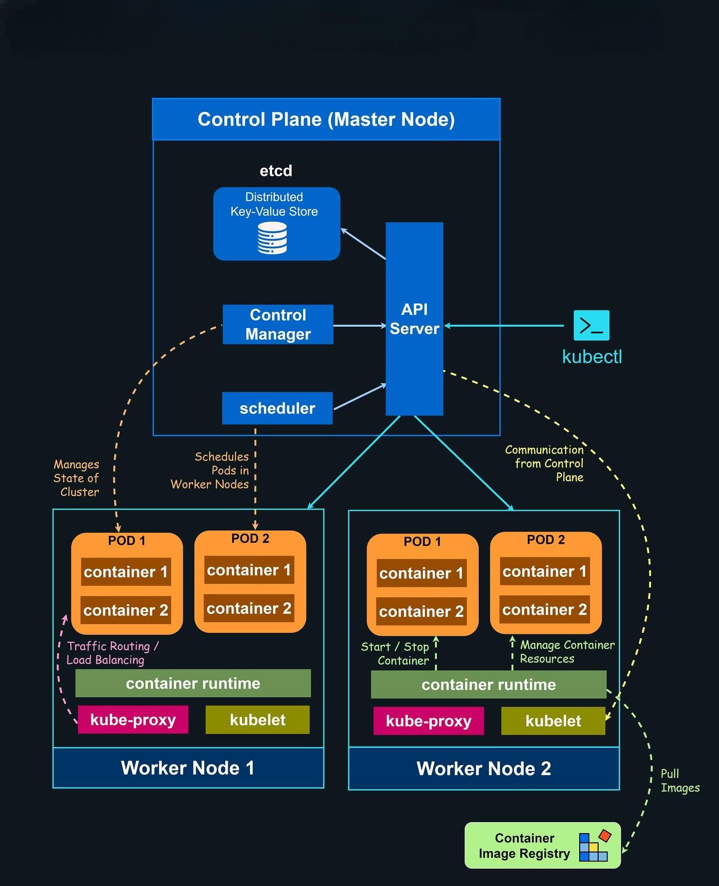

After drawing, verify your understanding:

### 🔹 What happens when you run `kubectl apply -f pod.yaml`?

- `kubectl` reads the `pod.yaml` file and sends the request to the Kubernetes **API Server**.
- The **API Server** authenticates, authorizes, and validates the request.
- If valid, the Pod object is stored in **etcd**.
- The **Scheduler** detects the unscheduled Pod and assigns it to a Worker Node.
- The **Kubelet** on the selected node receives the Pod specification from the API Server.
- The **Container Runtime** (e.g., containerd) pulls the image (if needed) and starts the container.
- The Pod status is updated to **Running** in the API Server.

### 🔹 What happens if the API Server goes down?

- `kubectl` commands and API requests stop working.
- Running Pods and Services continue working.
- No new Pods, Deployments, or scheduling can occur.
- Self-healing and cluster management are temporarily unavailable.

### 🔹 What happens if a Worker Node goes down?

- Pods running on that node become unavailable.
- Kubernetes detects the node failure and marks it **NotReady**.
- If the Pods are managed by a Deployment or ReplicaSet, replacement Pods are scheduled on healthy Worker Nodes.
- Traffic is automatically routed only to healthy Pods.

---

## Task 3: Install `kubectl`

`kubectl` is the command-line tool used to communicate with a Kubernetes cluster.

### Windows

```bash
winget install -e --id Kubernetes.kubectl
```

### Verify Installation
```bash
kubectl version --client
```
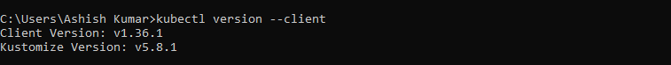

---

## Task 4: Set Up Your Local Kubernetes Cluster

I chose **KIND (Kubernetes IN Docker)** to create a local Kubernetes cluster.

### Install KIND (Windows)

```bash
curl.exe -Lo kind-windows-amd64.exe https://kind.sigs.k8s.io/dl/v0.33.0/kind-windows-amd64
Move-Item .\kind-windows-amd64.exe c:\some-dir-in-your-PATH\kind.exe
```
### Create a Cluster

```bash
kind create cluster --name devops-cluster
```
### Verify the Cluster

```bash
kubectl cluster-info
kubectl get nodes
```

### kind installation 

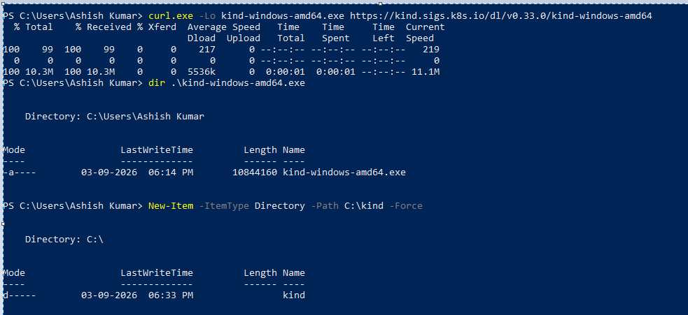

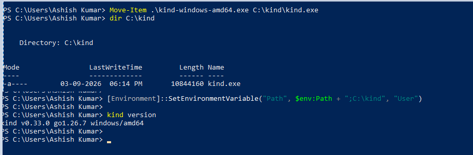

### Cluster Created

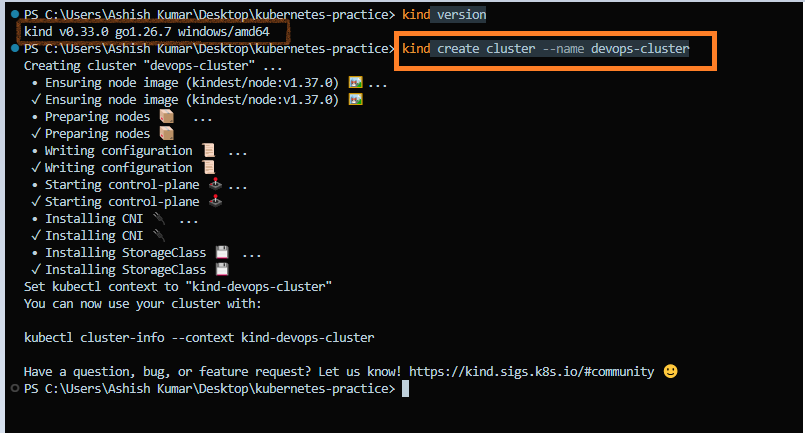

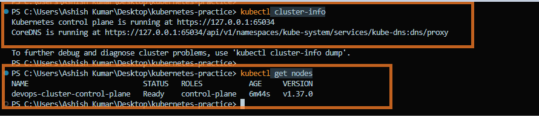

The Kubernetes cluster was created successfully, and the control plane node reached the **Ready** state.

- **Cluster Name:** `devops-cluster`
- **Cluster Endpoint:** `https://127.0.0.1:65034`
- **Node Name:** `devops-cluster-control-plane`
- **Role:** `control-plane`
- **Status:** `Ready`
- **Kubernetes Version:** `v1.37.0`

### Which one did you choose and why?

I chose **KIND (Kubernetes IN Docker)** because it is lightweight, fast, and easy to set up for local Kubernetes development.

KIND runs Kubernetes clusters inside Docker containers, allowing me to quickly create and delete clusters without requiring virtual machines or cloud infrastructure. It is ideal for learning Kubernetes, testing manifests, and practicing cluster administration in a local environment.

---

## Task 5: Explore Your Kubernetes Cluster

Now that your cluster is running, explore its components using the following commands.

### 1. View Cluster Information
```bash
kubectl cluster-info
```
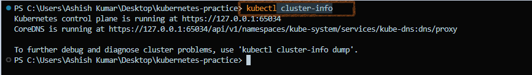

### 2. List All Nodes
```bash
kubectl get nodes
```
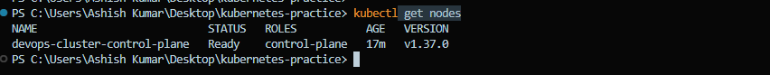

### 3. Describe the Control Plane Node
```bash
kubectl describe node devops-cluster-control-plane
```
This command displays detailed information about the `devops-cluster-control-plane` node, including its status, labels, resource capacity, conditions, running Pods, and events.

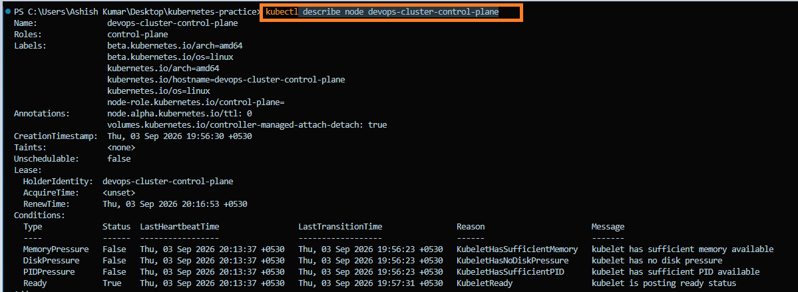

### 4. List All Namespaces
```bash
kubectl get namespaces
```
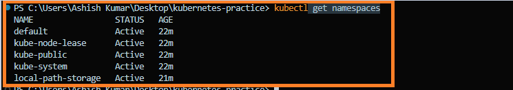

### 5. View All Pods
```bash
kubectl get pods -A
```
Displays Pods running across all namespaces, including the Kubernetes control plane and system components.

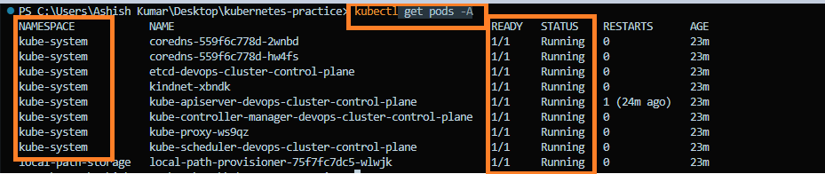

### 6. View Kubernetes System Pods
```bash
kubectl get pods -n kube-system
```

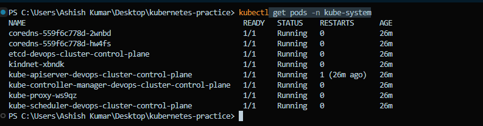

You should see pods like `etcd`, `kube-apiserver`, `kube-scheduler`, `kube-controller-manager`, `coredns`, and `kube-proxy`. These are the architecture components you drew in Task 2 — running as pods inside the cluster.

**Verify:** Can you match each running pod in `kube-system` to a component in your architecture diagram?

### Kubernetes System Pods

| Pod Name | Purpose |
|----------|---------|
| `coredns` | Provides DNS-based service discovery inside the cluster. |
| `etcd` | Stores the cluster configuration and desired state. |
| `kube-apiserver` | Entry point for all Kubernetes API requests. |
| `kube-controller-manager` | Maintains the desired state of the cluster. |
| `kube-scheduler` | Assigns newly created Pods to available nodes. |
| `kube-proxy` | Manages Service networking and load balancing. |
| `kindnet` | CNI plugin that enables Pod-to-Pod networking. |
| `local-path-provisioner` | Dynamically provisions local Persistent Volumes. |

### Pod Status

- **READY:** `1/1` → All containers in the Pod are running.
- **STATUS:** `Running` → The Pod is healthy and operational.
- **RESTARTS:** `0` → No container restarts have occurred.
- **AGE:** Time since the Pod was created.

### Verify Your Understanding

- `etcd` → Cluster Database
- `kube-apiserver` → API Server
- `kube-scheduler` → Scheduler
- `kube-controller-manager` → Controller Manager
- `kube-proxy` → Service Networking
- `coredns` → Cluster DNS
- `kindnet` → CNI Plugin
- `local-path-provisioner` → Storage Provisioner

---

## Task 6: Practice Cluster Lifecycle

Practice creating, deleting, and managing your Kubernetes cluster to build familiarity with the cluster lifecycle.

### 1. Delete the Cluster
```bash
kind delete cluster --name devops-cluster
```
### 2. Recreate the Cluster
```bash
kind create cluster --name devops-cluster
```
### 3. Verify the Cluster
```bash
kubectl get nodes
```
### 4. Check the Current Context
```bash
kubectl config current-context
```
Displays the Kubernetes cluster that `kubectl` is currently connected to.

### 5. List All Available Contexts
```bash
kubectl config get-contexts
```
Displays all configured Kubernetes contexts and highlights the active one.

### 6. View the kubeconfig File
```bash
kubectl config view
```
Displays the complete Kubernetes configuration, including clusters, users, and contexts.


### Verify Your Understanding

#### What is a kubeconfig?
- **kubeconfig** is the configuration file used by `kubectl` to connect to Kubernetes clusters.
- **KIND** automatically updates the kubeconfig when a cluster is created.
- It stores cluster information, user credentials, and contexts.

#### Where is it stored?
- **Linux / macOS:** `~/.kube/config`
- **Windows:** `%USERPROFILE%\.kube\config`

---

### Key Commands
| Command | Purpose |
|---------|---------|
| `kind delete cluster --name devops-cluster` | Delete the cluster |
| `kind create cluster --name devops-cluster` | Create the cluster |
| `kubectl get nodes` | Verify the cluster |
| `kubectl config current-context` | Show the active context |
| `kubectl config get-contexts` | List all contexts |
| `kubectl config view` | View the kubeconfig |