# Day 51 – Kubernetes Manifests and Your First Pods

## The Anatomy of a Kubernetes Manifest

Every Kubernetes resource is defined using a YAML manifest with four required top-level fields:

```yaml
apiVersion: v1          # Which API version to use
kind: Pod               # What type of resource
metadata:               # Name, labels, namespace
  name: my-pod
  labels:
    app: my-app
spec:                   # The actual specification (what you want)
  containers:
  - name: my-container
    image: nginx:latest
    ports:
    - containerPort: 80
```

- `apiVersion` — tells Kubernetes which API group to use. For Pods, it is `v1`.
- `kind` — the resource type. Today it is `Pod`. Later you will use `Deployment`, `Service`, etc.
- `metadata` — the identity of your resource. `name` is required. `labels` are key-value pairs used for organization and selection.
- `spec` — the desired state. For a Pod, this means which containers to run, which images, which ports, etc.

---

### Task 1: Create Your First Pod (Nginx)
Create a file called `nginx-pod.yaml`:

```yaml
apiVersion: v1
kind: Pod
metadata:
  name: nginx-pod
  labels:
    app: nginx
spec:
  containers:
  - name: nginx
    image: nginx:latest
    ports:
    - containerPort: 80
```

**Manifest file:** [`nginx-pod.yaml`](./manifests/nginx-pod.yaml)

Apply it:
```bash
kubectl apply -f nginx-pod.yaml
```
Verify:
```bash
kubectl get pods
kubectl get pods -o wide
```

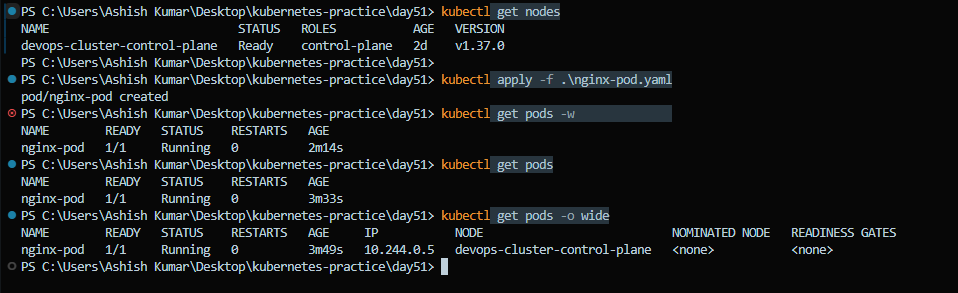

Wait until the STATUS shows `Running`. Then explore:
```bash
# Detailed info about the pod
kubectl describe pod nginx-pod
```
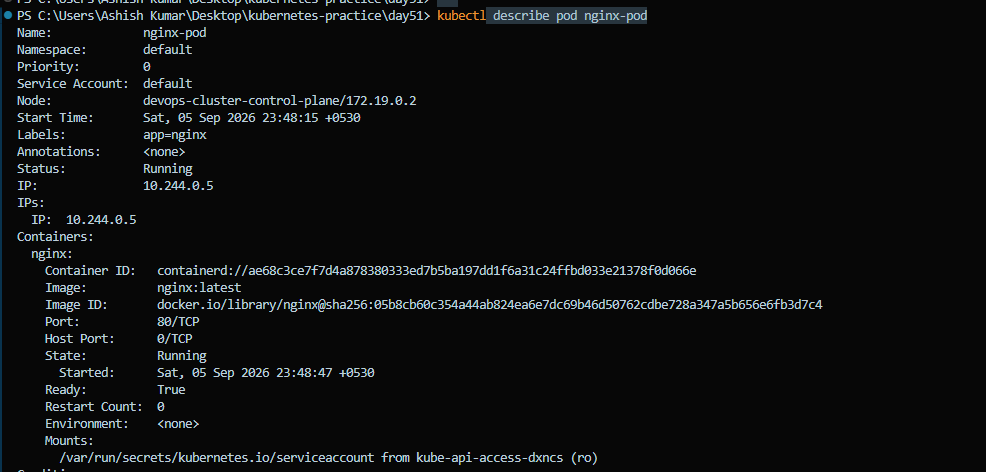

```bash
# Read the logs
kubectl logs nginx-pod
```
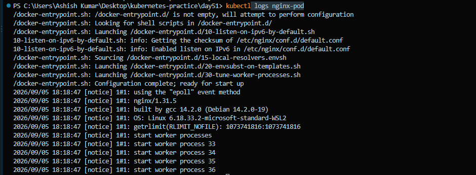

```bash
# Get a shell inside the container
kubectl exec -it nginx-pod -- /bin/bash

# Inside the container, run:
curl localhost:80
exit
```

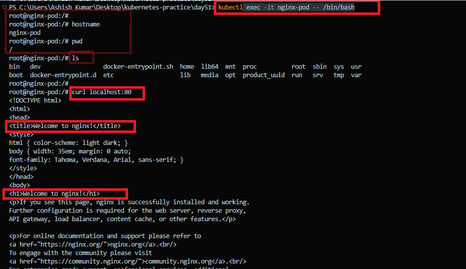

**Verification** 
- Successfully accessed the container and confirmed the Nginx Welcome page using: ```curl localhost:80```

---

### Task 2: Create a Custom Pod (BusyBox)
Write a new manifest `busybox-pod.yaml` from scratch (do not copy-paste the nginx one):

```yaml
apiVersion: v1
kind: Pod
metadata:
  name: busybox-pod
  labels:
    app: busybox
    environment: dev
spec:
  containers:
  - name: busybox
    image: busybox:latest
    command: ["sh", "-c", "echo Hello from BusyBox && sleep 3600"]
```
**Manifest file:** [`busybox-pod.yaml`](./manifests/busybox-pod.yaml)

Apply and verify:
```bash
kubectl apply -f busybox-pod.yaml
kubectl get pods
kubectl logs busybox-pod
```
> **Why use the `command` field?**
>
> Unlike Nginx, BusyBox does not start a long-running process by default. If no command keeps the container alive, it exits immediately, causing the Pod to repeatedly restart (`CrashLoopBackOff`). Here, `sleep 3600` keeps the container running for one hour.

**Verification** 
- Successfully created the BusyBox Pod and confirmed the following log output: ```Hello from BusyBox```

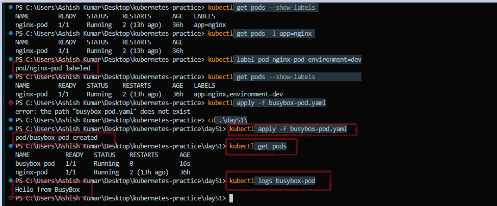
---

### Task 3: Imperative vs Declarative

So far, you've been using the **declarative approach**, where you define resources in a YAML manifest and apply them using `kubectl apply`. Kubernetes also supports an **imperative approach**, which lets you create resources directly from the command line.

Create a Pod using an imperative command:

```bash
# Create a Pod without a YAML manifest
kubectl run redis-pod --image=redis:latest

# Verify the Pod
kubectl get pods
```
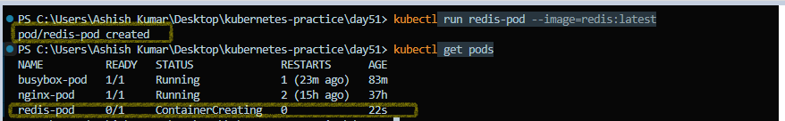

Export the generated Pod definition as YAML:

```bash
kubectl get pod redis-pod -o yaml
```
**Manifest file:** [`redis-generated.yaml`](./manifests/redis-generated.yaml)

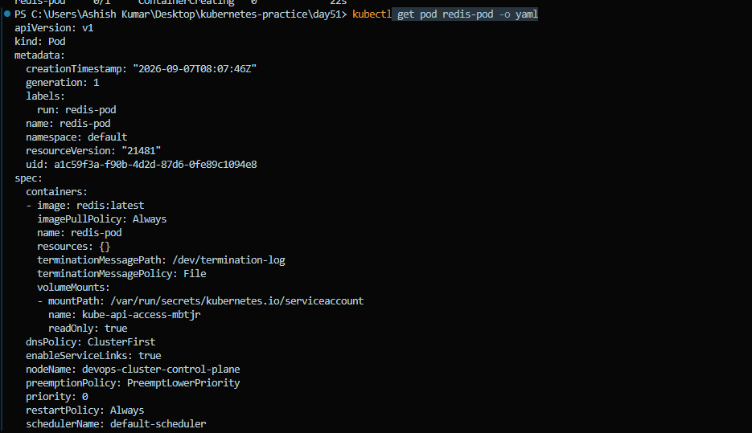

Notice that Kubernetes automatically adds metadata such as:

- `uid`
- `creationTimestamp`
- `resourceVersion`
- `managedFields`
- `status`

These fields are generated by the Kubernetes API Server and are typically not included in hand-written manifests.

Generate a Pod manifest without creating the Pod:

```bash
kubectl run test-pod --image=nginx --dry-run=client -o yaml
```

**Manifest file:** [`test-pod.yaml`](./manifests/test-pod.yaml)

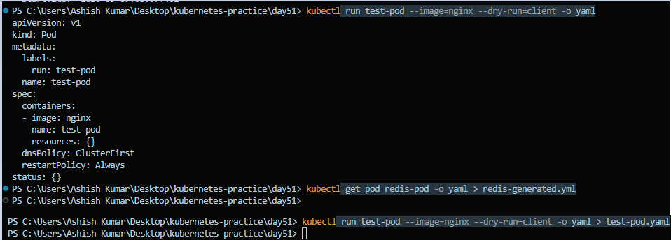

Using `--dry-run=client -o yaml` is a convenient way to scaffold a manifest. You can save the generated YAML, modify it as needed, and then apply it later.

**Verification** 
- Saved the dry-run output to a file and compared it with `nginx-pod.yaml`.

**Common fields**
- `apiVersion`
- `kind`
- `metadata.name`
- `spec.containers`
- `image`
- `restartPolicy`

**Differences**
- The generated manifest includes the default label `run: test-pod`.
- The container name is automatically set to `test-pod`.
- The hand-written manifest contains custom labels (`app: nginx`).
- The hand-written manifest is cleaner and includes only the fields required for deployment.

---

### Task 4: Validate Before Applying

Before creating resources in a Kubernetes cluster, it's a good practice to validate your manifest. This helps catch configuration errors early without creating any resources.

Validate the manifest locally:

```bash
# Validate the manifest without creating the resource
kubectl apply -f nginx-pod.yaml --dry-run=client
```

Validate against the Kubernetes API Server:

```bash
# Validate the manifest using the cluster's API
kubectl apply -f nginx-pod.yaml --dry-run=server
```

Create an invalid manifest by removing the `image` field (or adding an unsupported field) and save it as:

**Manifest file:** [`broken-nginx.yaml`](./manifests/broken-nginx.yaml)

Run the validation again:

```bash
kubectl apply -f broken-nginx.yaml --dry-run=client
kubectl apply -f broken-nginx.yaml --dry-run=server
```
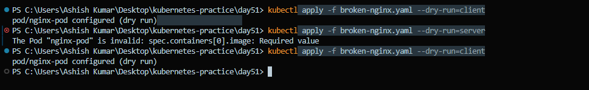

Notice how Kubernetes reports validation errors without creating any resources. Using `--dry-run` is a safe way to verify manifests before deployment.

**Verification** 
- Kubernetes returned an error because the required `image` field was missing from the container specification.

Example error:

```text
error: error validating "broken-nginx.yaml":
ValidationError(Pod.spec.containers[0]):
missing required field "image" in io.k8s.api.core.v1.Container
```
This validation helps identify manifest issues before they are applied to the cluster.

---

### Task 5: Pod Labels and Filtering

Labels help organize Kubernetes resources and make it easy to select, group, and manage them.

View all Pods along with their labels:

```bash
# Display Pods with their labels
kubectl get pods --show-labels
```
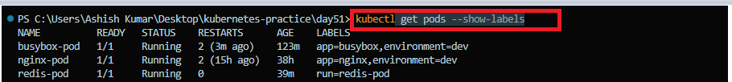

Filter Pods using labels:

```bash
# Filter Pods by label
kubectl get pods -l app=nginx
kubectl get pods -l environment=dev
```

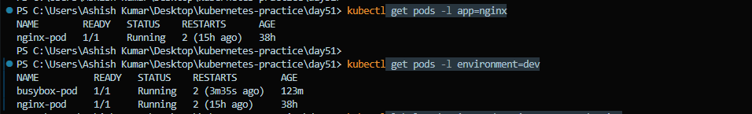

Add a new label to an existing Pod:

```bash
kubectl label pod nginx-pod environment=production
```

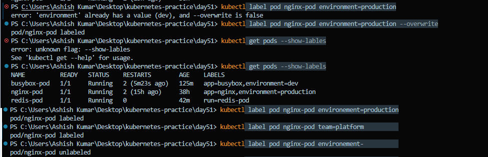

Verify the updated labels:

```bash
kubectl get pods --show-labels
```

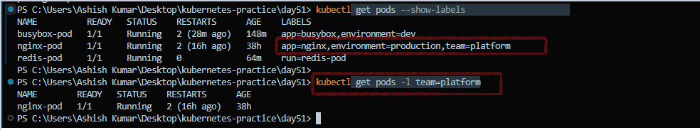

Remove the label:

```bash
kubectl label pod nginx-pod environment-
```

Create a third Pod manifest with at least three labels (`app`, `environment`, and `team`).

**Manifest file:** [`tools-pod.yaml`](./manifests/tools-pod.yaml)

Apply the manifest and verify the Pod:

```bash
kubectl apply -f tools-pod.yaml
kubectl get pods --show-labels
```

Practice filtering using different labels:

```bash
kubectl get pods -l app=tools
kubectl get pods -l environment=dev
kubectl get pods -l team=platform
```

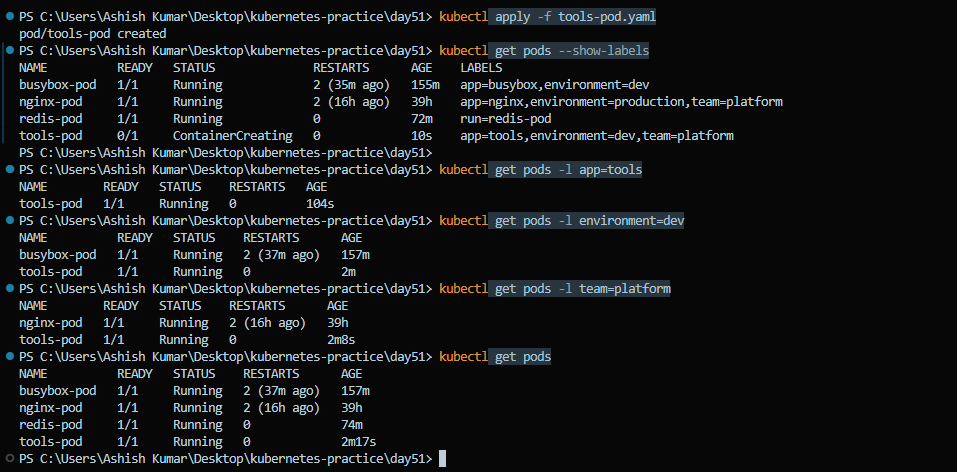

**Verification**
- Successfully viewed, added, updated, and removed Pod labels.
- Created a new Pod with multiple labels and verified label-based filtering using the `-l` option.

**Example labels**

| Label | Value |
|--------|-------|
| `app` | `tools` |
| `environment` | `dev` |
| `team` | `platform` |

---

### Task 6: Clean Up

After completing the lab, delete all the Pods you created to keep your cluster clean.

Delete the Pods by name:

```bash
kubectl delete pod nginx-pod
kubectl delete pod busybox-pod
kubectl delete pod redis-pod
kubectl delete pod tools-pod
```

You can also delete resources using their manifest files:

```bash
kubectl delete -f nginx-pod.yaml
kubectl delete -f busybox-pod.yaml
kubectl delete -f tools-pod.yaml
```

Verify that all Pods have been removed:

```bash
kubectl get pods
```

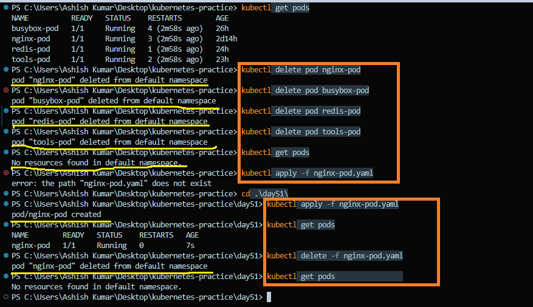

> **Note**
>
> Standalone Pods are not self-healing. Once a Pod is deleted, Kubernetes does not recreate it because there is no controller managing it. In production environments, Pods are typically managed by higher-level controllers such as **Deployments**, which automatically recreate Pods if they fail or are deleted.

**Verification**

- Successfully deleted all Pods.
- Verified that no Pods remain in the namespace.

```bash
kubectl get pods
```

Expected output:

```text
No resources found in default namespace.
```

---

## Imperative vs Declarative

| **Imperative** | **Declarative** |
|----------------|-----------------|
| Directly tells Kubernetes **what to do** using commands like `kubectl run`. | Describes the **desired state** using a YAML manifest and applies it with `kubectl apply -f`. |
| No manifest is stored unless you explicitly export it. | Requires a YAML or JSON manifest file. |
| Harder to reproduce because commands must be run manually each time. | Easy to reproduce because manifests can be version-controlled and reused. |
| Best for quick experiments, testing, and one-off tasks. | Best for production environments, automation, and CI/CD pipelines. |
| Changes are made directly from the command line. | Changes are managed by updating the manifest and reapplying it. |
| Not ideal for collaboration or tracking changes. | Ideal for GitOps, team collaboration, and infrastructure as code. |

### Quick Summary

- **Imperative:** Tell Kubernetes **how** to perform an action.
- **Declarative:** Tell Kubernetes **what** the desired state should be, and let Kubernetes reconcile it.

---

### Key Takeaways

- Learned the structure of a Kubernetes Pod manifest.
- Created Pods using both declarative and imperative approaches.
- Explored Pods using `describe`, `logs`, and `exec`.
- Generated manifests with `--dry-run`.
- Validated manifests before deployment.
- Used labels and selectors to organize and filter Pods.
- Cleaned up Kubernetes resources after completing the lab.