# Day 52 – Kubernetes Namespaces and Deployments


### Task 1: Explore Default Namespaces
Kubernetes comes with built-in namespaces. List them:

```bash
kubectl get namespaces
```

You should see at least:
- `default` — where your resources go if you do not specify a namespace
- `kube-system` — Kubernetes internal components (API server, scheduler, etc.)
- `kube-public` — publicly readable resources
- `kube-node-lease` — node heartbeat tracking

Check what is running inside `kube-system`:
```bash
kubectl get pods -n kube-system
```

These are the control plane components keeping your cluster alive. Do not touch them.

**Verify:** How many pods are running in `kube-system`?

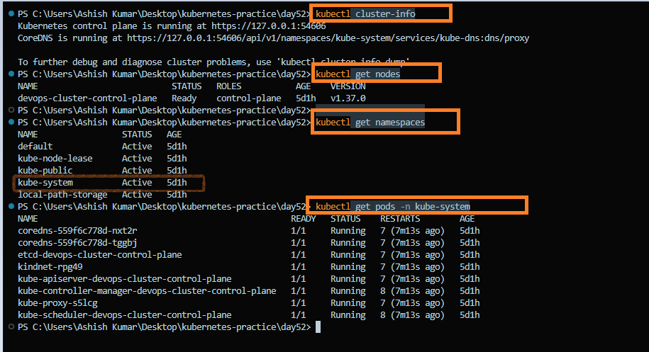

---

### Task 2: Create and Use Custom Namespaces

Create two namespaces—one for development and one for staging:

```bash
kubectl create namespace dev
kubectl create namespace staging
```

Verify they exist:

```bash
kubectl get namespaces
```

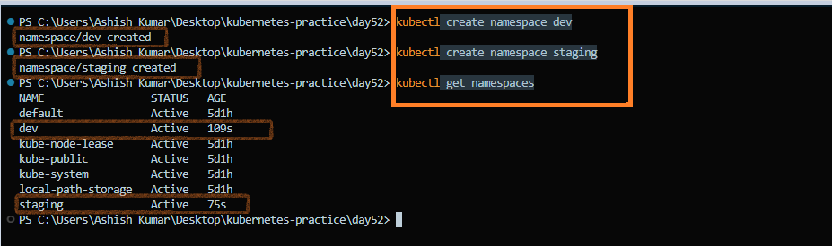

You can also create a namespace using a manifest:

```yaml
# namespace.yml
apiVersion: v1
kind: Namespace
metadata:
  name: production
```

**Manifest:** [`namespace.yml`](./manifests/namespace.yml)

Apply the manifest:

```bash
kubectl apply -f namespace.yml
```

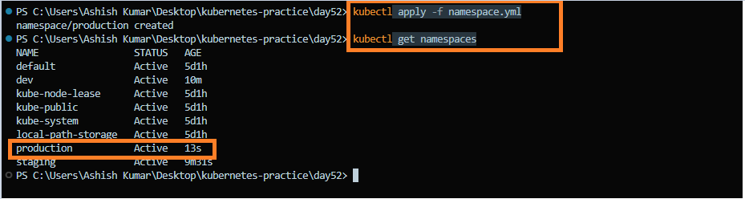

Create Pods in the `dev` and `staging` namespaces:

```bash
kubectl run nginx-dev --image=nginx:latest -n dev

kubectl run nginx-staging --image=nginx:latest -n staging
```

List Pods across all namespaces:

```bash
kubectl get pods -A
```

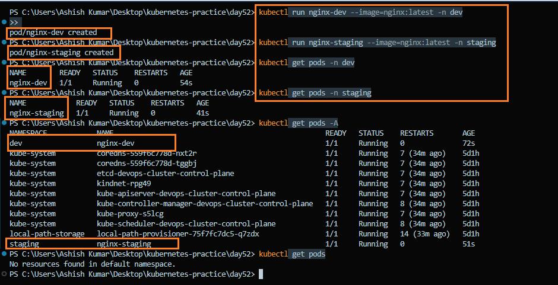

By default, `kubectl get pods` only checks the **default** namespace. Use `-n <namespace>` to view a specific namespace or `-A` to view Pods across all namespaces.

**Observation:**

- `kubectl get pods` showed **no Pods** because no Pods were running in the **default** namespace.
- `kubectl get pods -A` displayed the Pods running in the **dev** and **staging** namespaces.

> **Note:** Kubernetes commands operate on the **default** namespace unless another namespace is specified with `-n`, or all namespaces are requested using `-A`.

---
### Task 3: Create Your First Deployment

A Deployment ensures the desired number of Pods are always running. If a Pod fails or is deleted, Kubernetes automatically creates a replacement.

Create `nginx-deployment.yaml`:

```yaml
apiVersion: apps/v1
kind: Deployment
metadata:
  name: nginx-deployment
  namespace: dev
  labels:
    app: nginx
spec:
  replicas: 3
  selector:
    matchLabels:
      app: nginx
  template:
    metadata:
      labels:
        app: nginx
    spec:
      containers:
      - name: nginx
        image: nginx:1.24
        ports:
        - containerPort: 80
```

**Key Points:**
- `replicas: 3` maintains 3 identical Pods.
- `selector.matchLabels` connects the Deployment to its Pods.
- `template` defines the Pod blueprint.

**Manifest:** [`nginx-deployment.yaml`](./manifests/nginx-deployment.yaml)

Apply and verify:

```bash
kubectl apply -f nginx-deployment.yaml

kubectl get deployments -n dev
kubectl get pods -n dev
kubectl get rs -n dev
```

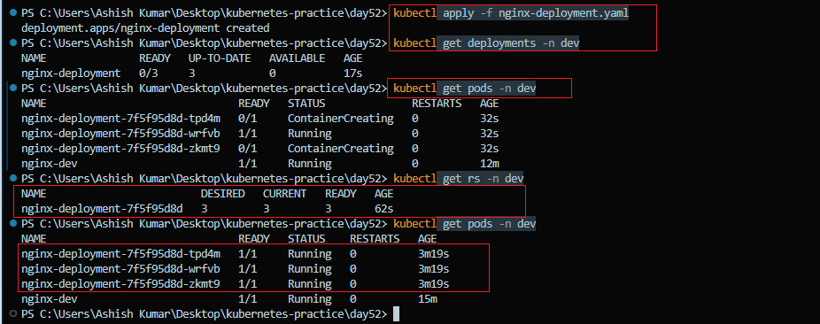

The Deployment creates 3 Pods with names like `nginx-deployment-xxxxx-yyyyy`.

**Observation:**
- **READY:** Pods ready to serve traffic (`ready/desired`).
- **UP-TO-DATE:** Pods running the latest Deployment specification.
- **AVAILABLE:** Pods that are ready and meet the Deployment's availability requirements.

> **Note:** A Deployment manages Pods through a ReplicaSet and continuously works to maintain the desired state.

---

### Task 4: Self-Healing — Delete a Pod and Watch It Come Back

One of the key features of a Deployment is **self-healing**. If a Pod fails or is deleted, Kubernetes automatically creates a new one to maintain the desired number of replicas.

```bash
# List Pods
kubectl get pods -n dev

# Delete one of the Deployment Pods
kubectl delete pod <pod-name> -n dev

# Watch the new Pod being created
kubectl get pods -n dev -w
```

The Deployment detects that only **2 of the desired 3 Pods** are running. The ReplicaSet immediately creates a replacement Pod to restore the desired state.

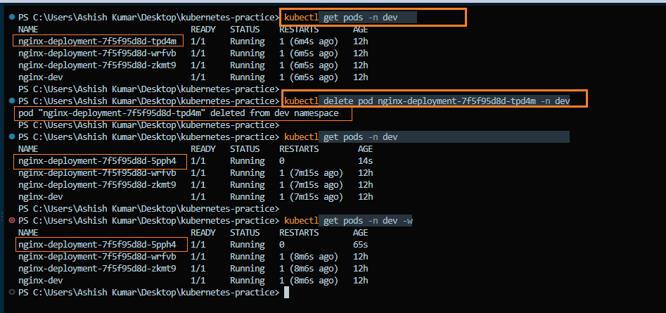

**Observation:**

- The replacement Pod had a **different name** but the **same Deployment/ReplicaSet prefix**.
- Kubernetes automatically created a new Pod to maintain **3 running replicas**.

> **Note:** Deployments provide **self-healing** by working with ReplicaSets to continuously maintain the desired number of Pods.

---

### Task 5: Scale the Deployment

Scale the Deployment by changing the number of replicas.

Scale up to **5** replicas:

```bash
kubectl scale deployment nginx-deployment --replicas=5 -n dev

kubectl get pods -n dev
```

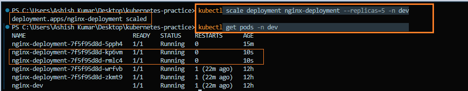

Scale down to **2** replicas:

```bash
kubectl scale deployment nginx-deployment --replicas=2 -n dev

kubectl get pods -n dev
```

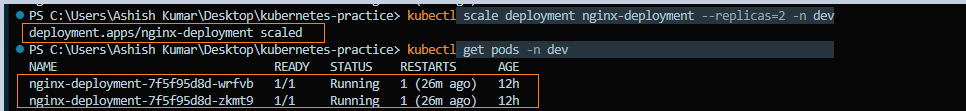

Kubernetes automatically creates or removes Pods to match the desired number of replicas.

You can also scale by updating the manifest (for example, change `replicas: 4`) and reapplying it:

```bash
kubectl apply -f nginx-deployment.yaml
```

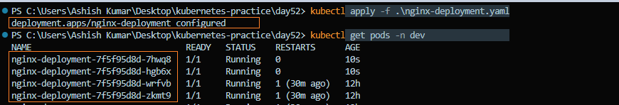

**Observation:**

- Scaling from **5** to **2** replicas automatically terminated the extra Pods.
- Kubernetes maintained only the desired **2 running replicas** by removing the additional Pods.

> **Note:** Kubernetes continuously reconciles the actual state with the desired state. When the replica count changes, it automatically creates or removes Pods to match the specified number.

---

### Task 6: Rolling Update

Update the Nginx image to trigger a rolling update:

```bash
kubectl set image deployment/nginx-deployment nginx=nginx:1.25 -n dev
```

Monitor the rollout:

```bash
kubectl rollout status deployment/nginx-deployment -n dev
```

Kubernetes performs a **rolling update**, replacing Pods one by one. New Pods become ready before old Pods are terminated, helping achieve minimal or zero application downtime.

View the rollout history:

```bash
kubectl rollout history deployment/nginx-deployment -n dev
```

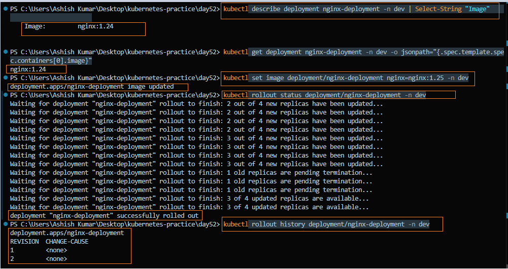

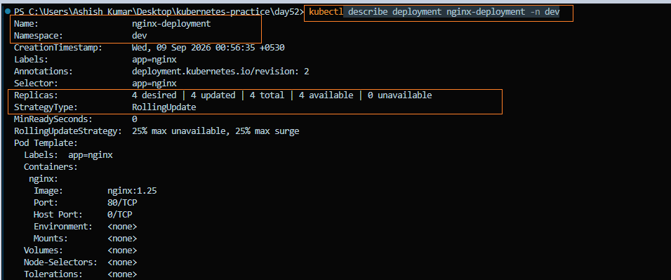

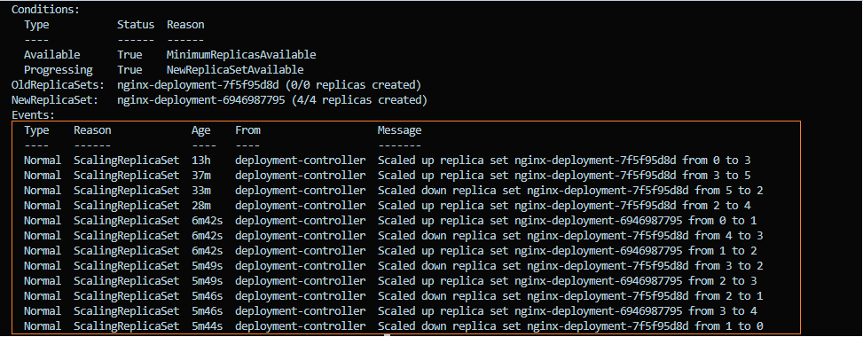

Roll back to the previous version:

```bash
kubectl rollout undo deployment/nginx-deployment -n dev

kubectl rollout status deployment/nginx-deployment -n dev
```

Verify the running image:

```bash
kubectl describe deployment nginx-deployment -n dev | grep Image
```

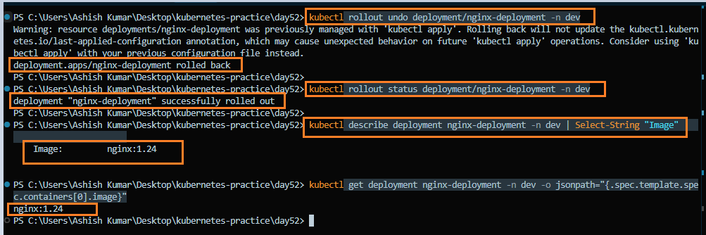

**Observation:**

- The rolling update upgraded the Deployment from **`nginx:1.24`** to **`nginx:1.25`** without recreating all Pods at once.
- After executing the rollback, the Deployment successfully reverted to **`nginx:1.24`**.

> **Note:** Rolling updates enable safe application upgrades with minimal downtime, while rollbacks allow you to quickly restore the previous stable version if an update introduces issues.


---

### Task 7: Clean Up

Delete all resources created during this lab:

```bash
kubectl delete deployment nginx-deployment -n dev

kubectl delete pod nginx-staging -n staging

kubectl delete namespace dev staging production
```

> **Note:** Deleting a namespace removes all resources inside it. Use this command carefully in production environments.

Verify the cleanup:

```bash
kubectl get namespaces

kubectl get pods -A
```

Before deleting pods and namespaces

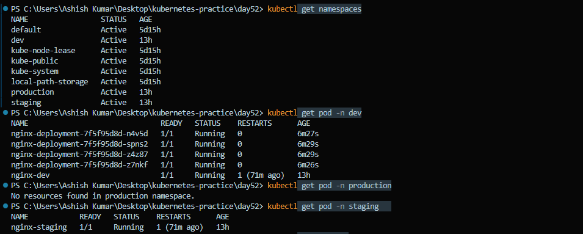

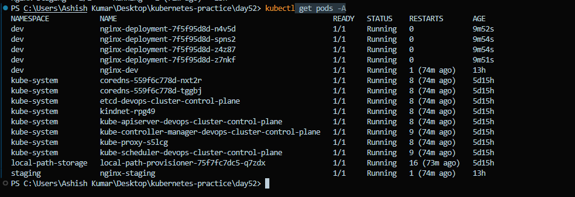

After deleting pods and namespaces

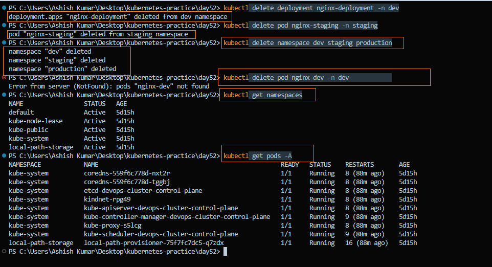

**Observation:**

- The Deployment and test Pods were deleted successfully.
- The `dev`, `staging`, and `production` namespaces were removed.
- Only the default Kubernetes namespaces `(default, kube-system, kube-public, kube-node-lease, etc.)` remained.

> **Note:** Cleaning up unused resources helps keep the cluster organized and prevents unnecessary resource consumption.

---

### Key Concepts Learned

### 🔹 Namespaces
- Provide **logical isolation** within a Kubernetes cluster.
- Used to organize resources and separate environments like **dev**, **staging**, and **production**.

### 🔹 Deployment Manifest Components
- `apiVersion` & `kind` – Define the resource as a Deployment.
- `metadata` – Deployment name, namespace, and labels.
- `spec.replicas` – Desired number of Pods.
- `spec.selector` – Selects the Pods managed by the Deployment.
- `spec.template` – Blueprint used to create Pods.
- `containers` – Defines the container image and configuration.

### 🔹 Deployment vs Standalone Pod
- **Deployment:** Automatically recreates deleted or failed Pods and maintains the desired number of replicas.
- **Standalone Pod:** Deleted Pods are **not** recreated automatically.

### 🔹 Scaling
- **Imperative:** `kubectl scale deployment <deployment-name> --replicas=<count>`
- **Declarative:** Update `replicas` in the Deployment manifest and run `kubectl apply -f`.

### 🔹 Rolling Updates & Rollbacks
- **Rolling Update:** Gradually replaces old Pods with new ones, minimizing downtime.
- **Rollback:** Restores the previous Deployment revision if an update fails.

### 🔹 ReplicaSet
- Created automatically by a Deployment.
- Ensures the desired number of Pod replicas are always running.
- Creates replacement Pods if an existing Pod is deleted or fails.

---

### Summary

In this lab, I learned how to:

- Explore Kubernetes default namespaces.
- Create and manage custom namespaces for environment isolation.
- Deploy applications using Kubernetes Deployments.
- Understand the relationship between Deployments, ReplicaSets, and Pods.
- Observe Kubernetes self-healing by deleting a Pod.
- Scale applications using both imperative and declarative approaches.
- Perform rolling updates and rollbacks.
- Clean up Kubernetes resources safely.