# Day 53 – Kubernetes Services

## Task 1: Deploy the Application

Before exposing an application with a Service, create a Deployment to manage the Pods.

Create **`app-deployment.yaml`**:

```yaml
apiVersion: apps/v1
kind: Deployment
metadata:
  name: web-app
  labels:
    app: web-app
spec:
  replicas: 3
  selector:
    matchLabels:
      app: web-app
  template:
    metadata:
      labels:
        app: web-app
    spec:
      containers:
      - name: nginx
        image: nginx:1.25
        ports:
        - containerPort: 80
```

**Manifest:** [`app-deployment.yaml`](./manifests/app-deployment.yaml)

```bash
kubectl apply -f app-deployment.yaml
kubectl get pods -o wide
```

> **Note:** Pod IPs are temporary and change if Pods are recreated. Kubernetes Services provide a stable IP and DNS name to access Pods reliably.

**Verify:**
- Are all 3 Pods running?
- Note their IP addresses.

**Result:**
- All 3 Pods are running successfully.
- Each Pod received a unique IP address.
- Deleting a Pod automatically created a new Pod with a different IP address, demonstrating why Kubernetes Services provide a stable endpoint instead of relying on Pod IPs.

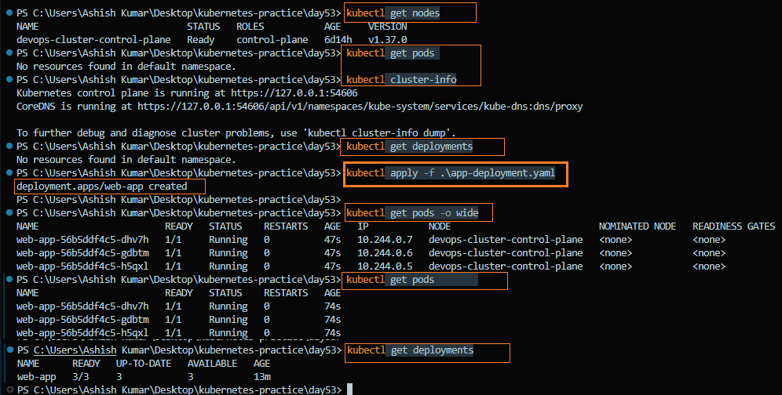

---

## Task 2: ClusterIP Service (Internal Access)

A **ClusterIP** Service provides a stable internal IP and DNS name, allowing Pods to communicate reliably within the cluster.

Create **`clusterip-service.yaml`**:

```yaml
apiVersion: v1
kind: Service
metadata:
  name: web-app-clusterip
spec:
  type: ClusterIP
  selector:
    app: web-app
  ports:
  - port: 80
    targetPort: 80
```

**Manifest:** [`clusterip-service.yaml`](./manifests/clusterip-service.yaml)

```bash
kubectl apply -f clusterip-service.yaml
kubectl get services
```
Inspect the Service:

```bash
kubectl describe service web-app-clusterip
kubectl get endpoints
```

**Before creating service**

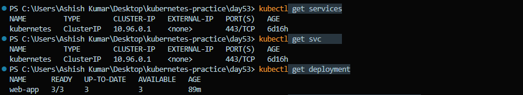

**After creating service**

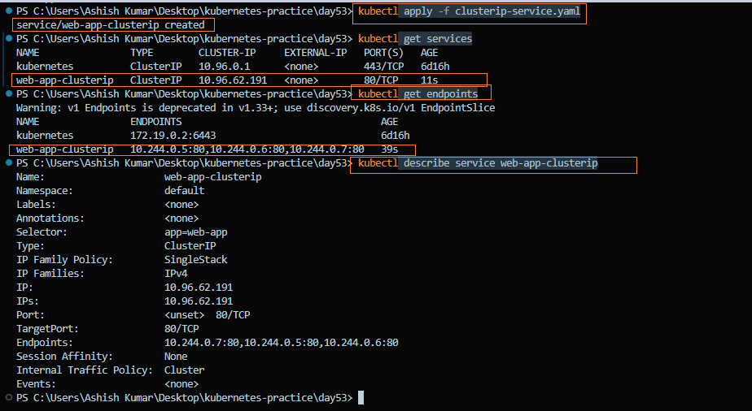
> **Note:** The ClusterIP remains stable even if the Pods are restarted or recreated.

Test the Service from inside the cluster:

```bash
kubectl run test-client --image=busybox:latest --rm -it --restart=Never -- sh

# Inside the Pod
wget -qO- http://web-app-clusterip
exit
```

**Verify:**
- Does the Service return the Nginx welcome page?
- Try running `wget` multiple times to confirm the Service load-balances requests across the Pods.

**Result:**
- Successfully accessed the Nginx welcome page through the ClusterIP Service.
- Verified that the Service provided a stable ClusterIP while routing traffic to the backend Pods.
- Confirmed that the Service automatically discovered Pods using the `app=web-app` label selector.

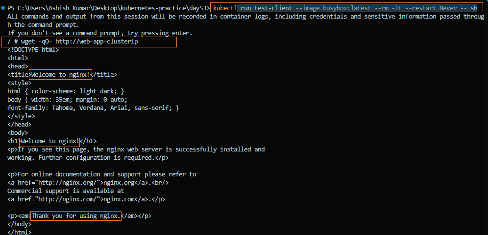

---

## Task 3: Discover Services with DNS

Kubernetes automatically creates a DNS entry for every Service, allowing Pods to communicate using the Service name instead of its IP address.

```
<service-name>.<namespace>.svc.cluster.local
```

Test DNS resolution:

```bash
kubectl run dns-test --image=busybox:latest --rm -it --restart=Never -- sh
```

Verify that CoreDNS is running:

```bash
kubectl get pods -n kube-system
```

> **Note:** Kubernetes uses **CoreDNS** to automatically resolve Service names to their ClusterIP addresses.

```bash
# Inside the Pod

# Short name (same namespace)
wget -qO- http://web-app-clusterip

# Full DNS name
wget -qO- http://web-app-clusterip.default.svc.cluster.local

# DNS lookup
nslookup web-app-clusterip
exit
```

> **Note:** Both the short name and the full DNS name resolve to the same ClusterIP. The short name is commonly used within the same namespace.

**Verify:**
- Does `nslookup` return the same IP as `kubectl get services`?
- Do both DNS names return the Nginx welcome page?

**Result:**
- `nslookup` resolved the Service name to the same ClusterIP shown by `kubectl get services`.
- Successfully accessed the application using both the short DNS name and the fully qualified domain name (FQDN).
- Learned that Kubernetes DNS (CoreDNS) allows applications to communicate using Service names instead of Pod IP addresses.

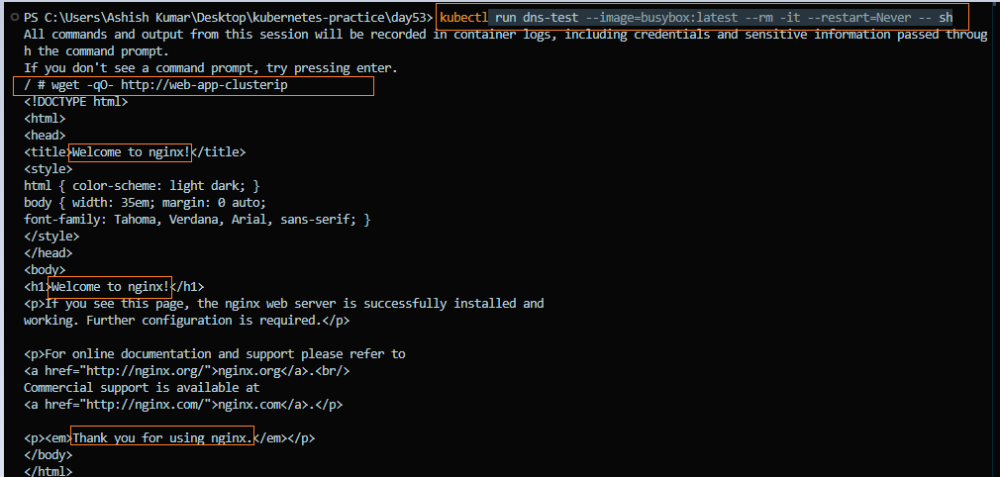

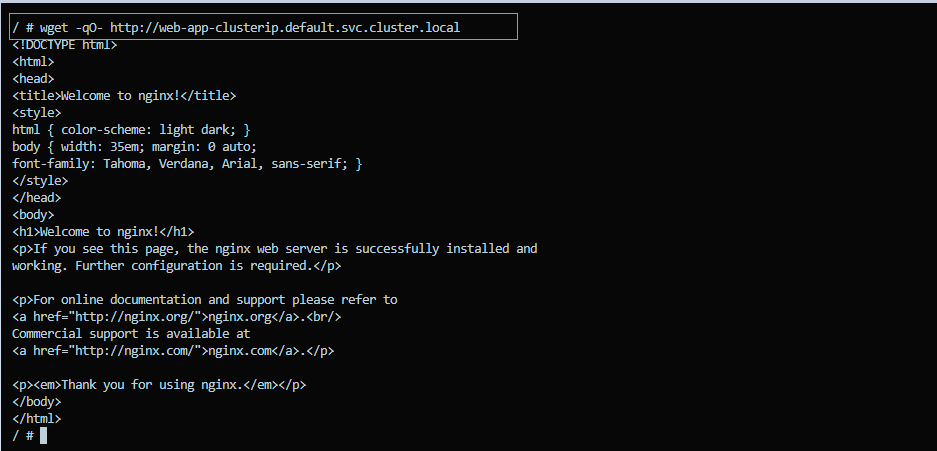

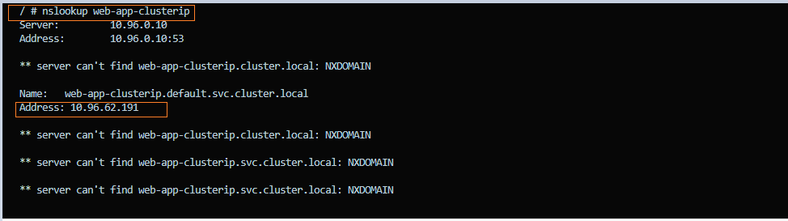

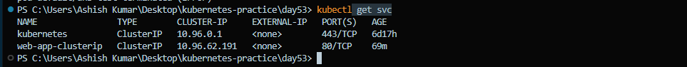

---

## Task 4: NodePort Service (External Access)

A **NodePort** Service exposes your application on a port of every cluster node, allowing access from outside the Kubernetes cluster.

Create **`nodeport-service.yaml`**:

```yaml
apiVersion: v1
kind: Service
metadata:
  name: web-app-nodeport
spec:
  type: NodePort
  selector:
    app: web-app
  ports:
  - port: 80
    targetPort: 80
    nodePort: 30080
```

**Manifest:** [`nodeport-service.yaml`](./manifests/nodeport-service.yaml)

```bash
kubectl apply -f nodeport-service.yaml
kubectl get services
```

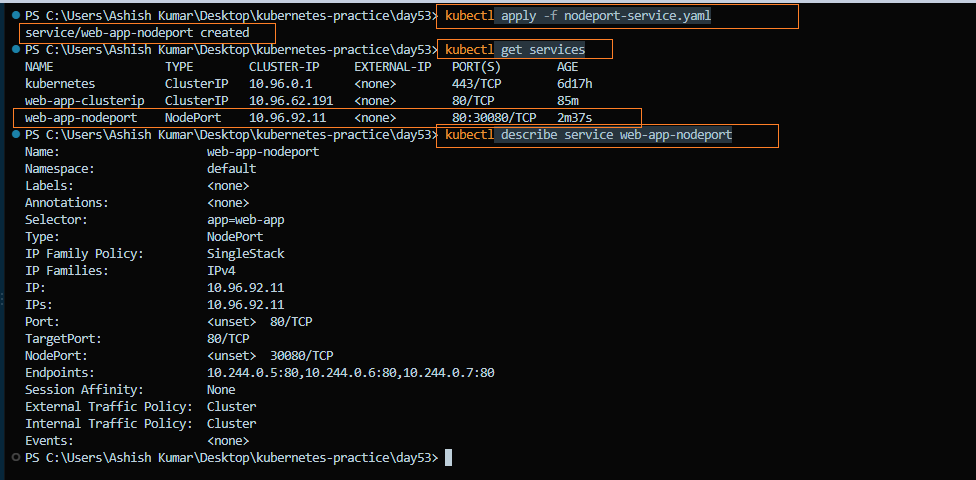

> **Note:** `nodePort: 30080` exposes the application on every node, making it accessible using `<NodeIP>:30080`.

Access the Service:

```bash
# Minikube
minikube service web-app-nodeport --url

# Kind
kubectl get nodes -o wide

# Get the node's internal IP
curl http://<NodeIP>:30080

# Or verify from inside the cluster
kubectl run test-client --image=busybox:latest --rm -it --restart=Never -- sh

wget -qO- http://web-app-nodeport
```

> **Note:** In a default Kind cluster, `localhost:30080` may not work because NodePorts are not automatically mapped to the host machine. I verified the NodePort Service using the node's internal IP and from inside the cluster. Starting from Day 54, I will use a `kind-config.yaml` with `extraPortMappings` to expose NodePorts on `localhost`.

**Verify:**
- Can you access the Nginx welcome page using the NodePort?

**Result:**
- Successfully exposed the application using a NodePort Service.
- Verified external access using the node's internal IP (`http://<NodeIP>:30080`).
- Also verified connectivity from inside the cluster using a temporary BusyBox Pod.
- Learned that in a default Kind cluster, `localhost:30080` is not accessible unless `extraPortMappings` are configured during cluster creation.

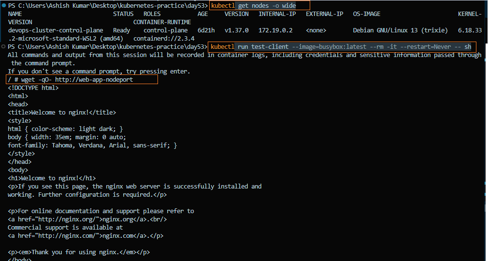

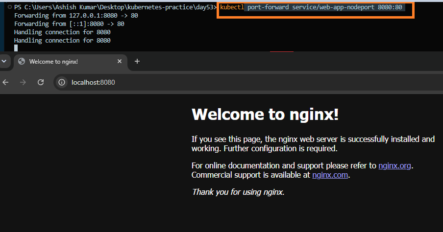

---

## Task 5: LoadBalancer Service (Cloud External Access)

A **LoadBalancer** Service exposes your application externally by provisioning a cloud load balancer. It is commonly used in production environments.

Create **`loadbalancer-service.yaml`**:

```yaml
apiVersion: v1
kind: Service
metadata:
  name: web-app-loadbalancer
spec:
  type: LoadBalancer
  selector:
    app: web-app
  ports:
  - port: 80
    targetPort: 80
```

**Manifest:** [`loadbalancer-service.yaml`](./manifests/loadbalancer-service.yaml)

```bash
kubectl apply -f loadbalancer-service.yaml
kubectl get services
```

> **Note:** Since this lab uses **Kind**, the **EXTERNAL-IP** remains `<pending>` because Kind runs locally and does not include a cloud provider to provision an external load balancer.

**Verify:**
- What does the **EXTERNAL-IP** column show?
- Why does it remain `<pending>`?

**Result:**
- Successfully created a LoadBalancer Service.
- Verified that the **EXTERNAL-IP** remained `<pending>`, which is expected in a Kind cluster.
- Learned that Kind does not include a cloud provider to provision an external load balancer.
- Understood that in cloud platforms such as AWS, Azure, or GCP, Kubernetes automatically provisions an external load balancer and assigns a public IP address or DNS name.

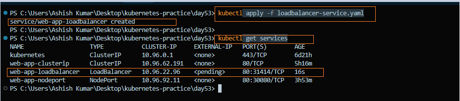

---

## Task 6: Compare Service Types

View all Services:

```bash
kubectl get services -o wide
```

Compare the Service types:

| Type | Accessible From | Common Use Case |
|------|-----------------|-----------------|
| **ClusterIP** | Inside the cluster | Internal communication between applications |
| **NodePort** | Outside via `<NodeIP>:<NodePort>` | Development and testing |
| **LoadBalancer** | Outside via cloud load balancer | Production workloads in cloud environments |

> **Note:** A **LoadBalancer** Service automatically includes both a **ClusterIP** and a **NodePort**.

Verify this:

```bash
kubectl describe service web-app-loadbalancer
```

**Verify:**
- Does the LoadBalancer Service also have a ClusterIP and NodePort assigned?

**Result:**
- Compared the behavior of ClusterIP, NodePort, and LoadBalancer Services.
- Verified that a LoadBalancer Service automatically creates both a ClusterIP and a NodePort.
- Understood when each Service type should be used in development, testing, and production environments.

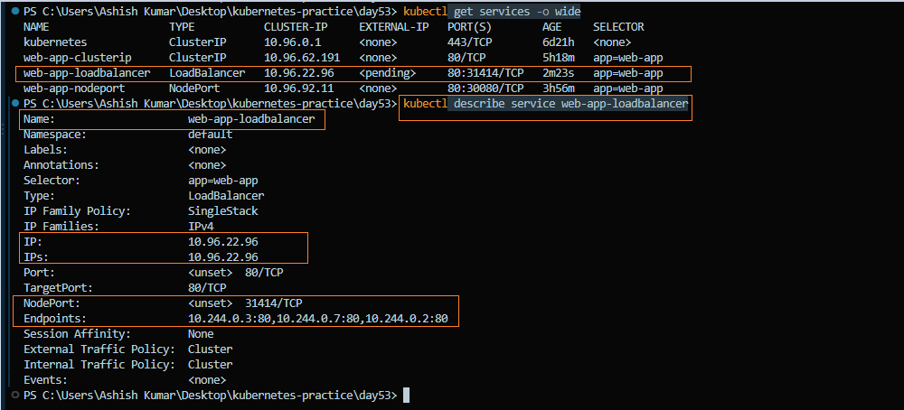

---

## Task 7: Clean Up

Delete all resources created during this lab:

```bash
kubectl delete -f app-deployment.yaml
kubectl delete -f clusterip-service.yaml
kubectl delete -f nodeport-service.yaml
kubectl delete -f loadbalancer-service.yaml

kubectl get pods
kubectl get services
```

> **Note:** After cleanup, only the default **`kubernetes`** Service should remain in the `default` namespace.

**Verify:**
- Have all application resources been removed successfully?

**Result:**
- Successfully removed all Deployments and Services created during the lab.
- Verified that only the default `kubernetes` Service remained in the cluster.
- Confirmed that the cluster was returned to a clean state, ready for the next hands-on lab.

**Before deleting**

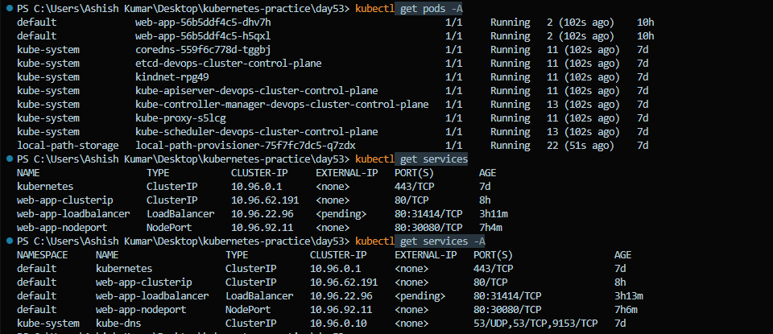

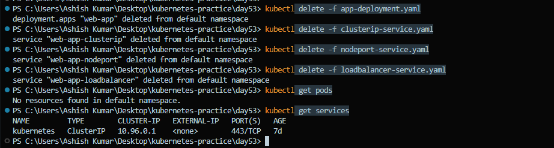
---

## Concepts Learned

### 1. Why Kubernetes Services Exist

#### The Problem
Pods are **ephemeral**, which means:
- Their IP addresses change when they are restarted or recreated.
- Deployments continuously create and replace Pods as needed.

Because of this, applications cannot reliably communicate using Pod IP addresses.

#### The Solution: Service

A **Service** provides:
- A stable **ClusterIP**
- A stable **DNS name**
- Automatic load balancing across healthy Pods

---

### 2. Relationship Between Deployments, Pods, and Services

- **Deployment** manages the desired number of Pods.
- **Pods** run the application (Nginx).
- **Service** sits in front of the Pods, discovers them using labels (`selector`), and routes traffic to them.

```
Client
   │
   ▼
Service
   │
(Label Selector)
   │
   ▼
Pods (Replica 1, 2, 3)
```

---

### 3. Kubernetes Service Types

#### ClusterIP

```yaml
apiVersion: v1
kind: Service
metadata:
  name: web-app-clusterip
spec:
  type: ClusterIP
  selector:
    app: web-app
  ports:
  - port: 80
    targetPort: 80
```

- Default Service type
- Accessible **only inside the cluster**
- Provides a stable IP and DNS name
- Used for internal service-to-service communication

---

#### NodePort

```yaml
apiVersion: v1
kind: Service
metadata:
  name: web-app-nodeport
spec:
  type: NodePort
  selector:
    app: web-app
  ports:
  - port: 80
    targetPort: 80
    nodePort: 30080
```

- Exposes the application on every cluster node
- Accessible using `<NodeIP>:30080`
- Commonly used for development and testing

---

#### LoadBalancer

```yaml
apiVersion: v1
kind: Service
metadata:
  name: web-app-loadbalancer
spec:
  type: LoadBalancer
  selector:
    app: web-app
  ports:
  - port: 80
    targetPort: 80
```

- Creates an external load balancer in cloud environments
- Provides a public IP or hostname
- Used for production workloads
- Internally also includes a **ClusterIP** and **NodePort**

---

### 4. Service Type Comparison

| Service Type | Accessible From | Common Use Case |
|---------------|-----------------|-----------------|
| **ClusterIP** | Inside the cluster | Internal communication |
| **NodePort** | `<NodeIP>:<NodePort>` | Development and testing |
| **LoadBalancer** | Cloud load balancer | Production deployments |

> **Note:** A **LoadBalancer** Service automatically includes both a **NodePort** and a **ClusterIP**.

---

### 5. How Kubernetes DNS Works

Every Service automatically receives a DNS name.

Example:

```
web-app-clusterip.default.svc.cluster.local
```

Request flow:

```
Pod
 │
 ▼
web-app-clusterip
 │
 ▼
CoreDNS
 │
 ▼
ClusterIP
 │
 ▼
Service
 │
 ▼
Endpoints
 │
 ▼
Pod
```

This allows applications to communicate using **Service names** instead of Pod IP addresses.

---

### 6. What Are Endpoints?

**Endpoints** represent the actual Pod IP addresses behind a Service.

Example:

```
Service: web-app-clusterip

Endpoints:
10.244.0.5:80
10.244.0.6:80
10.244.0.7:80
```

Endpoints are automatically updated whenever Pods are created, deleted, or restarted.

Inspect them with:

```bash
kubectl get endpoints
kubectl describe endpoints web-app-clusterip
```