# Day 54 – Kubernetes ConfigMaps & Secrets

## Task 1: Create a ConfigMap from Literals

1. Create a ConfigMap named `app-config` using literal key-value pairs:
   - `APP_ENV=production`
   - `APP_DEBUG=false`
   - `APP_PORT=8080`
2. Inspect the ConfigMap using:
   - `kubectl describe configmap app-config`
   - `kubectl get configmap app-config -o yaml`
3. Observe that ConfigMap data is stored as **plain text**.

**Verify:** Can you see all three key-value pairs?

- All three key-value pairs are visible.
- Data is stored in **plain text**.
- No encoding or encryption is applied.

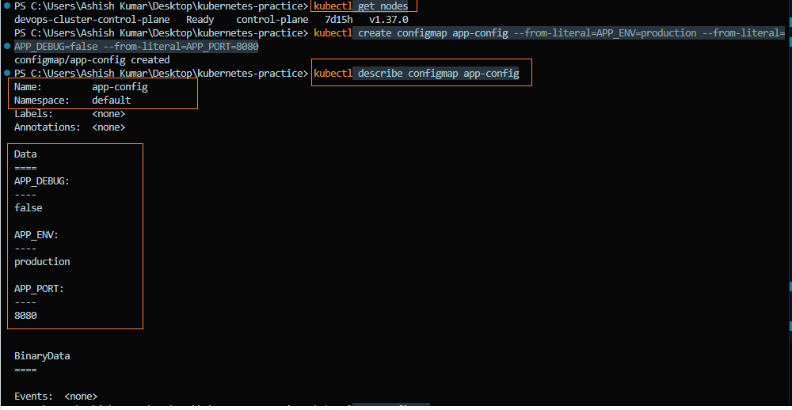

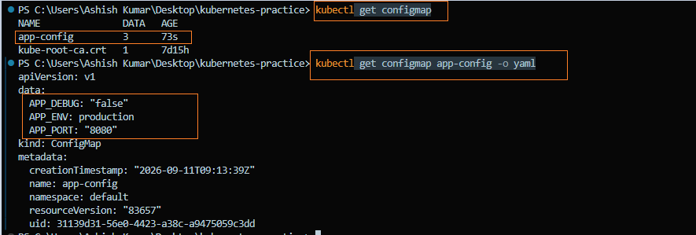

---

## Task 2: Create a ConfigMap from a File

1. Create a custom Nginx configuration file with a `/health` endpoint that returns **"healthy"**.
2. Create a ConfigMap named `nginx-config` from the configuration file.
3. Observe that the filename (`default.conf`) becomes the key in the ConfigMap and is preserved when mounted into a Pod.

**Manifest**
- [`default.conf`](./manifests/default.conf)

Verify the ConfigMap:

```bash
kubectl get configmap nginx-config -o yaml
```

**Verify:** Does `kubectl get configmap nginx-config -o yaml` show the file contents?
- The complete file contents are stored under the `default.conf` key.
- The ConfigMap preserves the original filename.

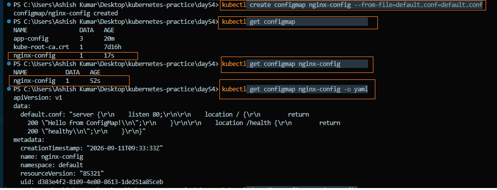

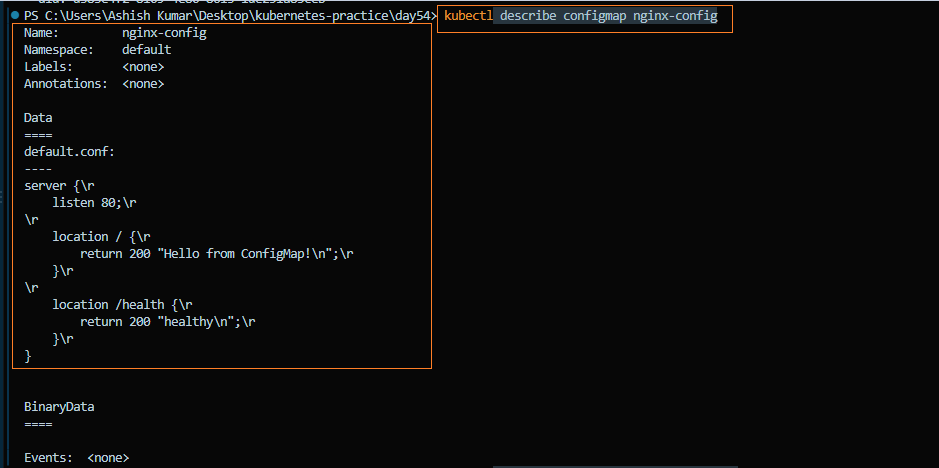


---

## Task 3: Use ConfigMaps in a Pod

1. Create a Pod that uses `envFrom` with `configMapRef` to load all keys from `app-config` as environment variables.
2. Create another Pod that mounts the `nginx-config` ConfigMap as a volume at `/etc/nginx/conf.d`.
3. Verify that the mounted configuration works by accessing the `/health` endpoint.

> 💡 Use **environment variables** for simple key-value settings and **volume mounts** for complete configuration files.

**Manifests**

- [`configmap-env-pod.yaml`](./manifests/configmap-env-pod.yaml)
- [`nginx-configmap-pod.yaml`](./manifests/nginx-configmap-pod.yaml)

Verify:

```bash
kubectl exec env-test-pod -- printenv
kubectl exec nginx-config-pod -- curl -s http://localhost/health
```
**Verify:** Does the `/health` endpoint respond?
- ConfigMap values are available as environment variables.
- The `/health` endpoint responds successfully.
- The Nginx configuration is loaded from the mounted ConfigMap.

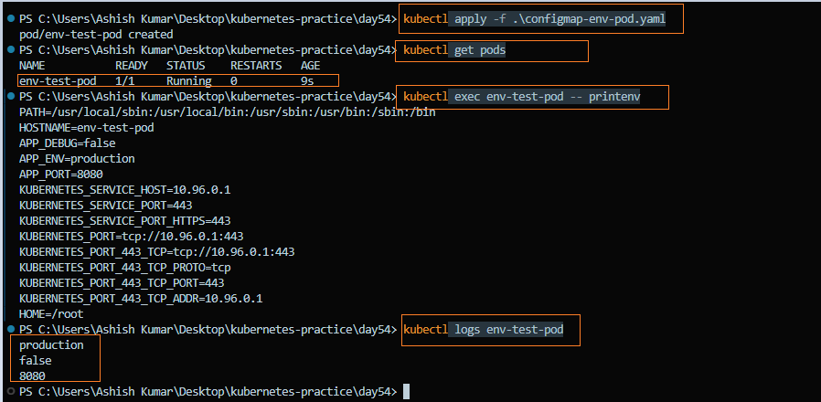

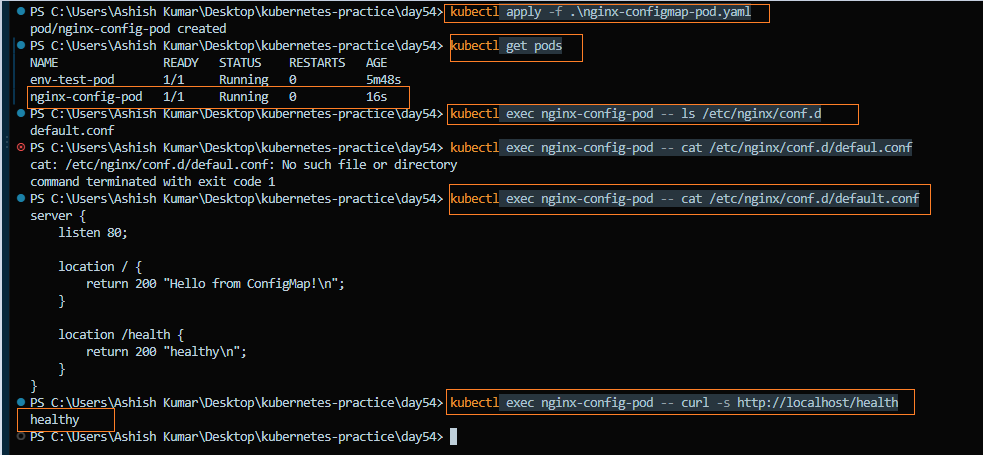

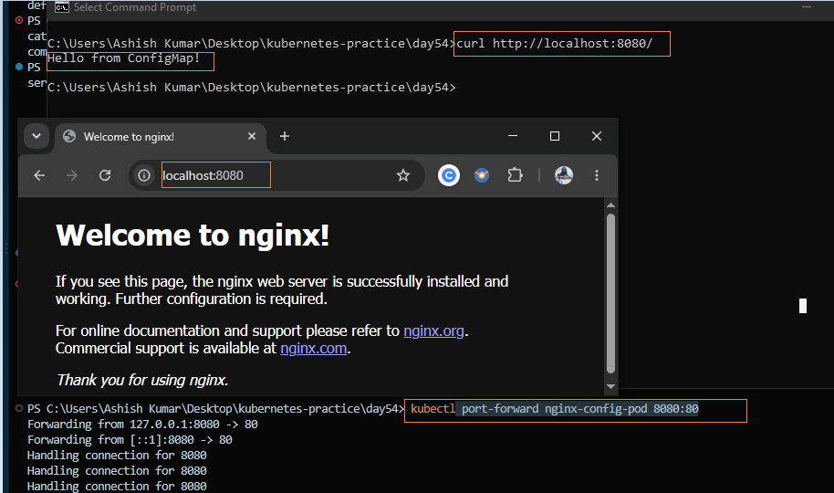
---

## Task 4: Create a Secret

1. Create a Secret named `db-credentials` using the following key-value pairs:
   - `DB_USER=admin`
   - `DB_PASSWORD=s3cureP@ssw0rd`
2. Inspect the Secret using `kubectl get secret db-credentials -o yaml`.
3. Decode the Base64-encoded values to view the original plaintext.

> 💡 Kubernetes Secrets are **Base64 encoded**, **not encrypted**. They help separate sensitive data from application configuration and can be secured further using **RBAC**, **Encryption at Rest**, or external secret managers.

Verify:

```bash
kubectl get secret db-credentials -o yaml
kubectl get secret db-credentials -o jsonpath='{.data.DB_PASSWORD}' | base64 --decode
```

**Verify:** Can you decode the password back to plaintext?
- Secret values are stored as **Base64-encoded** data.
- Successfully decoded the password back to plaintext.
- Base64 is **encoding**, not **encryption**.

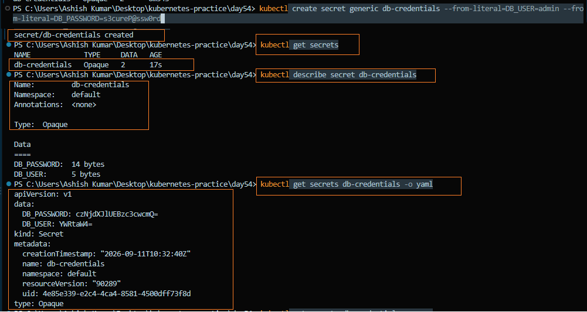

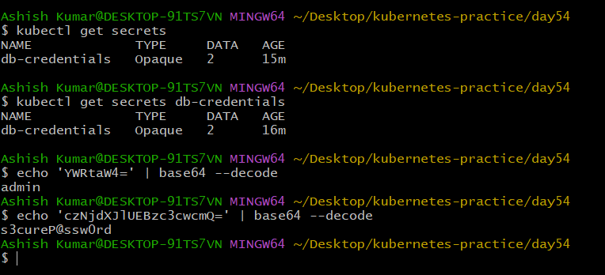

---

## Task 5: Use Secrets in a Pod

1. Create a Pod that injects Secret values as environment variables using `secretRef`.
2. Mount the `db-credentials` Secret as a read-only volume at `/etc/db-credentials`.
3. Verify that each Secret key is mounted as a separate file containing the decoded plaintext value.

> 💡 Use **environment variables** for application credentials and **volume mounts** for certificates, keys, or other sensitive files.

**Manifest**
- [`secret-env-pod.yaml`](./manifests/secret-env-pod.yaml)

Verify:

```bash
kubectl exec secret-pod -- printenv
kubectl exec secret-pod -- ls /etc/db-credentials
kubectl exec secret-pod -- cat /etc/db-credentials/DB_PASSWORD
```

**Verify:** Are the mounted file values plaintext or base64?
- Secret values are available as environment variables.
- Each Secret key is mounted as a separate file.
- Mounted file contents are stored as **decoded plaintext**.

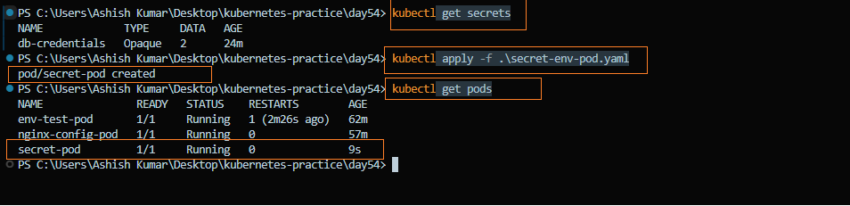

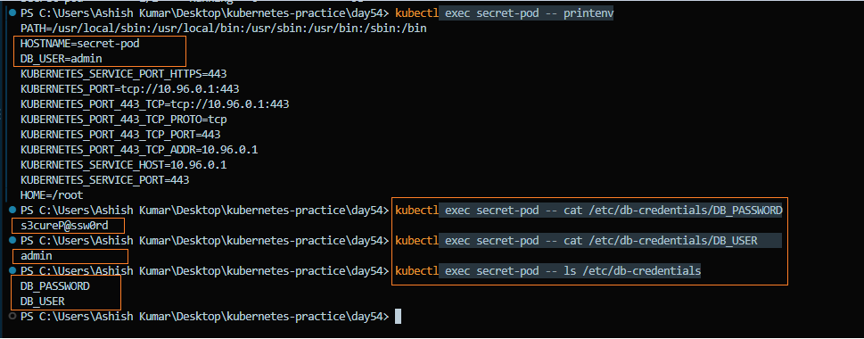

---

## Task 6: Update a ConfigMap and Observe Propagation

1. Create a ConfigMap named `live-config` with the key `message=hello`.
2. Create a Pod that mounts the ConfigMap as a volume and continuously reads the file every 5 seconds.
3. Update the ConfigMap by changing the value from `hello` to `world`.
4. Observe that the mounted ConfigMap updates automatically without restarting the Pod.
5. Compare this behavior with environment variables, which only load configuration during Pod startup.

**Manifest**
- [`live-config-pod.yaml`](./manifests/live-config-pod.yaml)

Verify:

```bash
kubectl logs -f live-pod

kubectl patch configmap live-config \
  --type merge \
  -p '{"data":{"message":"world"}}'
```
**Verify:** Did the volume-mounted value change without a pod restart?
- The mounted ConfigMap updates automatically without restarting the Pod.
- Environment variables do **not** update automatically after the ConfigMap changes.

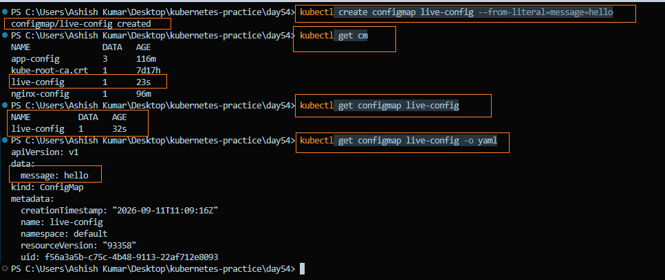

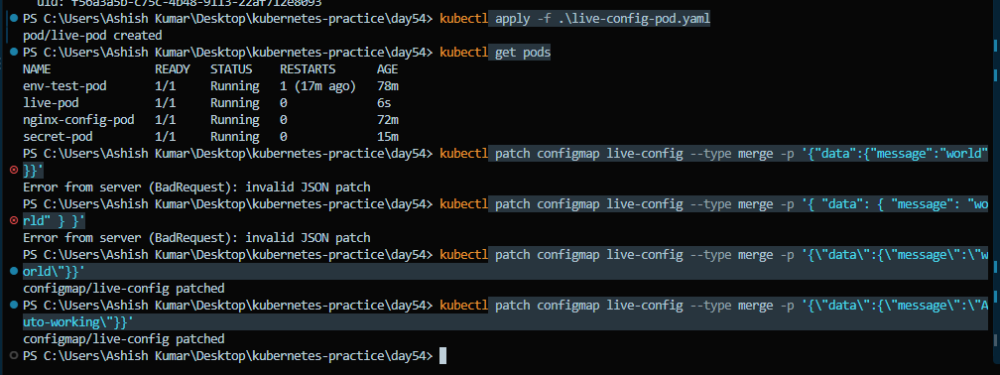

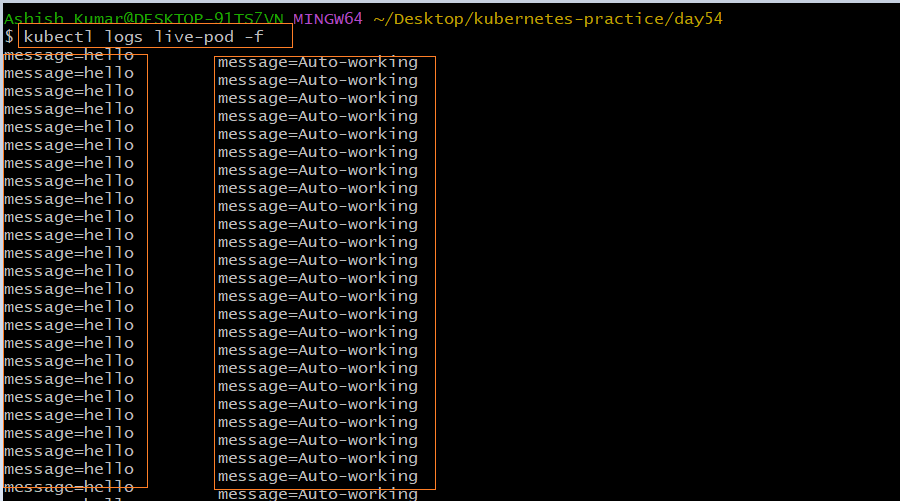
---

## Task 7: Clean Up
Delete all pods, ConfigMaps, and Secrets you created.


---

## Summary

In this lab, I learned how to:

- Create ConfigMaps from literals and files.
- Inject ConfigMaps into Pods using environment variables and volume mounts.
- Create and use Kubernetes Secrets for sensitive data.
- Understand the difference between ConfigMaps and Secrets.
- Observe how ConfigMap updates propagate to mounted volumes but not to environment variables.
- Separate application configuration from container images using Kubernetes-native resources.

---

## What I Learned

### What ConfigMaps and Secrets are

**ConfigMap**

- Stores **non-sensitive** configuration data.
- Used for values such as application settings, URLs, ports, and feature flags.
- Helps separate configuration from the container image.

**Secret**

- Stores **sensitive** data.
- Used for passwords, API keys, tokens, and certificates.
- Values are **Base64 encoded** by default.

---

### Environment Variables vs Volume Mounts

| Environment Variables | Volume Mounts |
|-----------------------|---------------|
| Injected when the Pod starts | Mounted as files inside the container |
| Best for simple key-value settings | Best for configuration files and certificates |
| Do **not** update automatically | Update automatically when the ConfigMap or Secret changes (typically within 30–60 seconds) |

---

### Why Base64 is Encoding, Not Encryption

- Base64 is an **encoding** method, not an encryption method.
- It can be decoded easily without a secret key.
- Kubernetes Secrets use Base64 to safely represent binary and text data in YAML.
- For production environments, protect Secrets using **RBAC**, **Encryption at Rest**, or an external secret manager.

---

### How ConfigMap Updates Work

**ConfigMap as a Volume**

- Mounted files are updated automatically when the ConfigMap changes.
- The Pod does **not** need to restart.

**ConfigMap as an Environment Variable**

- Environment variables are loaded only during Pod startup.
- Changes to the ConfigMap are **not** reflected until the Pod is restarted.