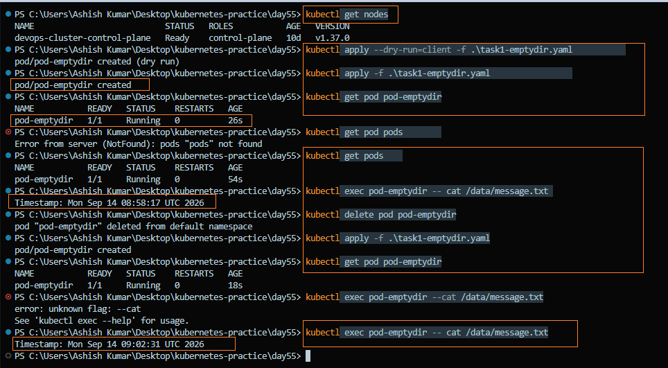
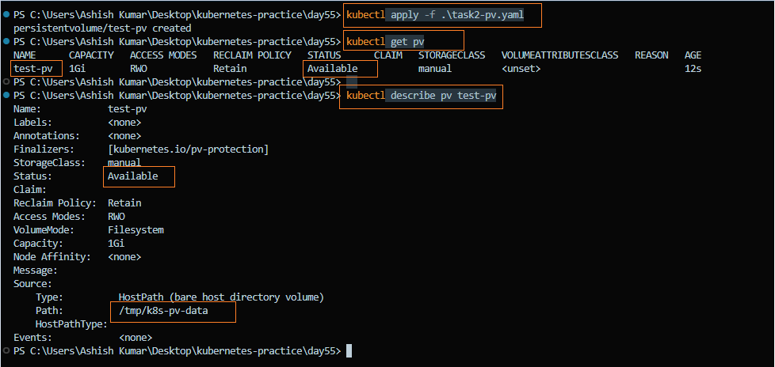
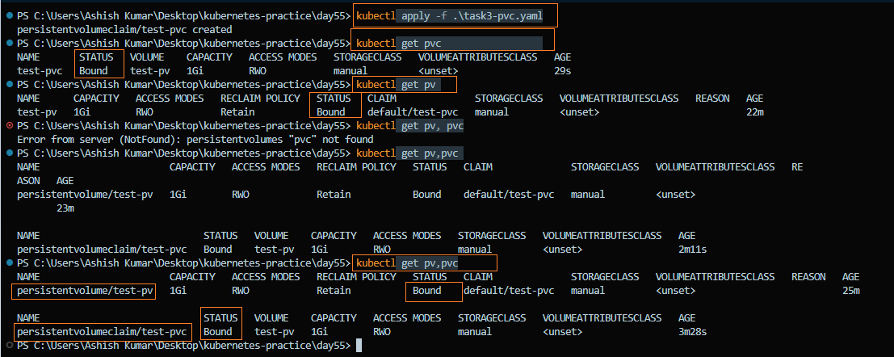
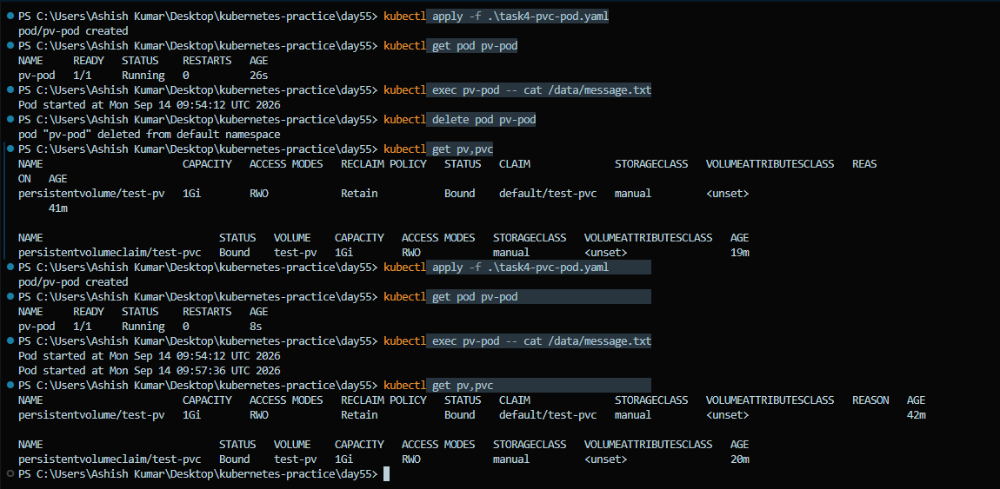
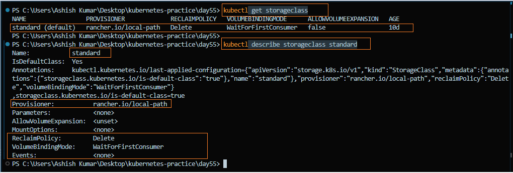
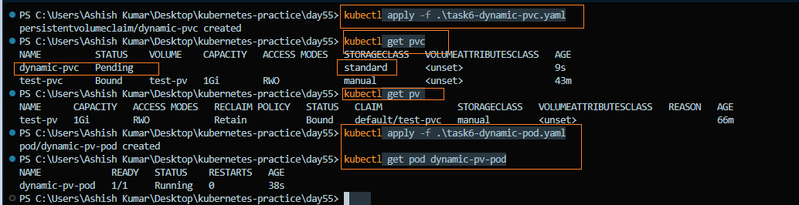
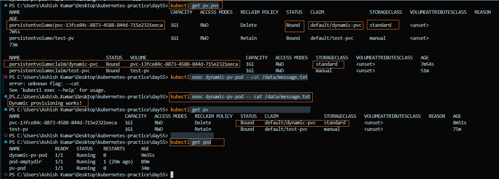

# Day 55 – Persistent Volumes (PV) and Persistent Volume Claims (PVC)

### Task 1: See the Problem — Data Lost on Pod Deletion

1. Write a Pod manifest that uses an `emptyDir` volume and writes a timestamped message to `/data/message.txt`
2. Apply it and verify the data exists with `kubectl exec`
3. Delete the Pod, recreate it, and check the file again — the old message is gone

**Manifest:** [`task1-emptydir.yaml`](./manifests/task1-emptydir.yaml)

**Verify:** Is the timestamp the same or different after recreation?

- The timestamp is **different** after recreation, proving that `emptyDir` data is lost when the Pod is deleted.



---

### Task 2: Create a PersistentVolume (Static Provisioning)

1. Write a PV manifest with `capacity: 1Gi`, `accessModes: ReadWriteOnce`, `persistentVolumeReclaimPolicy: Retain`, and `hostPath` pointing to `/tmp/k8s-pv-data`
2. Apply it and check `kubectl get pv` — status should be `Available`

Access modes to know:

- `ReadWriteOnce (RWO)` — read-write by a single node
- `ReadOnlyMany (ROX)` — read-only by multiple nodes
- `ReadWriteMany (RWX)` — read-write by multiple nodes

`hostPath` is useful for learning and local testing, but is generally not suitable for production workloads.

**Manifest:** [`task2-pv.yaml`](./manifests/task2-pv.yaml)

**Verify:** What is the STATUS of the PV?

- The PV status is **Available** because it has not yet been claimed by a PVC.


---

### Task 3: Create a PersistentVolumeClaim

1. Write a PVC manifest requesting `500Mi` of storage with `ReadWriteOnce` access
2. Apply it and check both `kubectl get pvc` and `kubectl get pv`
3. Verify that the PVC becomes `Bound` to the matching PV

**Manifest:** [`task3-pvc.yaml`](./manifests/task3-pvc.yaml)

**Verify:** What does the `VOLUME` column in `kubectl get pvc` show?

- The `VOLUME` column shows the name of the PersistentVolume (PV) that the PersistentVolumeClaim (PVC) is bound to.
- In this lab, the PVC was bound to **`test-pv`**.



---

### Task 4: Use the PVC in a Pod — Data That Survives

1. Write a Pod manifest that mounts the PVC at `/data` using `persistentVolumeClaim.claimName`
2. Write data to `/data/message.txt`, then delete and recreate the Pod
3. Check the file — it should contain data from both Pods

**Manifest:** [`task4-pvc-pod.yaml`](./manifests/task4-pvc-pod.yaml)

**Verify:** Does the file contain data from both the first and second Pod?

- Yes. The file contains data from both the first and second Pods, proving that the data persists after Pod deletion.


---

### Task 5: StorageClasses and Dynamic Provisioning

1. Run `kubectl get storageclass` and `kubectl describe storageclass standard`
2. Note the provisioner, reclaim policy, and volume binding mode
3. With dynamic provisioning, developers typically create PVCs while the StorageClass and provisioner handle PV creation automatically

**Verify:** What is the default StorageClass in your cluster?

- **Default StorageClass:** `standard` — used automatically when no StorageClass is specified in a PVC
- **Provisioner:** `rancher.io/local-path` — provisions storage using local node storage
- **Reclaim Policy:** `Delete` — the dynamically provisioned PV is automatically deleted when its PVC is deleted
- **Volume Binding Mode:** `WaitForFirstConsumer` — delays binding/provisioning until a Pod using the PVC is scheduled
- **Allow Volume Expansion:** `false`



---

### Task 6: Dynamic Provisioning

1. Write a PVC manifest that includes `storageClassName: standard`
2. Apply it and use the PVC in a Pod
3. Verify that Kubernetes automatically creates a PV
4. Write data to the dynamically provisioned storage and verify it works

**Manifests:**

- [`task6-dynamic-pvc.yaml`](./manifests/task6-dynamic-pvc.yaml)
- [`task6-dynamic-pod.yaml`](./manifests/task6-dynamic-pod.yaml)

**Verify:** How many PVs exist? Which was manual, and which was dynamic?

- **2 PVs** existed during the test.
- **Manual PV:** `test-pv`
- **Dynamic PV:** `pvc-9b9bb362-b23f-460f-b543-41da5e2199eb`
- The dynamic PV was automatically created by the `standard` StorageClass.




---

### Task 7: Clean Up

1. Delete all Pods first
2. Delete the PVCs and check `kubectl get pv` to observe what happens
3. The dynamic PV is automatically deleted because its reclaim policy is `Delete`
4. The manual PV changes to `Released` because its reclaim policy is `Retain`
5. Delete the remaining retained PV manually

**Verify:** Which PV was auto-deleted and which was retained? Why?

- **Auto-deleted PV:** `pvc-9b9bb362-b23f-460f-b543-41da5e2199eb`

  - **Why:** It was dynamically provisioned by the `standard` StorageClass and had a **Reclaim Policy = `Delete`**, so Kubernetes automatically deleted the PV when its associated PVC was deleted.

- **Retained PV:** `test-pv`

  - **Why:** It was manually created and had a **Reclaim Policy = `Retain`**, so Kubernetes kept the PV after the PVC was deleted. The PV changed to **`Released`** and was later deleted manually.


---

## Why Containers Need Persistent Storage

- Containers are **ephemeral**, so data stored inside a container can be lost when the container is removed or recreated.
- **Persistent storage** keeps data independent of the container lifecycle.
- Persistent storage is important for **databases, logs, user files, and application data**.

---

## What PVs and PVCs Are and How They Relate

### PersistentVolume (PV)

- A **PersistentVolume (PV)** is a piece of storage available in the Kubernetes cluster.
- It can be created **manually** by an administrator or **automatically** through dynamic provisioning.

### PersistentVolumeClaim (PVC)

- A **PersistentVolumeClaim (PVC)** is a request for storage by a user or application.
- It specifies requirements such as:
  - Storage size
  - Access mode
  - Storage class
- Kubernetes binds the PVC to a suitable PV that satisfies its requirements.

### Relationship

```text
PVC requests storage
        ↓
PVC is bound to a PV
        ↓
Pod uses the PVC
        ↓
Pod accesses persistent storage