# Day 56 – Kubernetes StatefulSets

### Task 1: Understand the Problem

1. Create a Deployment with 3 replicas using nginx.
2. Check the Pod names — they are random (`app-xyz-abc`).
3. Delete a Pod and notice the replacement gets a different random name.

This is fine for web servers but not for databases where you need stable identity.

| Feature | Deployment | StatefulSet |
|---|---|---|
| Pod names | Random | Stable, ordered (`app-0`, `app-1`) |
| Startup order | All at once | Ordered: pod-0, then pod-1, then pod-2 |
| Storage | Shared PVC | Each Pod gets its own PVC |
| Network identity | No stable hostname | Stable DNS per Pod |

Delete the Deployment before moving on.

**Manifest:** [deployment.yaml](./manifests/deployment.yaml)

**Verify:** Why would random Pod names be a problem for a database cluster?

- Random Pod names break database clusters because nodes need stable names for connections, replication, and storage.

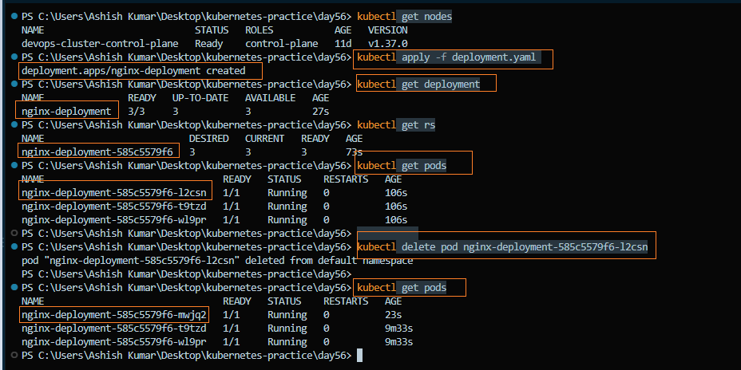

---

### Task 2: Create a Headless Service

1. Write a Service manifest with `clusterIP: None` — this creates a **Headless Service**.
2. Set the selector to match the labels you will use on your StatefulSet Pods.
3. Apply the manifest and confirm that the `CLUSTER-IP` shows `None`.

A Headless Service creates DNS records for individual Pods instead of providing a single virtual IP for load balancing. StatefulSets use this for stable network identity.

**Manifest:** [headless-service.yaml](./manifests/headless-service.yaml)

**Verify:** What does the `CLUSTER-IP` column show?

- `CLUSTER-IP`: `None`

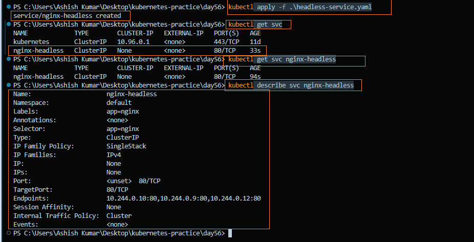

---

### Task 3: Create a StatefulSet
1. Write a StatefulSet manifest with `serviceName` pointing to your Headless Service
2. Set replicas to 3, use the nginx image
3. Add a `volumeClaimTemplates` section requesting 100Mi of ReadWriteOnce storage
4. Apply and watch: `kubectl get pods -l <your-label> -w`

Observe ordered creation — `web-0` first, then `web-1` after `web-0` is Ready, then `web-2`.

Check the PVCs: `kubectl get pvc` — you should see `web-data-web-0`, `web-data-web-1`, `web-data-web-2` (names follow the pattern `<template-name>-<pod-name>`).

**manifest** [statefulset.yaml](./manifests/statefulset.yaml)

**Verify:** What are the exact pod names and PVC names?

- Pod names : `web-0`, `web-1`, `web-2`
- PVC names : `web-data-web-0`, `web-data-web-1`, `web-data-web-2`

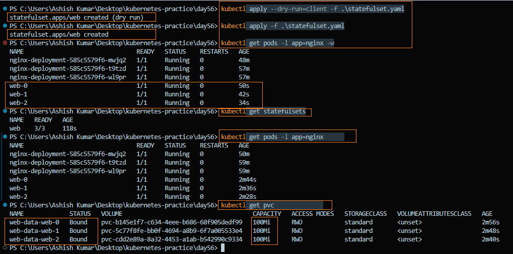

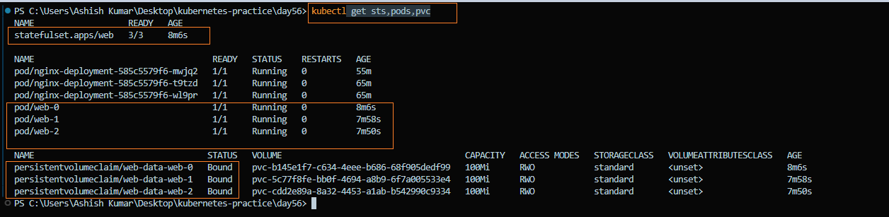

---

### Task 4: Stable Network Identity
Each StatefulSet pod gets a DNS name: `<pod-name>.<service-name>.<namespace>.svc.cluster.local`

1. Run a temporary busybox pod and use `nslookup` to resolve `web-0.<your-headless-service>.default.svc.cluster.local`
2. Do the same for `web-1` and `web-2`
3. Confirm the IPs match `kubectl get pods -o wide`

**Verify:** Does the nslookup IP match the pod IP?

- Yes, the `nslookup` IP matches the corresponding Pod IP.

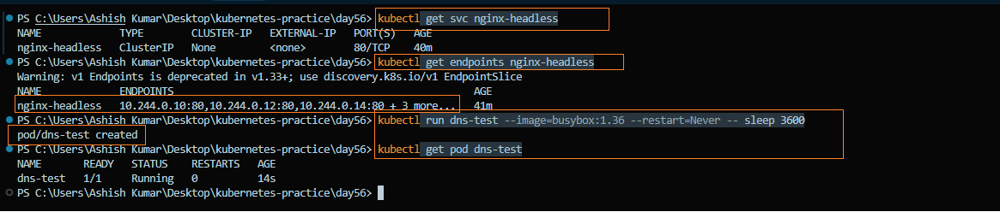

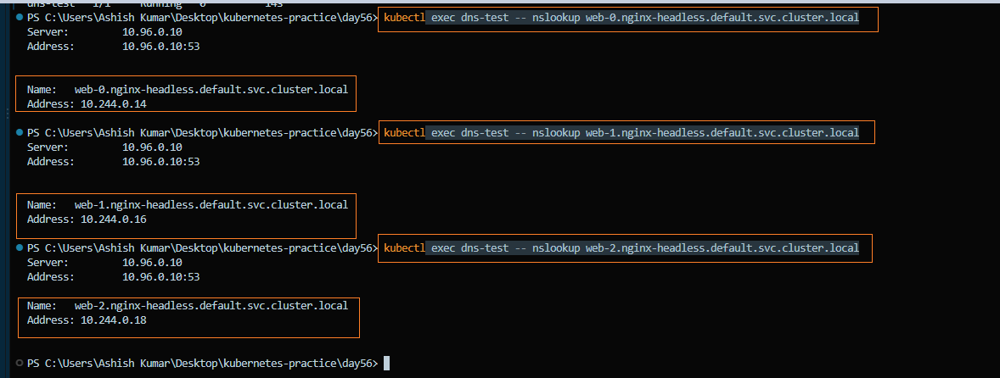

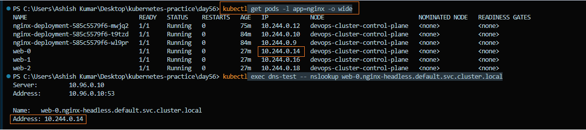
---

### Task 5: Stable Storage — Data Survives Pod Deletion
1. Write unique data to each pod: `kubectl exec web-0 -- sh -c "echo 'Data from web-0' > /usr/share/nginx/html/index.html"`
2. Delete `web-0`: `kubectl delete pod web-0`
3. Wait for it to come back, then check the data — it should still be "Data from web-0"

The new pod reconnected to the same PVC.

**Verify:** Is the data identical after pod recreation?

- Yes, the data is exactly the same: `Data from web-0`.

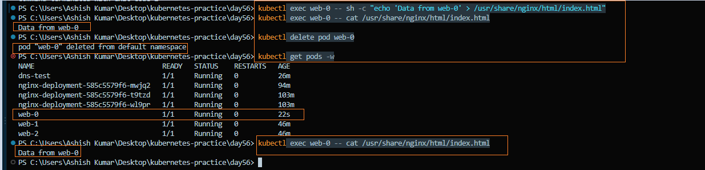
---

### Task 6: Ordered Scaling
1. Scale up to 5: `kubectl scale statefulset web --replicas=5` — pods create in order (web-3, then web-4)
2. Scale down to 3 — pods terminate in reverse order (web-4, then web-3)
3. Check `kubectl get pvc` — all five PVCs still exist. Kubernetes keeps them on scale-down so data is preserved if you scale back up.

**Verify:** After scaling down, how many PVCs exist?

- After scaling down,5 PVCs still exist.

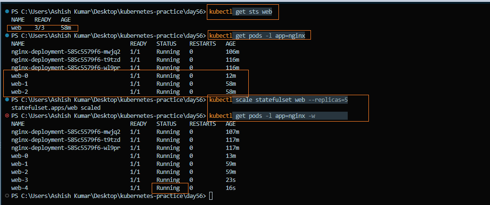

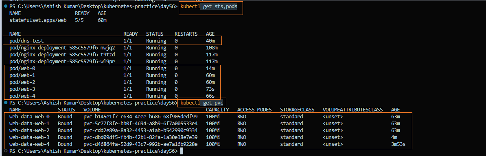

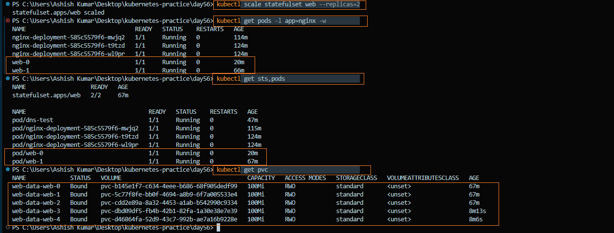

---

### Task 7: Clean Up
1. Delete the StatefulSet and the Headless Service
2. Check `kubectl get pvc` — PVCs are still there (safety feature)
3. Delete PVCs manually

**Verify:** Were PVCs auto-deleted with the StatefulSet?

- No. PVCs are NOT automatically deleted when a StatefulSet is deleted. They remain as a safety feature to protect persistent data and must be deleted manually when they are no longer needed.

**Before delete**

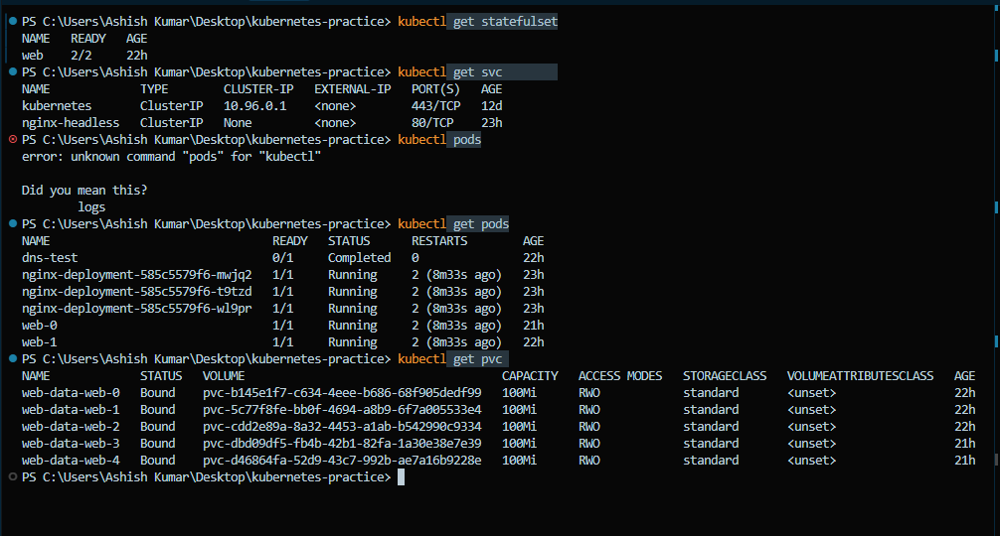

**After delete**

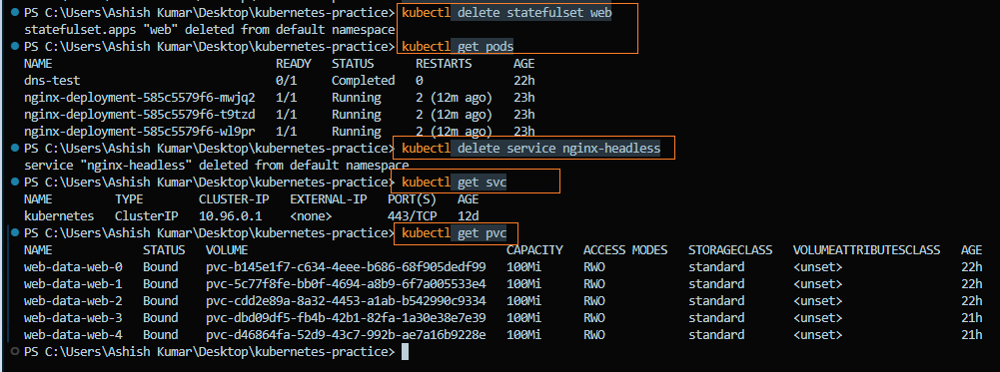

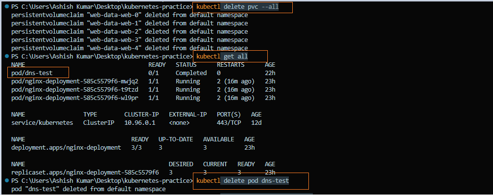

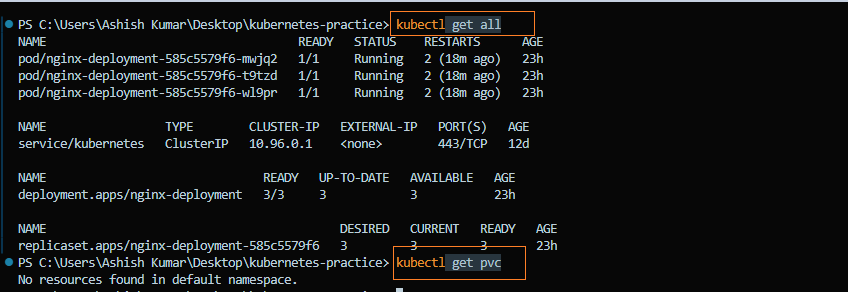

---

### What StatefulSets are and when to use them vs Deployments

#### 1. StatefulSet

- A StatefulSet is used to manage stateful applications where each pod needs:

   - Stable identity (fixed name like web-0)
   - Stable network (DNS)
   - Persistent storage (PVC per pod)
   - Ordered deployment & scaling

- Use StatefulSet when:

   - Running databases (MySQL, PostgreSQL, MongoDB)
   - Distributed systems (Kafka, Zookeeper)
   - Apps needing data persistence + identity

#### 2. Deployment

- A Deployment is used for stateless applications where:

   -  Pods are interchangeable
   -  No fixed identity needed 
   -  No persistent storage required

- Use Deployment when:

   - Web apps (frontend, APIs)
   - Microservices

#### 3. Comparison: Deployment vs StatefulSet

| Feature | Deployment | StatefulSet |
|---|---|---|
| Pod names | Random | Stable, ordered (`app-0`, `app-1`) |
| Startup order | All at once | Ordered: `pod-0`, then `pod-1`, then `pod-2` |
| Storage | Shared PVC | Each Pod gets its own PVC |
| Network identity | No stable hostname | Stable DNS per Pod |

How Headless Services, stable DNS, and volumeClaimTemplates work

1. `StatefulSet`
- Creates pods: web-0, web-1, web-2
- Each pod has a fixed identity

2. `Storage (volumeClaimTemplates)`

   - Each pod gets its own PVC:
   - web-0 -> web-data-0
   - web-1 -> web-data-1
   - web-2 -> web-data-2

3. `Headless Service`

- Exposes each pod individually

4. `DNS`

- Each pod gets a stable DNS:

  - web-0.web-headless -> Pod IP
  - web-1.web-headless -> Pod IP
  - web-2.web-headless -> Pod IP