# Day 57 – Resource Requests, Limits, and Probes

### Task 1: Resource Requests and Limits
1. Write a Pod manifest with `resources.requests` (cpu: 100m, memory: 128Mi) and `resources.limits` (cpu: 250m, memory: 256Mi)
2. Apply and inspect with `kubectl describe pod` — look for the Requests, Limits, and QoS Class sections
3. Since requests and limits differ, the QoS class is `Burstable`. If equal, it would be `Guaranteed`. If missing, `BestEffort`.

CPU is in millicores: `100m` = 0.1 CPU. Memory is in mebibytes: `128Mi`.

**Requests** = resources used by the scheduler for Pod placement and the amount of resources the container requests.
**Limits** = maximum resources the container is allowed to use.

**manifest** [resources-pod.yaml](./manifests/resources-pod.yaml) 

**Verify:** What QoS class does your Pod have?
- The Pod has **QoS Class: `Burstable`**.

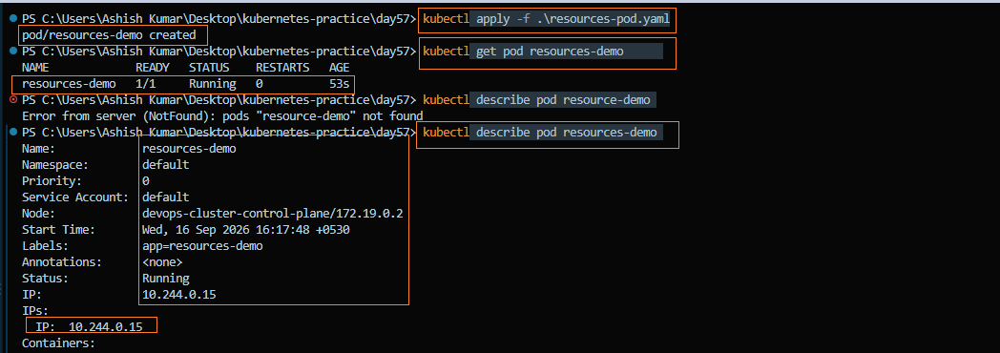

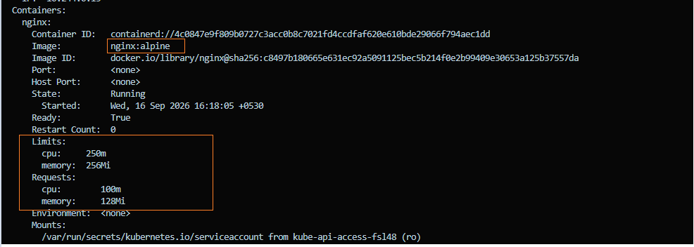

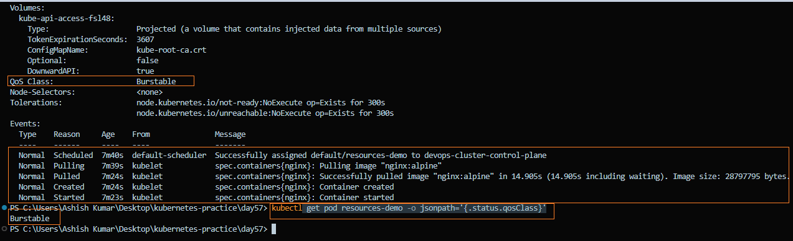

---

### Task 2: OOMKilled — Exceeding Memory Limits
1. Write a Pod manifest using the `polinux/stress` image with a memory limit of `100Mi`
2. Set the stress command to allocate 200M of memory: `command: ["stress"] args: ["--vm", "1", "--vm-bytes", "200M", "--vm-hang", "1"]`
3. Apply and watch — the container gets killed immediately

CPU is throttled when the limit is exceeded. Memory usage beyond the limit can trigger `OOMKilled`.

Check `kubectl describe pod` for `Reason: OOMKilled` and `Exit Code: 137` (128 + SIGKILL).

**manifest** [oom-demo.yaml](./manifests/oom-demo.yaml)

**Verify:** What exit code does an OOMKilled container have?

- An OOMKilled container exits with **code `137`** (`128 + SIGKILL`).

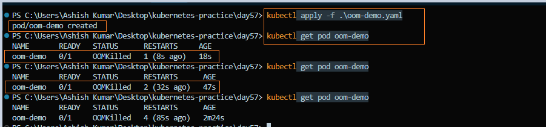

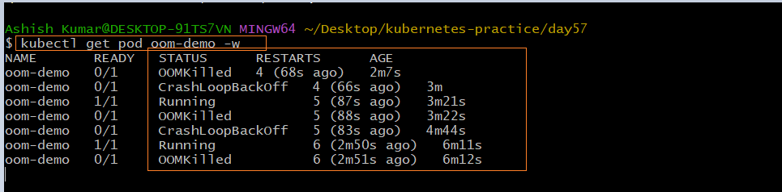

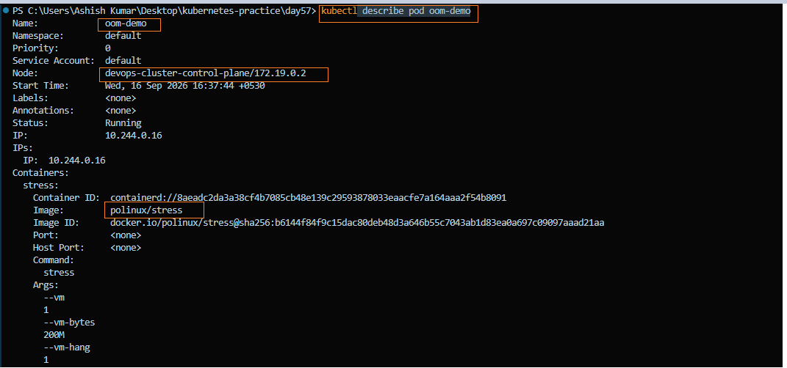

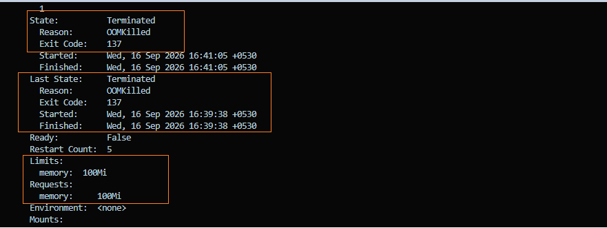

---

### Task 3: Pending Pod — Requesting Too Much
1. Write a Pod manifest requesting `cpu: 100` and `memory: 128Gi`
2. Apply and check — STATUS stays `Pending` forever
3. Run `kubectl describe pod` and read the Events — the scheduler says exactly why: insufficient resources

**manifest** [pending-demo.yaml](./manifests/pending-demo.yaml)

**Verify:** What event message does the scheduler produce?

- 0/3 nodes are available: Insufficient cpu, Insufficient memory

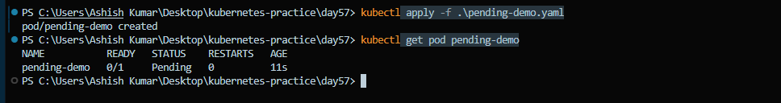

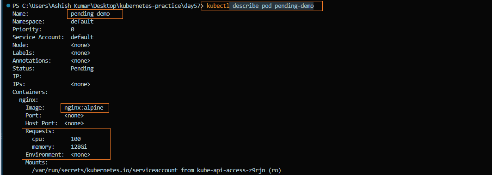

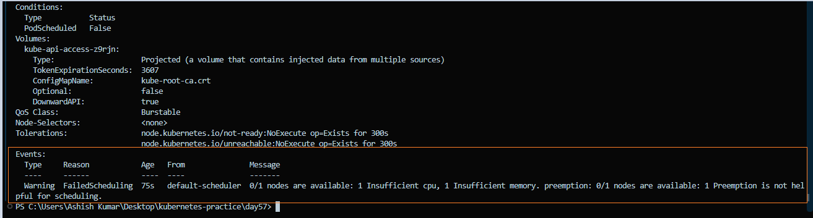

---

### Task 4: Liveness Probe
A liveness probe detects stuck containers. If it fails, Kubernetes restarts the container.

1. Write a Pod manifest with a busybox container that creates `/tmp/healthy` on startup, then deletes it after 30 seconds
2. Add a liveness probe using `exec` that runs `cat /tmp/healthy`, with `periodSeconds: 5` and `failureThreshold: 3`
3. After the file is deleted, 3 consecutive failures trigger a restart. Watch with `kubectl get pod -w`

**manifest** [liveness-demo.yaml](./manifests/liveness-demo.yaml)

**Verify:** How many times has the container restarted?

- The container was restarted **6 times** after the liveness probe repeatedly failed.
- `kubectl describe pod liveness-demo` shows **Restart Count: 6**.
- Events confirm: **`Liveness probe failed` → `Container will be restarted`**.
- The Pod eventually entered **`CrashLoopBackOff`** because the probe kept failing.

**Note:** A failed **liveness probe** causes Kubernetes to restart the container.

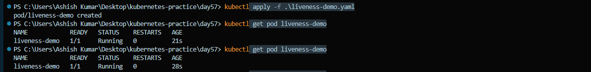

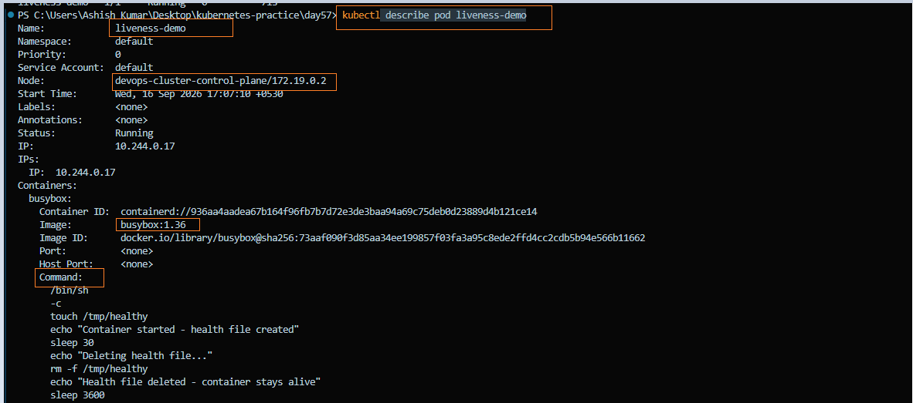

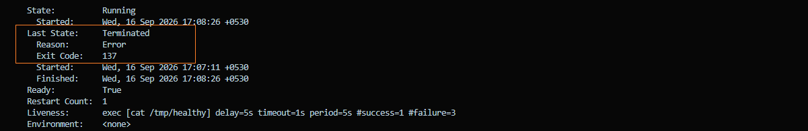

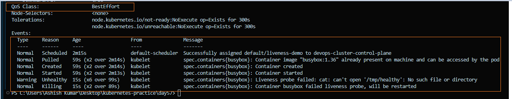

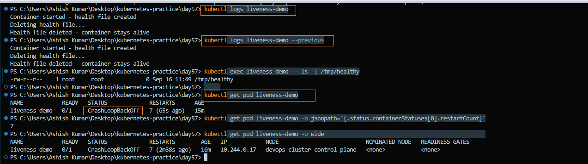

---

### Task 5: Readiness Probe
A readiness probe controls traffic. Failure removes the Pod from Service endpoints but does NOT restart it.

1. Write a Pod manifest with nginx and a `readinessProbe` using `httpGet` on path `/` port `80`
2. Expose it as a Service: `kubectl expose pod <name> --port=80 --name=readiness-svc`
3. Check `kubectl get endpoints readiness-svc` — the Pod IP is listed
4. Break the probe: `kubectl exec <pod> -- rm /usr/share/nginx/html/index.html`
5. Wait 15 seconds — Pod shows `0/1` READY, endpoints are empty, but the container is NOT restarted

**manifest** [readiness-demo.yaml](./manifests/readiness-demo.yaml)

**Verify:** When the readiness probe failed, was the container restarted?

- **No.** The container remained **Running** with **0 restarts**.
- The Pod became **`0/1 Ready`**, and the Service endpoints became **empty**.
- Events confirmed repeated **Readiness probe failed** messages.

**Note:** A failed **readiness probe** removes the Pod from Service traffic but does **not** restart the container.

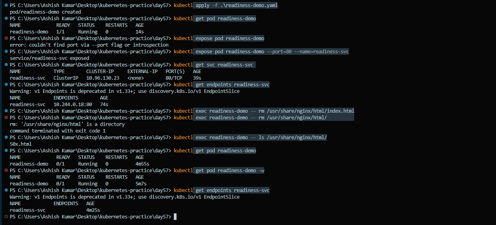

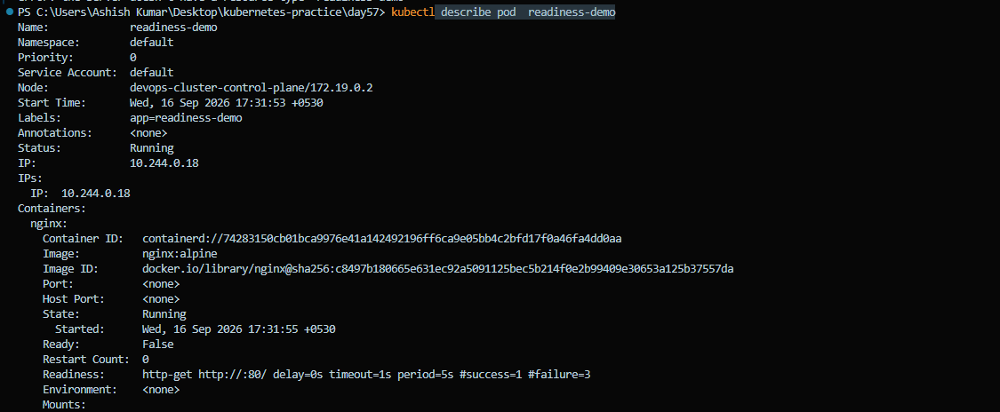

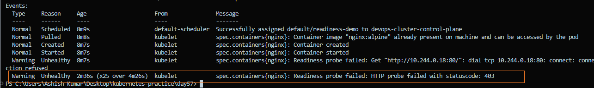

---

### Task 6: Startup Probe
A startup probe gives slow-starting containers extra time. While it runs, liveness and readiness probes are disabled.

1. Write a Pod manifest where the container takes 20 seconds to start (e.g., `sleep 20 && touch /tmp/started`)
2. Add a `startupProbe` checking for `/tmp/started` with `periodSeconds: 5` and `failureThreshold: 12` (60 second budget)
3. Add a `livenessProbe` that checks the same file — it only kicks in after startup succeeds

**manifest** [startup-demo.yaml](./manifests/startup-demo.yaml)

**Verify:** What would happen if `failureThreshold` were `2` instead of `12`?

- The startup probe would allow only **2 consecutive failures** before restarting the container.
- With `periodSeconds: 5`, the probe would fail before the **20-second startup** completes.
- Kubernetes would **restart the container repeatedly**, eventually causing `CrashLoopBackOff`.

**Note:** A startup probe must succeed before liveness/readiness probes begin.


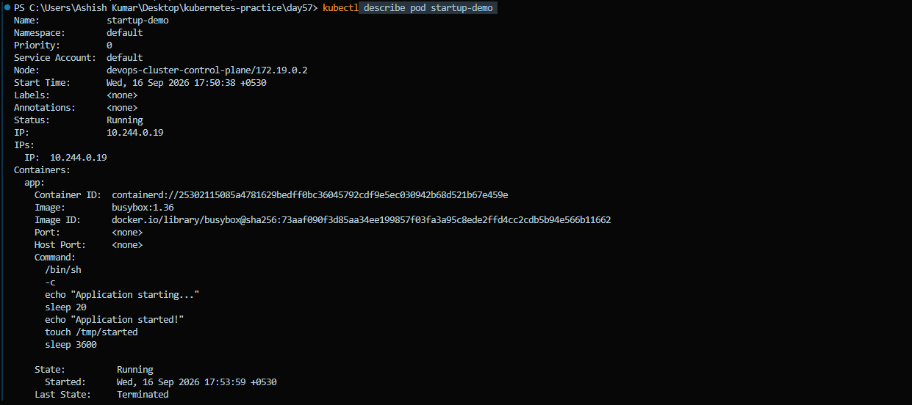

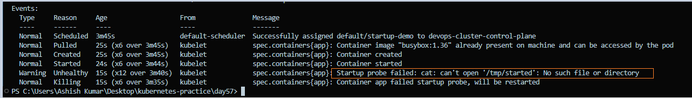

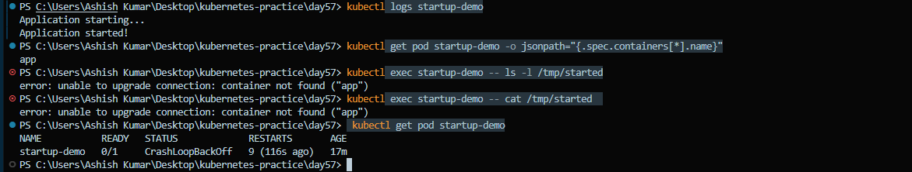

---

### Task 7: Clean Up
Delete all pods and services you created.

```bash
kubectl delete pod --all
kubectl delete svc readiness-svc
```
**Before delete**


**After delete**


**Note:** The default kubernetes Service is managed by Kubernetes and remains after cleanup.

---

## Requests vs Limits — Scheduling vs Enforcement

### `Requests`

- Used by the Kubernetes **scheduler** to decide where to place the Pod.
- Represents the **minimum resources** required by the container.

### `Limits`

- Enforced at runtime by the **kubelet/container runtime**.
- Defines the **maximum resources** a container can use.

---

## What Happens When CPU or Memory Limits Are Exceeded?

### `CPU Limit Exceeded`

- Container is **throttled**.
- The container continues running but may become slower.

### `Memory Limit Exceeded`

- Container is **killed** with `OOMKilled`.
- Kubernetes may restart the container depending on its restart policy.

---

## Liveness vs Readiness vs Startup Probes

| Probe Type | Purpose | When It Runs | If It Fails | Simple Meaning |
|---|---|---|---|---|
| **Startup Probe** | Check if the application has started | During container startup | Container is restarted | "Has the app started?" |
| **Liveness Probe** | Check if the application is still alive | After startup succeeds | Container is restarted | "Is the app alive?" |
| **Readiness Probe** | Check if the application can serve traffic | Throughout the container lifecycle | Pod is removed from Service endpoints | "Is the app ready for users?" |