# Day 58 – Metrics Server and Horizontal Pod Autoscaler (HPA)

Metrics Server collects **CPU and memory usage** from Kubernetes Nodes and Pods.

These metrics are used by:

- `kubectl top`
- Horizontal Pod Autoscaler (HPA)

### Task 1: Install the Metrics Server

1. Check if the Metrics Server is already running: `kubectl get pods -n kube-system | grep metrics-server`

2. If it is not installed, install the official Metrics Server manifest:

   Since I was using a **Kind cluster**, I used: `kubectl apply -f https://github.com/kubernetes-sigs/metrics-server/releases/latest/download/components.yaml`

3. For local clusters like Kind, add the `--kubelet-insecure-tls` flag if required:
`kubectl patch deployment metrics-server -n kube-system --type=json -p='[{"op":"add","path":"/spec/template/spec/containers/0/args/-","value":"--kubelet-insecure-tls"}]'`
   
> **Note:** This is suitable for local learning environments only and should **not be used in production**.

4. Wait around **60 seconds** for the Metrics Server to start collecting metrics.
5. Verify Node and Pod metrics:
   - `kubectl top nodes`
   - `kubectl top pods -A`

**Verify:** What is the current CPU and memory usage of your Nodes?

- **Control Plane:** CPU `2%` | Memory `8%`
- **Worker:** CPU `0%` | Memory `2%`
- **Worker2:** CPU `0%` | Memory `2%`
- Current Node utilization is low: CPU usage is **0–2%** and memory usage is **2–8%** across Nodes.

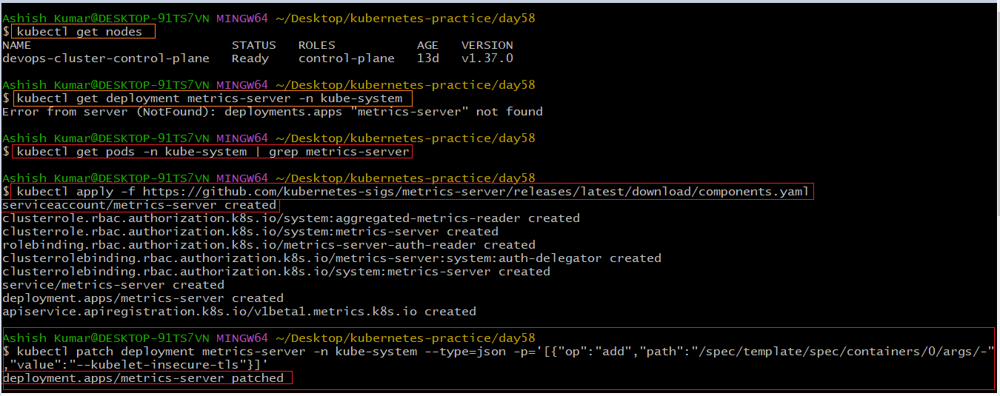

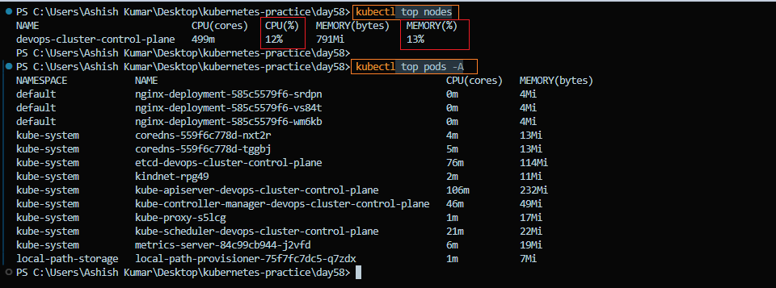
---

### Task 2: Explore `kubectl top`

1. Check CPU and memory usage of all Nodes: `kubectl top nodes`
2. Check CPU and memory usage of all Pods across namespaces: `kubectl top pods -A`
3. Sort Pods by CPU usage to identify the highest-consuming Pod: `kubectl top pods -A --sort-by=cpu`
4. Understand what `kubectl top` reports:
   - Shows **current CPU and memory usage**.
   - It does **not** show resource requests or limits.
   - These are different concepts used for scheduling and resource management.
5. Metrics are collected by the **Metrics Server** from kubelets and exposed through the Kubernetes Metrics API.

**Verify:** Which Pod is using the most CPU right now?

- **Pod:** `kube-apiserver-devops-cluster-control-plane`
- **CPU:** `99m`
- **Memory:** `231Mi`
- The `kube-apiserver` is currently using the most CPU.

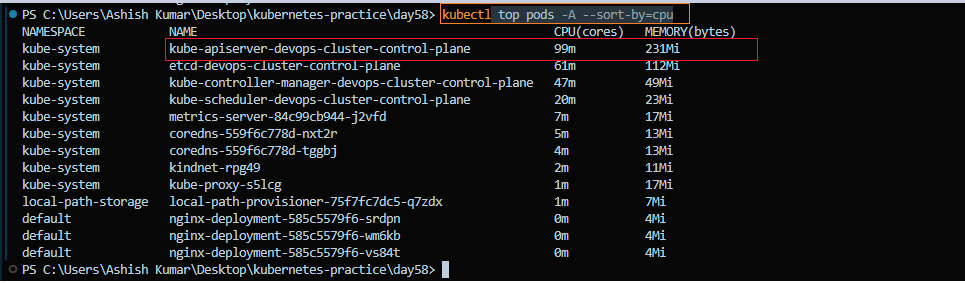

---

### Task 3: Create a Deployment with CPU Requests
1. Write a Deployment manifest using the `registry.k8s.io/hpa-example` image (a CPU-intensive PHP-Apache server)
2. Set `resources.requests.cpu: 200m` — HPA needs this to calculate utilization percentages
3. Expose it as a Service: `kubectl expose deployment php-apache --port=80`
4. Verify the Deployment, Pod, and Service:
   - `kubectl get deployment php-apache`
   - `kubectl get pods -l app=php-apache`
   - `kubectl get service php-apache`

> **Note:** Without CPU requests, HPA cannot calculate CPU utilization correctly. Missing resource requests are one of the most common HPA configuration mistakes.

**Manifest:** [php-apache.yaml](./manifests/php-apache.yaml)

**Verify:** What is the current CPU usage of the Pod?

- **Pod:** `php-apache-6b99fd56b-rl65d`
- **CPU:** `1m`
- **Memory:** `9Mi`

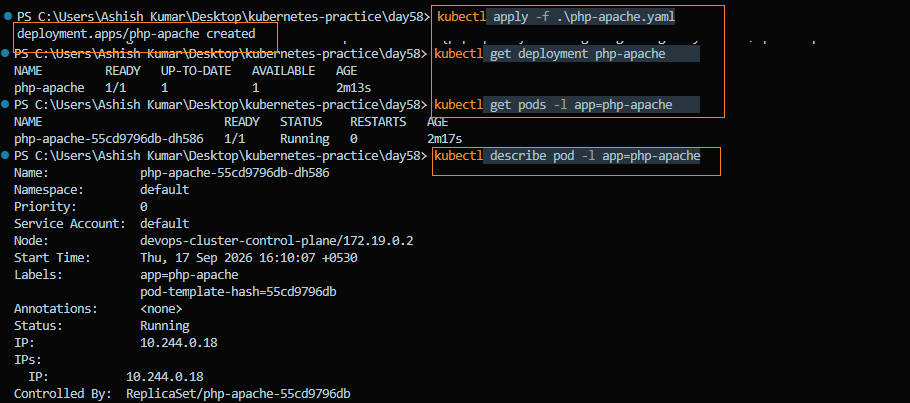

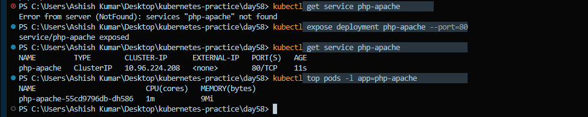

---

### Task 4: Create an HPA (Imperative)
1. Run: `kubectl autoscale deployment php-apache --cpu-percent=50 --min=1 --max=10`
2. Check: `kubectl get hpa` and `kubectl describe hpa php-apache`
3. TARGETS may show `<unknown>` initially — wait 30 seconds for metrics to arrive

This scales up when average CPU exceeds 50% of requests, and down when it drops below.

**Verify:** What does the `TARGETS` column show?

- **TARGETS:** `cpu: 0%/50%`
- Current CPU utilization is **0% of the requested CPU**, while the target is **50%**.
- The HPA is successfully receiving CPU metrics and is currently maintaining **1 replica**.

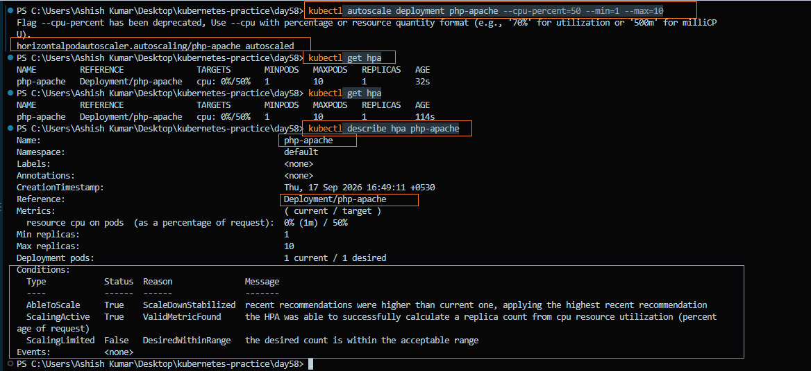
---

### Task 5: Generate Load and Watch Autoscaling
1. Start a load generator: `kubectl run load-generator --image=busybox:1.36 --restart=Never -- /bin/sh -c "while true; do wget -q -O- http://php-apache; done"`
2. Verify the load generator is running: `kubectl get pod load-generator`
3. Watch HPA: `kubectl get hpa php-apache --watch`
4. Observe the autoscaling behavior:
   - CPU usage rises above the **50% target**.
   - HPA increases the number of replicas.
   - Replicas eventually reach the configured maximum of **10**.
   - CPU utilization stabilizes as additional Pods handle the load.
5. Stop the load: `kubectl delete pod load-generator`
6. Observe scale-down:
   - CPU usage drops back toward `0%`.
   - HPA gradually reduces the replicas.
   - Scale-down is intentionally slow because of the HPA stabilization window.

**Verify:** How many replicas did HPA scale to under load?

- **Maximum replicas reached:** `10`
- **CPU target:** `50%`
- HPA successfully scaled the Deployment from **1 → 10 replicas** under load.
- After the load generator was deleted, CPU usage dropped back to `0%`.
- The HPA did not immediately scale down because HPA scale-down is intentionally conservative.

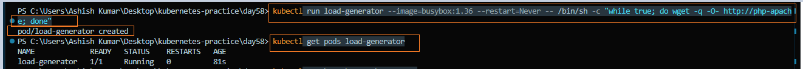

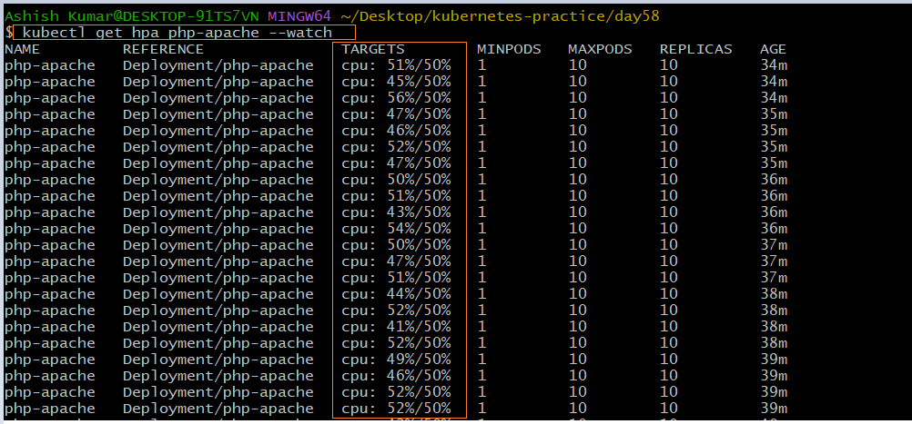

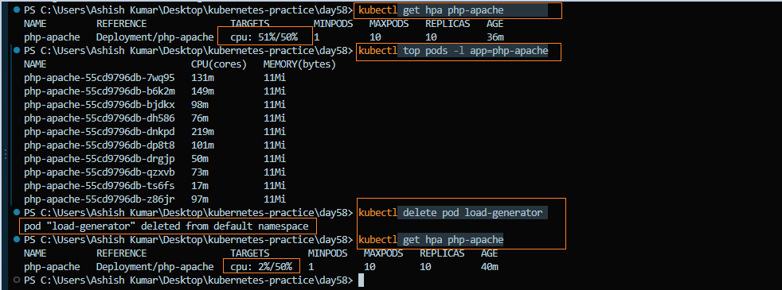

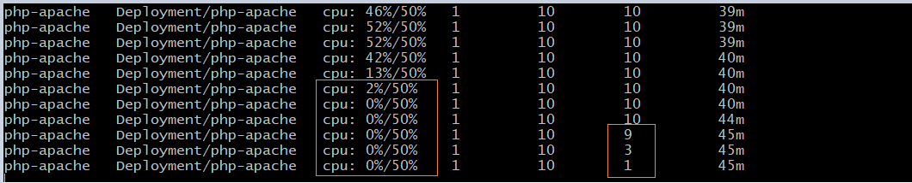

---

### Task 6: Create an HPA from YAML (Declarative)
1. Delete the imperative HPA: `kubectl delete hpa php-apache`
2. Write an HPA manifest using `autoscaling/v2` API with CPU target at 50% utilization
3. Add a `behavior` section to control scaling behavior:
   - Scale-up: no stabilization window
   - Scale-down: `300`-second stabilization window
4. Apply and verify with `kubectl describe hpa`

`autoscaling/v2` supports multiple metrics and fine-grained scaling behavior that the imperative command cannot configure.

**Manifest:** [hpa.yaml](./manifests/hpa.yaml)

**Verify:** What does the `behavior` section control?

- Controls **how the HPA scales up and down**.
- `scaleUp` controls policies for increasing replicas.
- `scaleDown` controls policies for decreasing replicas.
- In this configuration, scale-down uses a **300-second stabilization window** to avoid rapid fluctuations.

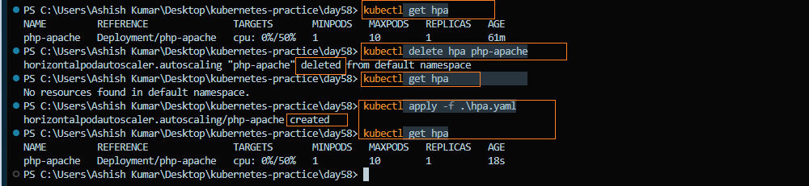

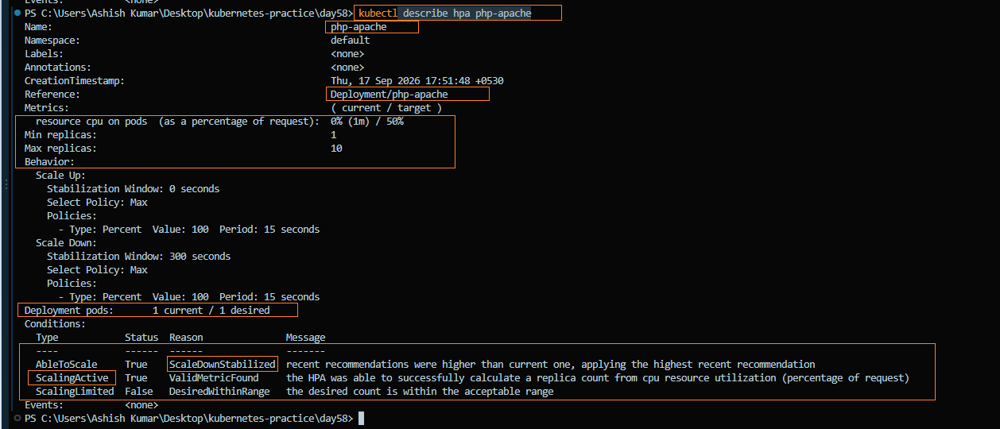

---

### Task 7: Clean Up

Delete the HPA, Service, Deployment, and load-generator Pod. Leave the Metrics Server installed.

**Verify:** Is the Metrics Server still installed and collecting metrics?

- **Metrics Server:** `1/1 Ready`
- **Deployment:** `metrics-server`
- `kubectl top nodes` successfully returns CPU and memory metrics.
- HPA, PHP-Apache Deployment, Service, and load-generator Pod were removed.

**Before delete**

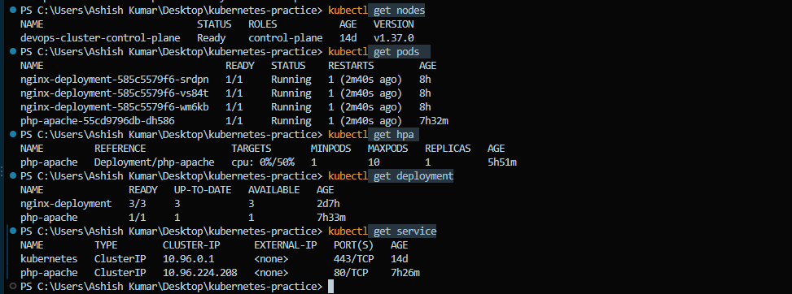

**After delete**

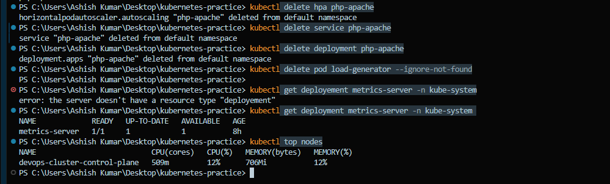

---

## Key Concepts

### What the Metrics Server Is and Why HPA Needs It

- Metrics Server collects **CPU and memory usage** from Nodes and Pods.
- HPA uses this data to decide when to **scale Pods up or down** based on actual resource usage.

### How HPA Calculates Desired Replicas

```text
desiredReplicas = ceil(currentReplicas × (currentUsage / targetUsage))
```
Example: 
- Current replicas = 2
- Current CPU usage = 80%
- Target CPU usage = 50%

```text
desiredReplicas = ceil(2 × (80 / 50))
                = ceil(3.2)
                = 4
```
> **Note:** This is a simplified representation of the HPA calculation. The actual controller also considers tolerance, missing metrics, readiness, and other conditions.

### Difference Between autoscaling/v1 and autoscaling/v2

`autoscaling/v1`

   - Supports CPU-based scaling
   - Provides basic HPA configuration

`autoscaling/v2`

   - Supports multiple metrics such as CPU, memory, and custom metrics
   - Supports advanced scaling behavior
   - Allows fine-grained scale-up and scale-down policies