# Day 60 – Capstone: Deploy WordPress + MySQL on Kubernetes

## Task 1: Create the Namespace (Day 52)

The `capstone` namespace provides an isolated environment for all resources used in the Kubernetes capstone project.

1. Create a `capstone` namespace
2. Set it as your default: `kubectl config set-context --current --namespace=capstone`
3. Verify the namespace: `kubectl get namespace capstone`

**Manifest:** [namespace.yaml](./manifests/namespace.yaml)

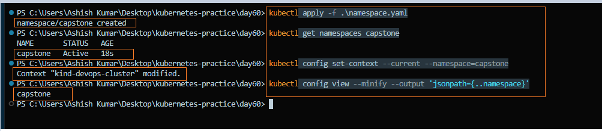

**Verify:** Is the capstone namespace created and set as the current namespace?

- Yes, the `capstone` namespace was created successfully.
- The current Kubernetes context was configured to use `capstone`.

---

## Task 2: Deploy MySQL (Days 54-56)

MySQL is deployed using a Secret for database credentials, a Headless Service for stable network identity, and a StatefulSet with persistent storage.

1. Create a Secret with `MYSQL_ROOT_PASSWORD`, `MYSQL_DATABASE`, `MYSQL_USER`, and `MYSQL_PASSWORD` using `stringData`

**Manifests:** [secret.yaml](./manifests/secret.yaml)

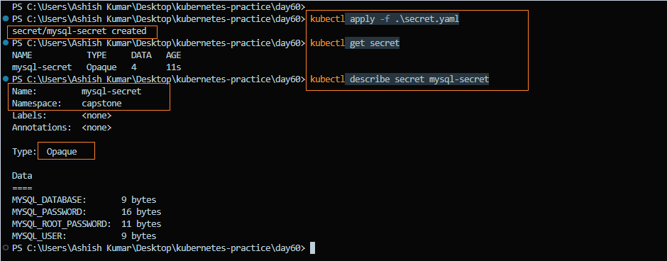

2. Create a Headless Service (`clusterIP: None`) for MySQL on port `3306`

**Manifests:** [service.yaml](./manifests/service.yaml)

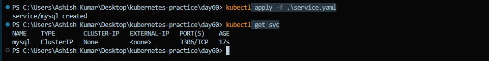

3. Create a StatefulSet for MySQL with:
   - Image: `mysql:8.0`
   - `envFrom` referencing the Secret
   - Resource requests (cpu: 250m, memory: 512Mi) and limits (cpu: 500m, memory: 1Gi)
   - A `volumeClaimTemplates` section requesting 1Gi of storage, mounted at `/var/lib/mysql`

**Manifests:** [statefulset.yaml](./manifests/statefulset.yaml)

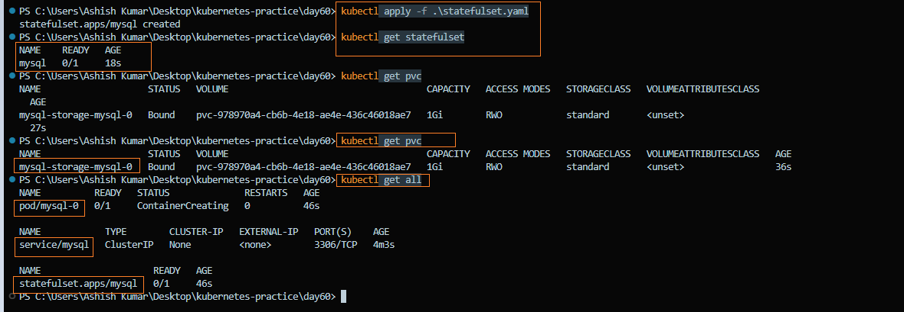

4. Verify that MySQL is working and the `wordpress` database exists: `kubectl exec -it mysql-0 -- mysql -u <user> -p<password> -e "SHOW DATABASES;"`

**Verify:** Can you see the `wordpress` database?

- Yes, the `wordpress` database was created successfully.
- MySQL is running successfully inside the StatefulSet.

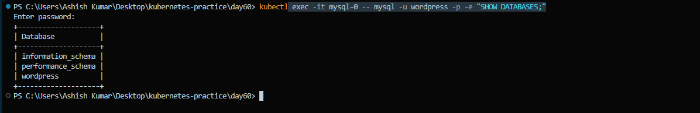

> **Note:**  The StatefulSet provides a stable MySQL identity `(mysql-0)` and persistent storage ensures that database data survives pod restarts.

---

## Task 3: Deploy WordPress (Days 52, 54, 57)

WordPress is deployed as a Kubernetes Deployment with multiple replicas, using the MySQL database configuration and credentials from the ConfigMap and Secret.

1. Create a ConfigMap with:
   - `WORDPRESS_DB_HOST` set to `mysql-0.mysql.capstone.svc.cluster.local:3306`
   - `WORDPRESS_DB_NAME` set to `wordpress`

2. Create a Deployment with 2 replicas using `wordpress:latest` that:
   - Uses `envFrom` for the WordPress ConfigMap
   - Uses `secretKeyRef` to read `WORDPRESS_DB_USER` and `WORDPRESS_DB_PASSWORD` from the MySQL Secret
   - Defines CPU and memory resource requests and limits
   - Configures a liveness probe on `/wp-login.php` port 80
   - Configures a readiness probe on `/wp-login.php` port 80

3. Apply the Deployment and wait until both WordPress pods show `1/1 Running`.

**Manifests:**

- [wordpress-configmap.yaml](./manifests/wordpress-configmap.yaml)
- [wordpress-deployment.yaml](./manifests/wordpress-deployment.yaml)

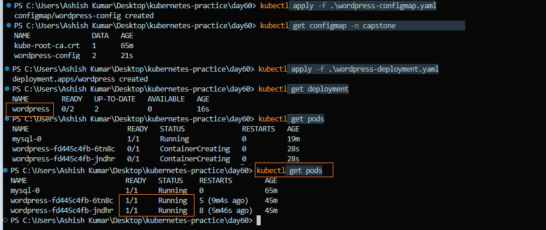

**Verify:** Are both WordPress pods running and ready?

- Yes, both WordPress pods are `1/1 Running`.

> **Note:** The Deployment uses 2 replicas to provide basic availability. If one WordPress pod fails, Kubernetes automatically creates a replacement pod.

---

## Task 4: Expose WordPress (Day 53)

A NodePort Service is used to expose the WordPress application running on the Kubernetes cluster.

1. Create a NodePort Service on port `30080` targeting the WordPress pods.
2. Apply the Service: `kubectl apply -f wordpress-service.yaml`
3. Verify the Service: `kubectl get svc`
4. Verify that the Service has WordPress pod endpoints: `kubectl get endpoints wordpress`
5. Since the cluster is running with Kind, use port forwarding to access WordPress: `kubectl port-forward svc/wordpress 8080:80 -n capstone`
6. Open WordPress in the browser: `http://127.0.0.1:8080`
7. Complete the WordPress setup wizard and create a blog post. 

**Manifest:** [wordpress-service.yaml](./manifests/wordpress-service.yaml)

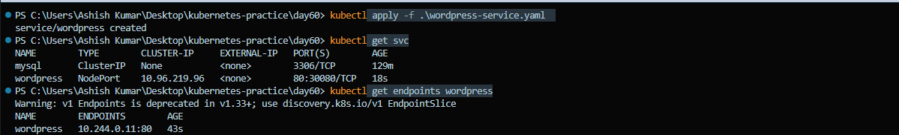

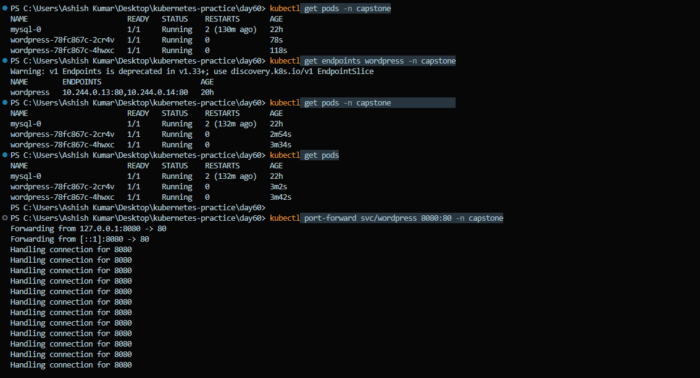

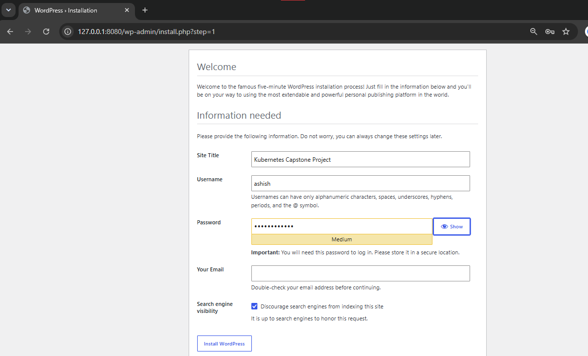

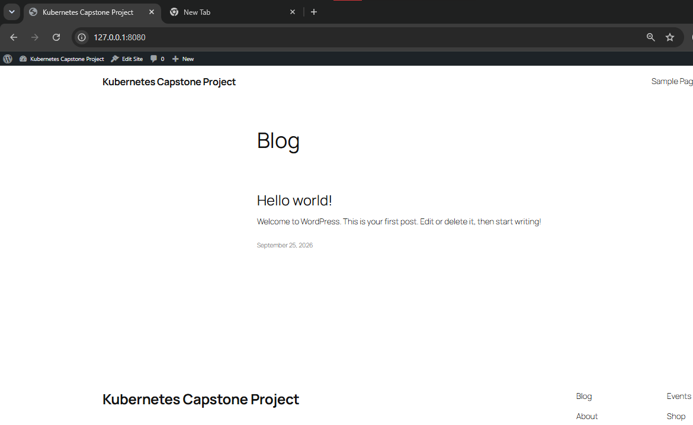

**Verify:** Can you see the WordPress setup page?

- Yes, WordPress was successfully accessed using `kubectl port-forward`.
- The WordPress setup page was displayed successfully.
- A blog post was created successfully.

> **Note:** The WordPress Service is configured as a NodePort with NodePort `30080`. Since the cluster is running with Kind, the application was accessed using `kubectl port-forward` to reliably expose the Service locally at `127.0.0.1:8080`.

---

## Task 5: Test Self-Healing and Persistence

Kubernetes provides **self-healing** by automatically recreating failed pods, while persistent storage ensures that application data survives pod restarts.

1. Delete a WordPress pod and verify that the Deployment automatically recreates it: `kubectl delete pod <wordpress-pod-name> -n capstone`

> **Note:** The WordPress pod name is dynamically generated by the Deployment, so replace `<wordpress-pod-name>` with the current pod name.

2. Delete the MySQL pod and verify that the StatefulSet recreates the pod with the same stable identity: `kubectl delete pod mysql-0 -n capstone`
3. Watch the pods until the replacement WordPress and MySQL pods are running: `kubectl get pods -w`
4. Keep the WordPress port-forward running: `kubectl port-forward svc/wordpress 8080:80 -n capstone`
5. Refresh WordPress in the browser and verify that the previously created blog post is still available.

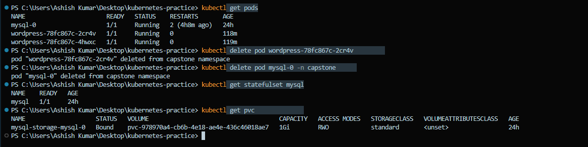

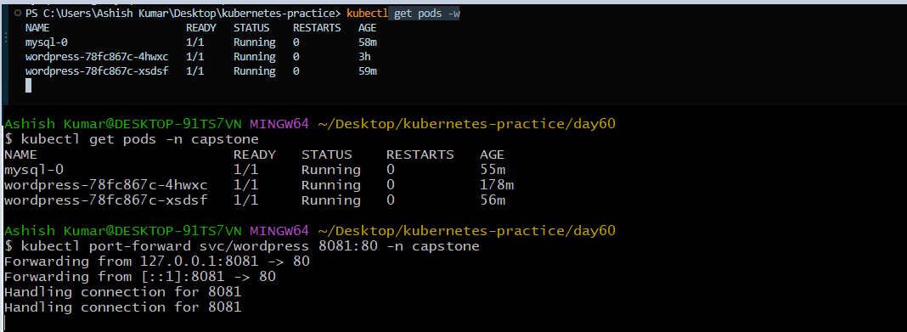

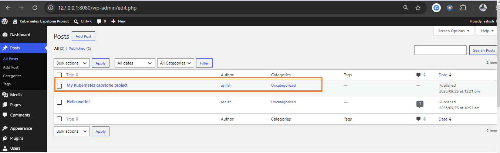

**Verify:** After deleting both pods, is your blog post still there?

- Yes, the WordPress Deployment recreated the deleted pod automatically.
- The MySQL StatefulSet recreated mysql-0.
- The MySQL PVC remained Bound, preserving the database data.
- The previously created WordPress blog post was still available after both pods were recreated.

> **Note:** The Deployment provides self-healing for WordPress, while the StatefulSet combined with a PersistentVolumeClaim provides stable identity and persistent storage for MySQL. This allows the database data to survive pod deletion and recreation.

---

## Task 6: Set Up HPA (Day 58)

1. Create an HPA targeting the WordPress Deployment with:
   - CPU target: 50%
   - Minimum replicas: 2
   - Maximum replicas: 10
2. Apply the HPA and verify it: `kubectl get hpa -n capstone`
3. Check all resources: `kubectl get all -n capstone`

**Manifest:** [hpa.yaml](./manifests/hpa.yaml)

**Verify:** Does the HPA show the correct target, minimum replicas, and maximum replicas?

- CPU target is `50%`
- Minimum replicas are `2`
- Maximum replicas are `10`
- Current replicas are `2`
- HPA is targeting the `wordpress` Deployment

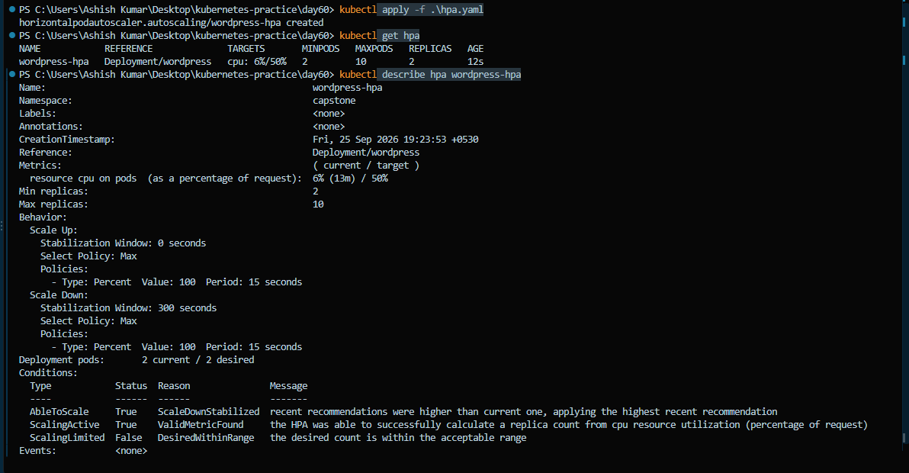

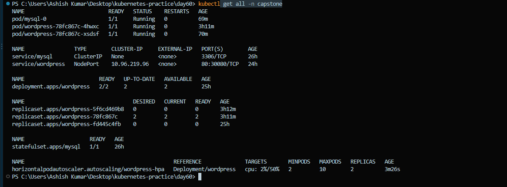

---

## Task 7: (Bonus) Compare with Helm (Day 59)

1. Create a separate namespace for the Helm deployment: `kubectl create namespace wordpress-helm`

2. Install WordPress using the Bitnami Helm chart: `helm install wp-helm bitnami/wordpress -n wordpress-helm`

**Verify:** Is the Helm release deployed successfully?

- Helm release `wp-helm` was deployed successfully.
- Chart version: `34.0.4`
- WordPress version: `7.1.2`

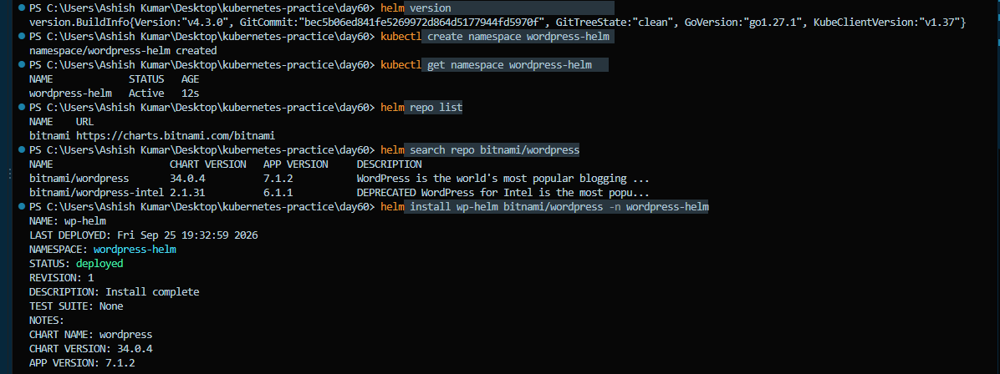

3. Check the resources created by Helm: `kubectl get all -n wordpress-helm`

4. Check additional resources such as PVCs, Secrets, and ConfigMaps: `kubectl get pvc,secret,configmap -n wordpress-helm`

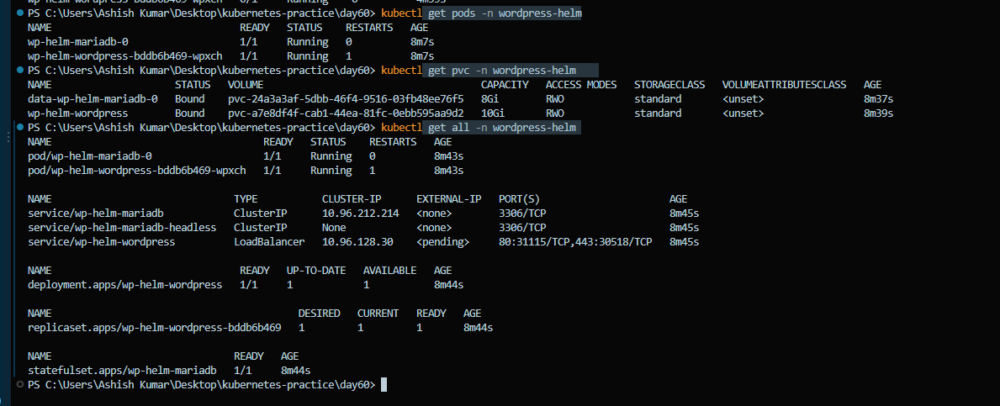

5. Compare the manually created WordPress deployment with the Helm deployment.

| Resource | Manual Deployment | Helm Deployment |
|---|---:|---:|
| WordPress Pod | 2 | 1 |
| MySQL/MariaDB Pod | 1 | 1 |
| Deployment | 1 | 1 |
| StatefulSet | 1 | 1 |
| Services | 2 | 3 |
| PVCs | 1 | 2 |
| Secrets | 1 | 3 |
| ConfigMaps | 1 | 2 |

> **Note:** The exact resource count can vary depending on the chart version and configuration.

**Which approach gives more control?**

- **Manual Kubernetes manifests** give more direct control over each resource and configuration.
- **Helm** is faster and easier for deploying complex applications because one chart manages multiple Kubernetes resources.
- Helm also makes upgrades, configuration changes, and repeatable deployments easier.

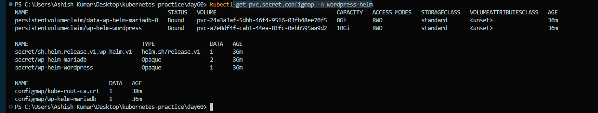

6. Clean up the Helm deployment:

```bash
helm uninstall wp-helm -n wordpress-helm
kubectl get all -n wordpress-helm
kubectl delete namespace wordpress-helm
```
**Verify:** Was the Helm deployment completely removed?

- Helm release `wp-helm` was successfully uninstalled.
- No resources remained in the `wordpress-helm` namespace.
- The `wordpress-helm` namespace was deleted successfully.

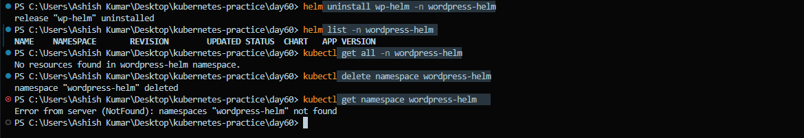


---

## Task 8: Clean Up and Reflect

1. Take a final look: `kubectl get all -n capstone`

2. Review the concepts used:
   - Namespace
   - Secret
   - ConfigMap
   - PVC
   - StatefulSet
   - Headless Service
   - Deployment
   - NodePort Service
   - Resource Requests and Limits
   - Liveness and Readiness Probes
   - HPA
   - Helm

   **Total: 12 Kubernetes/DevOps concepts used in one deployment.**

3. Delete the `capstone` namespace: `kubectl delete namespace capstone`

4. Verify that all resources were removed: `kubectl get all -n capstone`

5. Reset the default namespace: `kubectl config set-context --current --namespace=default`

**Verify:** Did deleting the namespace remove everything?

- Yes, the `capstone` namespace and its resources were removed.
- `kubectl get all -n capstone` returned no resources.
- The PVC in the `capstone` namespace was removed along with the namespace.
- The Kubernetes context was reset to the `default` namespace.


---

## Architecture Diagram

**Which resources connect to which:**

1. `User / Local Browser → kubectl port-forward → WordPress Service`
   - WordPress was accessed locally through `127.0.0.1:8080`.
   - `kubectl port-forward` forwarded local port `8080` to Service port `80`.

2. `WordPress Service → WordPress Pods`
   - The WordPress Service forwards traffic to the WordPress Deployment pods on port `80`.
   - The Service is configured as a NodePort with NodePort `30080`, although the lab access was performed using port-forwarding.

3. `WordPress Pods → ConfigMap & Secret`
   - WordPress pods read `WORDPRESS_DB_HOST` and `WORDPRESS_DB_NAME` from the ConfigMap.
   - WordPress pods read `WORDPRESS_DB_USER` and `WORDPRESS_DB_PASSWORD` from the MySQL Secret using `secretKeyRef`.

4. `WordPress Pods → MySQL Headless Service`
   - WordPress connects to MySQL through the Kubernetes DNS name:
     `mysql-0.mysql.capstone.svc.cluster.local:3306`

5. `MySQL Headless Service → MySQL StatefulSet Pod`
   - The Headless Service provides stable DNS-based access to the MySQL StatefulSet pod `mysql-0`.

6. `MySQL Pod → PVC → PersistentVolume`
   - The MySQL pod stores database files in its PersistentVolumeClaim.
   - The PVC is backed by persistent storage and allows MySQL data to survive pod deletion and recreation.

7. `WordPress Deployment → HPA`
   - The HPA monitors CPU utilization of the WordPress Deployment.
   - It maintains between `2` and `10` WordPress replicas based on CPU usage.

---

## Results of Self-Healing and Persistence Tests

- When a WordPress pod was deleted, the Deployment automatically created a replacement pod.
- When the MySQL pod was deleted, the StatefulSet automatically recreated `mysql-0`.
- The MySQL PVC remained `Bound` after the pod was recreated.
- After MySQL recovered, the WordPress blog post was still available.
- This demonstrated both **Kubernetes self-healing** and **persistent storage**.

---

## Concept-to-Day Mapping

| **Concept** | **Day** |
| --- | ---: |
| Namespace | 52 |
| Services | 53 |
| ConfigMap & Secrets | 54 |
| Persistent Volumes / PVC | 55 |
| Headless Service | 56 |
| Probes | 57 |
| Metrics & HPA | 58 |
| Helm Charts | 59 |

---

## Reflection

### Hardest Part

- Configuring liveness and readiness probes correctly so WordPress pods are given enough time to start without unnecessary restarts.
- Understanding and troubleshooting WordPress → MySQL connectivity using Kubernetes Service DNS.
- Understanding how StatefulSet, Headless Service, and PVC work together for the database.

### What Clicked

- **`initialDelaySeconds: 10`** → Wait 10 seconds before starting the first probe.
- **`periodSeconds: 5`** → Run the probe every 5 seconds.
- **`timeoutSeconds: 3`** → Wait up to 3 seconds for a probe response.
- **Deployment** maintains the desired number of WordPress replicas.
- **StatefulSet** maintains a stable identity for the MySQL pod.
- **PVC** keeps MySQL data persistent even when the pod is recreated.
- **HPA** automatically adjusts WordPress replicas based on CPU utilization.
- **Helm** can package and deploy multiple Kubernetes resources through a single chart.

### What I Would Add for Production

- **Database & Secrets:** Use a managed database such as Amazon RDS and a dedicated secrets manager instead of running the database inside the cluster.
- **Secure Access:** Use an Ingress or Gateway API with TLS/HTTPS instead of exposing the application directly through NodePort.
- **Access Control:** Implement RBAC with least-privilege permissions for users and service accounts.
- **Monitoring:** Deploy Prometheus and Grafana for metrics, dashboards, and alerts.
- **High Availability:** Run workloads across multiple nodes and Availability Zones where appropriate.
- **Backup & Recovery:** Configure automated database backups and test restoration procedures.
- **Resource Management:** Define appropriate CPU/memory requests and limits for all production workloads.
- **Security:** Use NetworkPolicies, image scanning, non-root containers, and regularly updated container images.

---